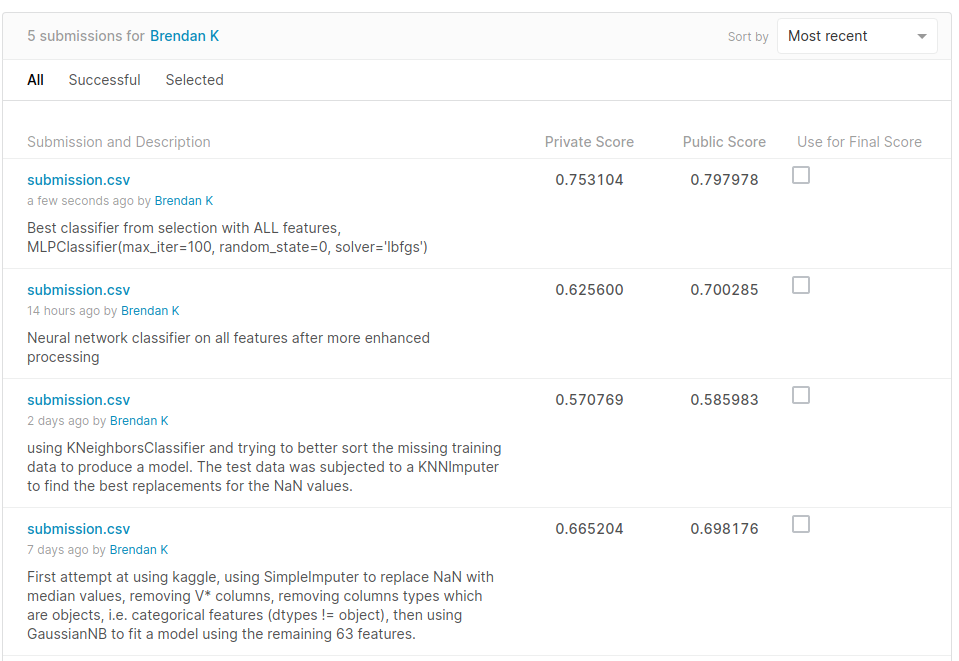
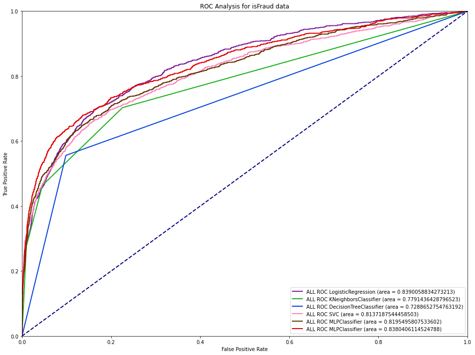
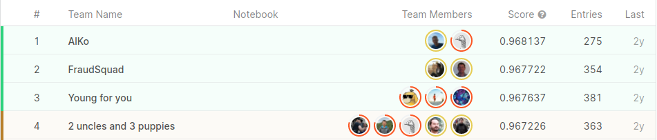

# fraud_detection_kaggle
My work on a Kaggle completion for an assignment 

[ IEEE-CIS Fraud Detection - Can you detect fraud from customer transactions?](https://www.kaggle.com/c/ieee-fraud-detection)

Main juptyer notebook 

[Fraud Detection Final.ipynb](Fraud%20Detection%20Final.ipynb)

# Kaggle results:

# My local results:

# Best results achveived on Kaggle :unamused: 

