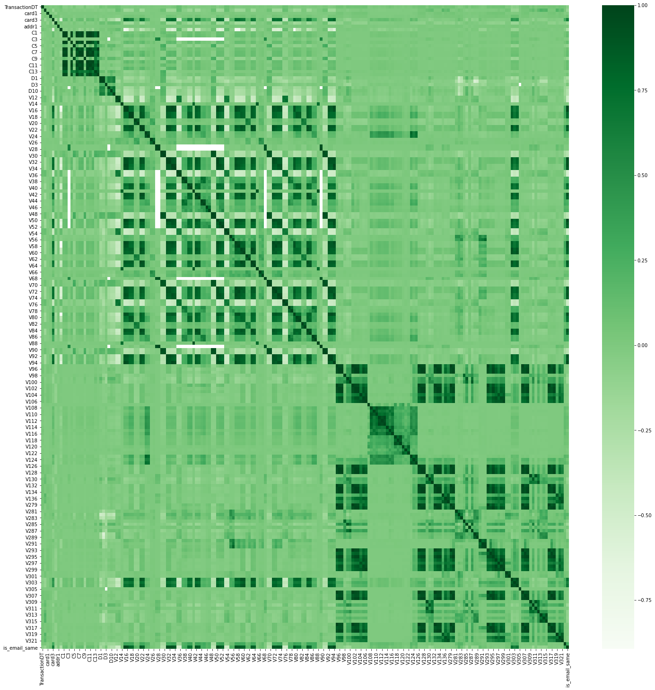
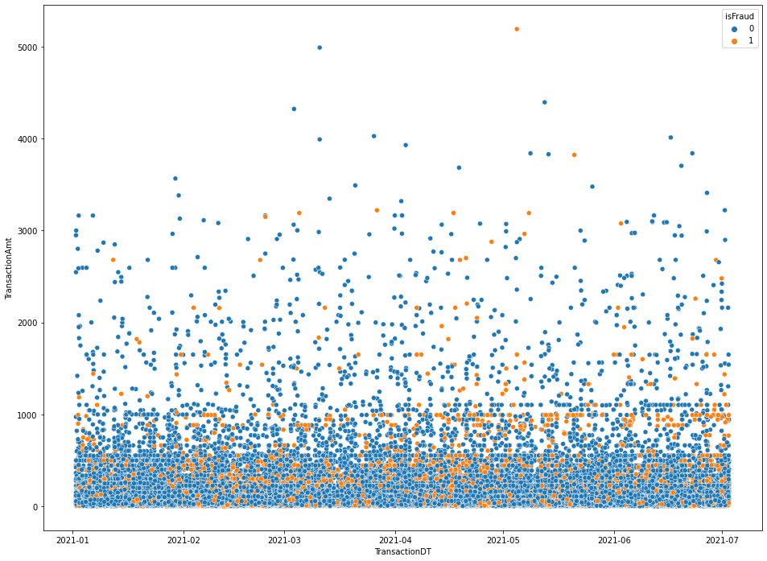
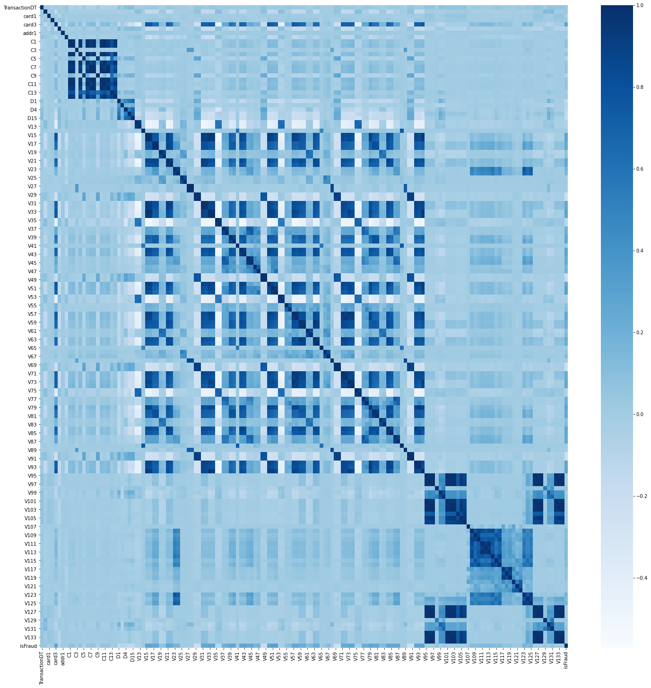
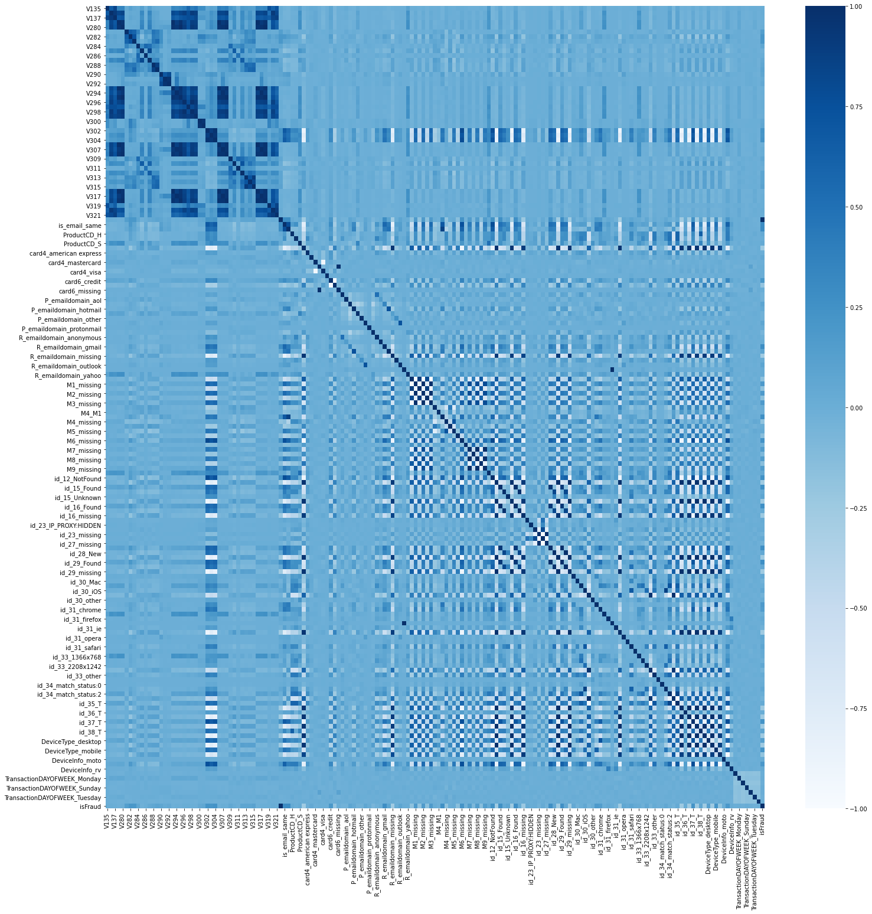
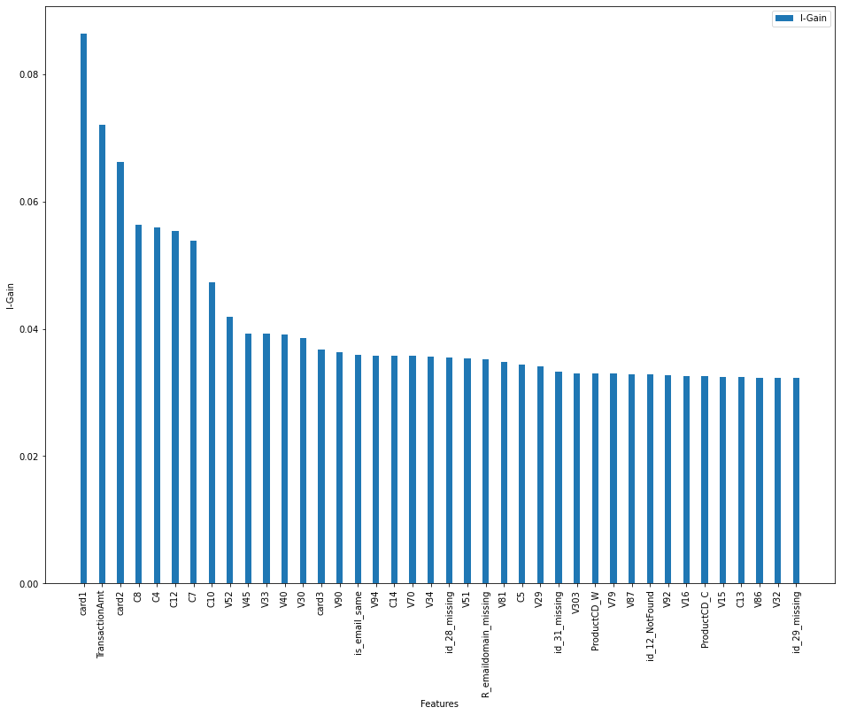
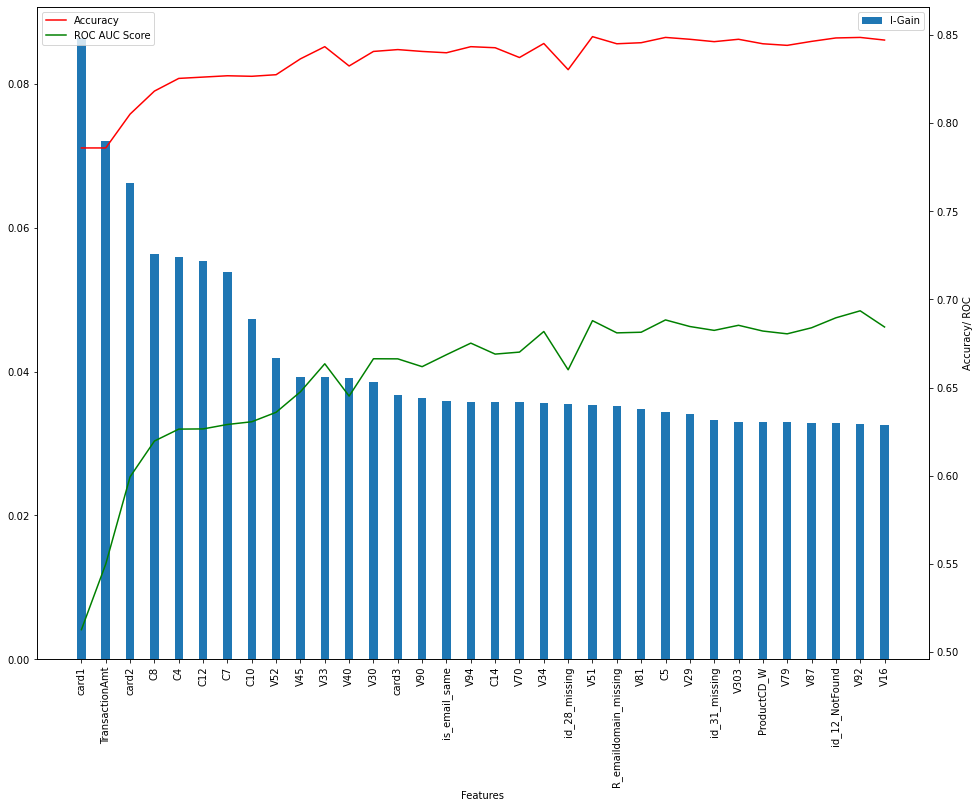
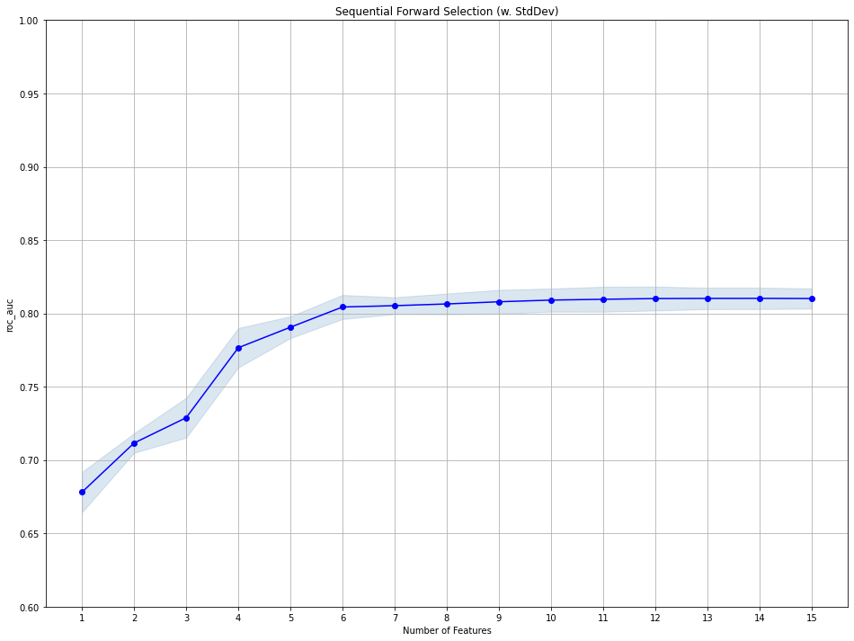
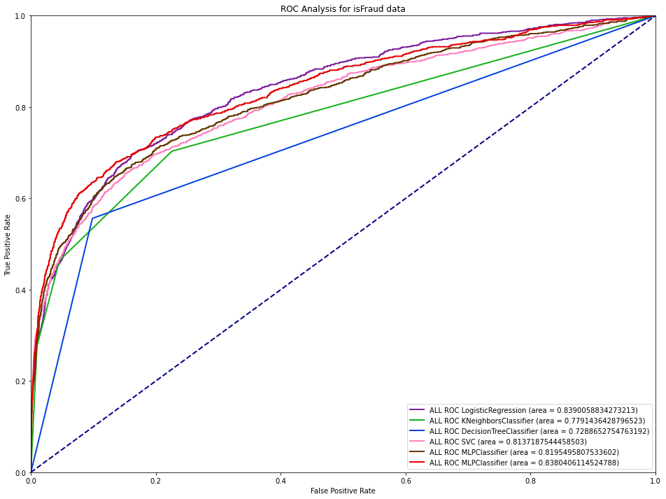

from https://www.kaggle.com/c/ieee-fraud-detection 

Transaction Table *

* TransactionDT: timedelta from a given reference datetime (not an actual timestamp)
* TransactionAMT: transaction payment amount in USD
* ProductCD: product code, the product for each transaction
* card1 - card6: payment card information, such as card type, card category, issue bank, country, etc.
* addr: address
* dist: distance
* P_ and (R__) emaildomain: purchaser and recipient email domain
* C1-C14: counting, such as how many addresses are found to be associated with the payment card, etc. The actual meaning is masked.
* D1-D15: timedelta, such as days between previous transaction, etc.
* M1-M9: match, such as names on card and address, etc.
* Vxxx: Vesta engineered rich features, including ranking, counting, and other entity relations.

Categorical Features:

* ProductCD
* card1 - card6
* addr1, addr2
* P_emaildomain
* R_emaildomain
* M1 - M9

Identity Table *

Variables in this table are identity information – network connection information (IP, ISP, Proxy, etc) and digital signature (UA/browser/os/version, etc) associated with transactions.
They're collected by Vesta’s fraud protection system and digital security partners.
(The field names are masked and pairwise dictionary will not be provided for privacy protection and contract agreement)

* Categorical Features:
* DeviceType
* DeviceInfo
* id_12 - id_38


```python
from IPython.core.display import display, HTML
display(HTML("<style>.container { width:100% !important; }</style>"))
import pandas as pd
import numpy as np
import gc
import re
from collections import defaultdict
import matplotlib.pyplot as plt
import seaborn as sns
import matplotlib.ticker as mticker
import matplotlib.colors as mcolors
%matplotlib inline

from sklearn.preprocessing import StandardScaler, OneHotEncoder, RobustScaler
from sklearn.model_selection import train_test_split
from sklearn.impute import SimpleImputer, KNNImputer
from sklearn.naive_bayes import MultinomialNB, GaussianNB, BernoulliNB
from sklearn.naive_bayes import CategoricalNB
from sklearn.metrics import confusion_matrix, accuracy_score
from sklearn.svm import OneClassSVM
from sklearn.svm import SVC
from sklearn.neighbors import KNeighborsClassifier
from sklearn.model_selection import cross_val_score
from sklearn.tree import DecisionTreeClassifier
from sklearn.metrics import classification_report, roc_auc_score
from sklearn.metrics import roc_curve, auc
from sklearn.feature_selection import SelectKBest, chi2, mutual_info_classif
from mlxtend.feature_selection import SequentialFeatureSelector 
from sklearn.feature_selection import SelectFromModel
from sklearn.linear_model import LogisticRegression
from sklearn.neural_network import MLPClassifier 
plt.rcParams['figure.figsize'] = (16,12)
skip_start = False
speed = False
import sklearn
print('The scikit-learn version is {}.'.format(sklearn.__version__))
```


<style>.container { width:100% !important; }</style>


    The scikit-learn version is 0.24.2.


```python
if not skip_start:
    train_identity = pd.read_csv('data/ieee-fraud-detection/train_identity.csv')
    train_transaction = pd.read_csv('data/ieee-fraud-detection/train_transaction.csv')
```


```python
if not skip_start:
    train = pd.merge(train_transaction, train_identity, on='TransactionID', how='left')
    print("missing:", dict(train.isna().mean()))
#     train = train.drop(columns=[x for x in train.columns if x.startswith("V")])
    train.shape
```

    missing: {'TransactionID': 0.0, 'isFraud': 0.0, 'TransactionDT': 0.0, 'TransactionAmt': 0.0, 'ProductCD': 0.0, 'card1': 0.0, 'card2': 0.015126833068039422, 'card3': 0.0026501168422122124, 'card4': 0.00267043722694483, 'card5': 0.007212043214684865, 'card6': 0.0026602770345785214, 'addr1': 0.1112642666034477, 'addr2': 0.1112642666034477, 'dist1': 0.596523520845328, 'dist2': 0.9362837403054831, 'P_emaildomain': 0.1599485216920107, 'R_emaildomain': 0.7675161716395164, 'C1': 0.0, 'C2': 0.0, 'C3': 0.0, 'C4': 0.0, 'C5': 0.0, 'C6': 0.0, 'C7': 0.0, 'C8': 0.0, 'C9': 0.0, 'C10': 0.0, 'C11': 0.0, 'C12': 0.0, 'C13': 0.0, 'C14': 0.0, 'D1': 0.0021488806854743116, 'D2': 0.4754919226470688, 'D3': 0.44514850814508755, 'D4': 0.2860466691502693, 'D5': 0.524674027161581, 'D6': 0.8760676668811597, 'D7': 0.9340992989467267, 'D8': 0.8731229044603245, 'D9': 0.8731229044603245, 'D10': 0.1287330240119213, 'D11': 0.47293494090154775, 'D12': 0.8904104717715988, 'D13': 0.8950926270870728, 'D14': 0.8946946862193924, 'D15': 0.1509008703898127, 'M1': 0.4590713584177194, 'M2': 0.4590713584177194, 'M3': 0.4590713584177194, 'M4': 0.47658753005723575, 'M5': 0.5934940901547736, 'M6': 0.28678836319300977, 'M7': 0.5863531682866528, 'M8': 0.5863311545365258, 'M9': 0.5863311545365258, 'V1': 0.47293494090154775, 'V2': 0.47293494090154775, 'V3': 0.47293494090154775, 'V4': 0.47293494090154775, 'V5': 0.47293494090154775, 'V6': 0.47293494090154775, 'V7': 0.47293494090154775, 'V8': 0.47293494090154775, 'V9': 0.47293494090154775, 'V10': 0.47293494090154775, 'V11': 0.47293494090154775, 'V12': 0.1288193856470349, 'V13': 0.1288193856470349, 'V14': 0.1288193856470349, 'V15': 0.1288193856470349, 'V16': 0.1288193856470349, 'V17': 0.1288193856470349, 'V18': 0.1288193856470349, 'V19': 0.1288193856470349, 'V20': 0.1288193856470349, 'V21': 0.1288193856470349, 'V22': 0.1288193856470349, 'V23': 0.1288193856470349, 'V24': 0.1288193856470349, 'V25': 0.1288193856470349, 'V26': 0.1288193856470349, 'V27': 0.1288193856470349, 'V28': 0.1288193856470349, 'V29': 0.1288193856470349, 'V30': 0.1288193856470349, 'V31': 0.1288193856470349, 'V32': 0.1288193856470349, 'V33': 0.1288193856470349, 'V34': 0.1288193856470349, 'V35': 0.2861262573238053, 'V36': 0.2861262573238053, 'V37': 0.2861262573238053, 'V38': 0.2861262573238053, 'V39': 0.2861262573238053, 'V40': 0.2861262573238053, 'V41': 0.2861262573238053, 'V42': 0.2861262573238053, 'V43': 0.2861262573238053, 'V44': 0.2861262573238053, 'V45': 0.2861262573238053, 'V46': 0.2861262573238053, 'V47': 0.2861262573238053, 'V48': 0.2861262573238053, 'V49': 0.2861262573238053, 'V50': 0.2861262573238053, 'V51': 0.2861262573238053, 'V52': 0.2861262573238053, 'V53': 0.13055169844549055, 'V54': 0.13055169844549055, 'V55': 0.13055169844549055, 'V56': 0.13055169844549055, 'V57': 0.13055169844549055, 'V58': 0.13055169844549055, 'V59': 0.13055169844549055, 'V60': 0.13055169844549055, 'V61': 0.13055169844549055, 'V62': 0.13055169844549055, 'V63': 0.13055169844549055, 'V64': 0.13055169844549055, 'V65': 0.13055169844549055, 'V66': 0.13055169844549055, 'V67': 0.13055169844549055, 'V68': 0.13055169844549055, 'V69': 0.13055169844549055, 'V70': 0.13055169844549055, 'V71': 0.13055169844549055, 'V72': 0.13055169844549055, 'V73': 0.13055169844549055, 'V74': 0.13055169844549055, 'V75': 0.15098723202492634, 'V76': 0.15098723202492634, 'V77': 0.15098723202492634, 'V78': 0.15098723202492634, 'V79': 0.15098723202492634, 'V80': 0.15098723202492634, 'V81': 0.15098723202492634, 'V82': 0.15098723202492634, 'V83': 0.15098723202492634, 'V84': 0.15098723202492634, 'V85': 0.15098723202492634, 'V86': 0.15098723202492634, 'V87': 0.15098723202492634, 'V88': 0.15098723202492634, 'V89': 0.15098723202492634, 'V90': 0.15098723202492634, 'V91': 0.15098723202492634, 'V92': 0.15098723202492634, 'V93': 0.15098723202492634, 'V94': 0.15098723202492634, 'V95': 0.0005317167338368274, 'V96': 0.0005317167338368274, 'V97': 0.0005317167338368274, 'V98': 0.0005317167338368274, 'V99': 0.0005317167338368274, 'V100': 0.0005317167338368274, 'V101': 0.0005317167338368274, 'V102': 0.0005317167338368274, 'V103': 0.0005317167338368274, 'V104': 0.0005317167338368274, 'V105': 0.0005317167338368274, 'V106': 0.0005317167338368274, 'V107': 0.0005317167338368274, 'V108': 0.0005317167338368274, 'V109': 0.0005317167338368274, 'V110': 0.0005317167338368274, 'V111': 0.0005317167338368274, 'V112': 0.0005317167338368274, 'V113': 0.0005317167338368274, 'V114': 0.0005317167338368274, 'V115': 0.0005317167338368274, 'V116': 0.0005317167338368274, 'V117': 0.0005317167338368274, 'V118': 0.0005317167338368274, 'V119': 0.0005317167338368274, 'V120': 0.0005317167338368274, 'V121': 0.0005317167338368274, 'V122': 0.0005317167338368274, 'V123': 0.0005317167338368274, 'V124': 0.0005317167338368274, 'V125': 0.0005317167338368274, 'V126': 0.0005317167338368274, 'V127': 0.0005317167338368274, 'V128': 0.0005317167338368274, 'V129': 0.0005317167338368274, 'V130': 0.0005317167338368274, 'V131': 0.0005317167338368274, 'V132': 0.0005317167338368274, 'V133': 0.0005317167338368274, 'V134': 0.0005317167338368274, 'V135': 0.0005317167338368274, 'V136': 0.0005317167338368274, 'V137': 0.0005317167338368274, 'V138': 0.8612371727571375, 'V139': 0.8612371727571375, 'V140': 0.8612371727571375, 'V141': 0.8612371727571375, 'V142': 0.8612371727571375, 'V143': 0.8612270125647712, 'V144': 0.8612270125647712, 'V145': 0.8612270125647712, 'V146': 0.8612371727571375, 'V147': 0.8612371727571375, 'V148': 0.8612371727571375, 'V149': 0.8612371727571375, 'V150': 0.8612270125647712, 'V151': 0.8612270125647712, 'V152': 0.8612270125647712, 'V153': 0.8612371727571375, 'V154': 0.8612371727571375, 'V155': 0.8612371727571375, 'V156': 0.8612371727571375, 'V157': 0.8612371727571375, 'V158': 0.8612371727571375, 'V159': 0.8612270125647712, 'V160': 0.8612270125647712, 'V161': 0.8612371727571375, 'V162': 0.8612371727571375, 'V163': 0.8612371727571375, 'V164': 0.8612270125647712, 'V165': 0.8612270125647712, 'V166': 0.8612270125647712, 'V167': 0.763553696616656, 'V168': 0.763553696616656, 'V169': 0.7632353439225116, 'V170': 0.7632353439225116, 'V171': 0.7632353439225116, 'V172': 0.763553696616656, 'V173': 0.763553696616656, 'V174': 0.7632353439225116, 'V175': 0.7632353439225116, 'V176': 0.763553696616656, 'V177': 0.763553696616656, 'V178': 0.763553696616656, 'V179': 0.763553696616656, 'V180': 0.7632353439225116, 'V181': 0.763553696616656, 'V182': 0.763553696616656, 'V183': 0.763553696616656, 'V184': 0.7632353439225116, 'V185': 0.7632353439225116, 'V186': 0.763553696616656, 'V187': 0.763553696616656, 'V188': 0.7632353439225116, 'V189': 0.7632353439225116, 'V190': 0.763553696616656, 'V191': 0.763553696616656, 'V192': 0.763553696616656, 'V193': 0.763553696616656, 'V194': 0.7632353439225116, 'V195': 0.7632353439225116, 'V196': 0.763553696616656, 'V197': 0.7632353439225116, 'V198': 0.7632353439225116, 'V199': 0.763553696616656, 'V200': 0.7632353439225116, 'V201': 0.7632353439225116, 'V202': 0.763553696616656, 'V203': 0.763553696616656, 'V204': 0.763553696616656, 'V205': 0.763553696616656, 'V206': 0.763553696616656, 'V207': 0.763553696616656, 'V208': 0.7632353439225116, 'V209': 0.7632353439225116, 'V210': 0.7632353439225116, 'V211': 0.763553696616656, 'V212': 0.763553696616656, 'V213': 0.763553696616656, 'V214': 0.763553696616656, 'V215': 0.763553696616656, 'V216': 0.763553696616656, 'V217': 0.7791343516103905, 'V218': 0.7791343516103905, 'V219': 0.7791343516103905, 'V220': 0.7605310393876791, 'V221': 0.7605310393876791, 'V222': 0.7605310393876791, 'V223': 0.7791343516103905, 'V224': 0.7791343516103905, 'V225': 0.7791343516103905, 'V226': 0.7791343516103905, 'V227': 0.7605310393876791, 'V228': 0.7791343516103905, 'V229': 0.7791343516103905, 'V230': 0.7791343516103905, 'V231': 0.7791343516103905, 'V232': 0.7791343516103905, 'V233': 0.7791343516103905, 'V234': 0.7605310393876791, 'V235': 0.7791343516103905, 'V236': 0.7791343516103905, 'V237': 0.7791343516103905, 'V238': 0.7605310393876791, 'V239': 0.7605310393876791, 'V240': 0.7791343516103905, 'V241': 0.7791343516103905, 'V242': 0.7791343516103905, 'V243': 0.7791343516103905, 'V244': 0.7791343516103905, 'V245': 0.7605310393876791, 'V246': 0.7791343516103905, 'V247': 0.7791343516103905, 'V248': 0.7791343516103905, 'V249': 0.7791343516103905, 'V250': 0.7605310393876791, 'V251': 0.7605310393876791, 'V252': 0.7791343516103905, 'V253': 0.7791343516103905, 'V254': 0.7791343516103905, 'V255': 0.7605310393876791, 'V256': 0.7605310393876791, 'V257': 0.7791343516103905, 'V258': 0.7791343516103905, 'V259': 0.7605310393876791, 'V260': 0.7791343516103905, 'V261': 0.7791343516103905, 'V262': 0.7791343516103905, 'V263': 0.7791343516103905, 'V264': 0.7791343516103905, 'V265': 0.7791343516103905, 'V266': 0.7791343516103905, 'V267': 0.7791343516103905, 'V268': 0.7791343516103905, 'V269': 0.7791343516103905, 'V270': 0.7605310393876791, 'V271': 0.7605310393876791, 'V272': 0.7605310393876791, 'V273': 0.7791343516103905, 'V274': 0.7791343516103905, 'V275': 0.7791343516103905, 'V276': 0.7791343516103905, 'V277': 0.7791343516103905, 'V278': 0.7791343516103905, 'V279': 2.0320384732617603e-05, 'V280': 2.0320384732617603e-05, 'V281': 0.0021488806854743116, 'V282': 0.0021488806854743116, 'V283': 0.0021488806854743116, 'V284': 2.0320384732617603e-05, 'V285': 2.0320384732617603e-05, 'V286': 2.0320384732617603e-05, 'V287': 2.0320384732617603e-05, 'V288': 0.0021488806854743116, 'V289': 0.0021488806854743116, 'V290': 2.0320384732617603e-05, 'V291': 2.0320384732617603e-05, 'V292': 2.0320384732617603e-05, 'V293': 2.0320384732617603e-05, 'V294': 2.0320384732617603e-05, 'V295': 2.0320384732617603e-05, 'V296': 0.0021488806854743116, 'V297': 2.0320384732617603e-05, 'V298': 2.0320384732617603e-05, 'V299': 2.0320384732617603e-05, 'V300': 0.0021488806854743116, 'V301': 0.0021488806854743116, 'V302': 2.0320384732617603e-05, 'V303': 2.0320384732617603e-05, 'V304': 2.0320384732617603e-05, 'V305': 2.0320384732617603e-05, 'V306': 2.0320384732617603e-05, 'V307': 2.0320384732617603e-05, 'V308': 2.0320384732617603e-05, 'V309': 2.0320384732617603e-05, 'V310': 2.0320384732617603e-05, 'V311': 2.0320384732617603e-05, 'V312': 2.0320384732617603e-05, 'V313': 0.0021488806854743116, 'V314': 0.0021488806854743116, 'V315': 0.0021488806854743116, 'V316': 2.0320384732617603e-05, 'V317': 2.0320384732617603e-05, 'V318': 2.0320384732617603e-05, 'V319': 2.0320384732617603e-05, 'V320': 2.0320384732617603e-05, 'V321': 2.0320384732617603e-05, 'V322': 0.8605496664070174, 'V323': 0.8605496664070174, 'V324': 0.8605496664070174, 'V325': 0.8605496664070174, 'V326': 0.8605496664070174, 'V327': 0.8605496664070174, 'V328': 0.8605496664070174, 'V329': 0.8605496664070174, 'V330': 0.8605496664070174, 'V331': 0.8605496664070174, 'V332': 0.8605496664070174, 'V333': 0.8605496664070174, 'V334': 0.8605496664070174, 'V335': 0.8605496664070174, 'V336': 0.8605496664070174, 'V337': 0.8605496664070174, 'V338': 0.8605496664070174, 'V339': 0.8605496664070174, 'id_01': 0.7557608290716971, 'id_02': 0.7614522301622244, 'id_03': 0.8876892335828225, 'id_04': 0.8876892335828225, 'id_05': 0.7682375452975243, 'id_06': 0.7682375452975243, 'id_07': 0.9912707013919464, 'id_08': 0.9912707013919464, 'id_09': 0.8731229044603245, 'id_10': 0.8731229044603245, 'id_11': 0.7612727334304196, 'id_12': 0.7557608290716971, 'id_13': 0.7844007179869272, 'id_14': 0.8644562603718631, 'id_15': 0.7612608798726589, 'id_16': 0.7809801198902699, 'id_17': 0.7639973583499847, 'id_18': 0.9236072069631185, 'id_19': 0.7640837199850984, 'id_20': 0.7641802418125783, 'id_21': 0.9912639279303688, 'id_22': 0.9912469942764249, 'id_23': 0.9912469942764249, 'id_24': 0.9919615944728554, 'id_25': 0.9913096487960172, 'id_26': 0.9912571544687913, 'id_27': 0.9912469942764249, 'id_28': 0.7612727334304196, 'id_29': 0.7612727334304196, 'id_30': 0.868654113184543, 'id_31': 0.7624513157449114, 'id_32': 0.8686185525112609, 'id_33': 0.8758949436109323, 'id_34': 0.8682477054898906, 'id_35': 0.7612608798726589, 'id_36': 0.7612608798726589, 'id_37': 0.7612608798726589, 'id_38': 0.7612608798726589, 'DeviceType': 0.7615572188166763, 'DeviceInfo': 0.7990551021099332}


```python
if not skip_start:
    del train_identity, train_transaction
    gc.collect()

```


```python
if not skip_start:
    # move isFraud to end
    isFraud = train['isFraud']
    train.drop(labels=['isFraud'], axis=1, inplace = True)
    train['isFraud'] = isFraud
    del isFraud

    # print amount of each
    frauds = train.shape[0]
    yes = train['isFraud'].sum()
    no = frauds - yes
    print('{} frauds\n'.format(frauds))
    print('{} yes \n{} no\n'.format(yes,no))
```

    590540 frauds
    
    20663 yes 
    569877 no
    


```python
if not skip_start:
    print(list(train.columns))

```

    ['TransactionID', 'TransactionDT', 'TransactionAmt', 'ProductCD', 'card1', 'card2', 'card3', 'card4', 'card5', 'card6', 'addr1', 'addr2', 'dist1', 'dist2', 'P_emaildomain', 'R_emaildomain', 'C1', 'C2', 'C3', 'C4', 'C5', 'C6', 'C7', 'C8', 'C9', 'C10', 'C11', 'C12', 'C13', 'C14', 'D1', 'D2', 'D3', 'D4', 'D5', 'D6', 'D7', 'D8', 'D9', 'D10', 'D11', 'D12', 'D13', 'D14', 'D15', 'M1', 'M2', 'M3', 'M4', 'M5', 'M6', 'M7', 'M8', 'M9', 'V1', 'V2', 'V3', 'V4', 'V5', 'V6', 'V7', 'V8', 'V9', 'V10', 'V11', 'V12', 'V13', 'V14', 'V15', 'V16', 'V17', 'V18', 'V19', 'V20', 'V21', 'V22', 'V23', 'V24', 'V25', 'V26', 'V27', 'V28', 'V29', 'V30', 'V31', 'V32', 'V33', 'V34', 'V35', 'V36', 'V37', 'V38', 'V39', 'V40', 'V41', 'V42', 'V43', 'V44', 'V45', 'V46', 'V47', 'V48', 'V49', 'V50', 'V51', 'V52', 'V53', 'V54', 'V55', 'V56', 'V57', 'V58', 'V59', 'V60', 'V61', 'V62', 'V63', 'V64', 'V65', 'V66', 'V67', 'V68', 'V69', 'V70', 'V71', 'V72', 'V73', 'V74', 'V75', 'V76', 'V77', 'V78', 'V79', 'V80', 'V81', 'V82', 'V83', 'V84', 'V85', 'V86', 'V87', 'V88', 'V89', 'V90', 'V91', 'V92', 'V93', 'V94', 'V95', 'V96', 'V97', 'V98', 'V99', 'V100', 'V101', 'V102', 'V103', 'V104', 'V105', 'V106', 'V107', 'V108', 'V109', 'V110', 'V111', 'V112', 'V113', 'V114', 'V115', 'V116', 'V117', 'V118', 'V119', 'V120', 'V121', 'V122', 'V123', 'V124', 'V125', 'V126', 'V127', 'V128', 'V129', 'V130', 'V131', 'V132', 'V133', 'V134', 'V135', 'V136', 'V137', 'V138', 'V139', 'V140', 'V141', 'V142', 'V143', 'V144', 'V145', 'V146', 'V147', 'V148', 'V149', 'V150', 'V151', 'V152', 'V153', 'V154', 'V155', 'V156', 'V157', 'V158', 'V159', 'V160', 'V161', 'V162', 'V163', 'V164', 'V165', 'V166', 'V167', 'V168', 'V169', 'V170', 'V171', 'V172', 'V173', 'V174', 'V175', 'V176', 'V177', 'V178', 'V179', 'V180', 'V181', 'V182', 'V183', 'V184', 'V185', 'V186', 'V187', 'V188', 'V189', 'V190', 'V191', 'V192', 'V193', 'V194', 'V195', 'V196', 'V197', 'V198', 'V199', 'V200', 'V201', 'V202', 'V203', 'V204', 'V205', 'V206', 'V207', 'V208', 'V209', 'V210', 'V211', 'V212', 'V213', 'V214', 'V215', 'V216', 'V217', 'V218', 'V219', 'V220', 'V221', 'V222', 'V223', 'V224', 'V225', 'V226', 'V227', 'V228', 'V229', 'V230', 'V231', 'V232', 'V233', 'V234', 'V235', 'V236', 'V237', 'V238', 'V239', 'V240', 'V241', 'V242', 'V243', 'V244', 'V245', 'V246', 'V247', 'V248', 'V249', 'V250', 'V251', 'V252', 'V253', 'V254', 'V255', 'V256', 'V257', 'V258', 'V259', 'V260', 'V261', 'V262', 'V263', 'V264', 'V265', 'V266', 'V267', 'V268', 'V269', 'V270', 'V271', 'V272', 'V273', 'V274', 'V275', 'V276', 'V277', 'V278', 'V279', 'V280', 'V281', 'V282', 'V283', 'V284', 'V285', 'V286', 'V287', 'V288', 'V289', 'V290', 'V291', 'V292', 'V293', 'V294', 'V295', 'V296', 'V297', 'V298', 'V299', 'V300', 'V301', 'V302', 'V303', 'V304', 'V305', 'V306', 'V307', 'V308', 'V309', 'V310', 'V311', 'V312', 'V313', 'V314', 'V315', 'V316', 'V317', 'V318', 'V319', 'V320', 'V321', 'V322', 'V323', 'V324', 'V325', 'V326', 'V327', 'V328', 'V329', 'V330', 'V331', 'V332', 'V333', 'V334', 'V335', 'V336', 'V337', 'V338', 'V339', 'id_01', 'id_02', 'id_03', 'id_04', 'id_05', 'id_06', 'id_07', 'id_08', 'id_09', 'id_10', 'id_11', 'id_12', 'id_13', 'id_14', 'id_15', 'id_16', 'id_17', 'id_18', 'id_19', 'id_20', 'id_21', 'id_22', 'id_23', 'id_24', 'id_25', 'id_26', 'id_27', 'id_28', 'id_29', 'id_30', 'id_31', 'id_32', 'id_33', 'id_34', 'id_35', 'id_36', 'id_37', 'id_38', 'DeviceType', 'DeviceInfo', 'isFraud']


```python
if not skip_start:
    total_is_fraud = train[train["isFraud"] == 1]["isFraud"].value_counts()[1]
    train = train[train["isFraud"] == 1].append(train[train["isFraud"] == 0].sample(total_is_fraud + 80000))
    train
```


```python
if not skip_start:
    train[train["isFraud"] == 1]["isFraud"].value_counts()[1]
```


```python
if not skip_start:
    train.to_pickle("train.pkl")
```


```python
if skip_start:
    train = pd.read_pickle("train.pkl")
if speed:
    train = train.sample(n=20000)
```

# First thing is first: Hold Out Validation

test part needs to be separate


```python
y = train['isFraud']   #target classes
X = train.drop('isFraud', axis=1)
X_train, X_test, y_train, y_test = train_test_split(X, y, random_state=0, test_size=1/3)
print("X_train shape: ",X_train.shape)
print("X_test shape: ",X_test.shape)
print("y_train.value_counts: ",y_train.value_counts())
print("y_test.value_counts: ",y_test.value_counts())
```

    X_train shape:  (80884, 433)
    X_test shape:  (40442, 433)
    y_train.value_counts:  0    67125
    1    13759
    Name: isFraud, dtype: int64
    y_test.value_counts:  0    33538
    1     6904
    Name: isFraud, dtype: int64


```python
train  = pd.concat([X_train,y_train], axis=1)
test = pd.concat([X_test,y_test], axis=1)
```


```python
del X
del y
gc.collect()
```


    20


```python
print(train.columns)
print(test.columns)
```

    Index(['TransactionID', 'TransactionDT', 'TransactionAmt', 'ProductCD',
           'card1', 'card2', 'card3', 'card4', 'card5', 'card6',
           ...
           'id_32', 'id_33', 'id_34', 'id_35', 'id_36', 'id_37', 'id_38',
           'DeviceType', 'DeviceInfo', 'isFraud'],
          dtype='object', length=434)
    Index(['TransactionID', 'TransactionDT', 'TransactionAmt', 'ProductCD',
           'card1', 'card2', 'card3', 'card4', 'card5', 'card6',
           ...
           'id_32', 'id_33', 'id_34', 'id_35', 'id_36', 'id_37', 'id_38',
           'DeviceType', 'DeviceInfo', 'isFraud'],
          dtype='object', length=434)


```python
print(train.shape)
print(test.shape)
```

    (80884, 434)
    (40442, 434)


```python

```


```python
train.describe(include = 'all')
```


<div>
<style scoped>
    .dataframe tbody tr th:only-of-type {
        vertical-align: middle;
    }

    .dataframe tbody tr th {
        vertical-align: top;
    }

    .dataframe thead th {
        text-align: right;
    }
</style>
<table border="1" class="dataframe">
  <thead>
    <tr style="text-align: right;">
      <th></th>
      <th>TransactionID</th>
      <th>TransactionDT</th>
      <th>TransactionAmt</th>
      <th>ProductCD</th>
      <th>card1</th>
      <th>card2</th>
      <th>card3</th>
      <th>card4</th>
      <th>card5</th>
      <th>card6</th>
      <th>...</th>
      <th>id_32</th>
      <th>id_33</th>
      <th>id_34</th>
      <th>id_35</th>
      <th>id_36</th>
      <th>id_37</th>
      <th>id_38</th>
      <th>DeviceType</th>
      <th>DeviceInfo</th>
      <th>isFraud</th>
    </tr>
  </thead>
  <tbody>
    <tr>
      <th>count</th>
      <td>8.088400e+04</td>
      <td>8.088400e+04</td>
      <td>80884.000000</td>
      <td>80884</td>
      <td>80884.000000</td>
      <td>79550.000000</td>
      <td>80661.000000</td>
      <td>80656</td>
      <td>80242.000000</td>
      <td>80659</td>
      <td>...</td>
      <td>11145.000000</td>
      <td>10615</td>
      <td>11185</td>
      <td>22791</td>
      <td>22791</td>
      <td>22791</td>
      <td>22791</td>
      <td>22774</td>
      <td>18791</td>
      <td>80884.000000</td>
    </tr>
    <tr>
      <th>unique</th>
      <td>NaN</td>
      <td>NaN</td>
      <td>NaN</td>
      <td>5</td>
      <td>NaN</td>
      <td>NaN</td>
      <td>NaN</td>
      <td>4</td>
      <td>NaN</td>
      <td>4</td>
      <td>...</td>
      <td>NaN</td>
      <td>138</td>
      <td>4</td>
      <td>2</td>
      <td>2</td>
      <td>2</td>
      <td>2</td>
      <td>2</td>
      <td>947</td>
      <td>NaN</td>
    </tr>
    <tr>
      <th>top</th>
      <td>NaN</td>
      <td>NaN</td>
      <td>NaN</td>
      <td>W</td>
      <td>NaN</td>
      <td>NaN</td>
      <td>NaN</td>
      <td>visa</td>
      <td>NaN</td>
      <td>debit</td>
      <td>...</td>
      <td>NaN</td>
      <td>1920x1080</td>
      <td>match_status:2</td>
      <td>F</td>
      <td>F</td>
      <td>T</td>
      <td>F</td>
      <td>desktop</td>
      <td>Windows</td>
      <td>NaN</td>
    </tr>
    <tr>
      <th>freq</th>
      <td>NaN</td>
      <td>NaN</td>
      <td>NaN</td>
      <td>56682</td>
      <td>NaN</td>
      <td>NaN</td>
      <td>NaN</td>
      <td>52546</td>
      <td>NaN</td>
      <td>57622</td>
      <td>...</td>
      <td>NaN</td>
      <td>2237</td>
      <td>8385</td>
      <td>11606</td>
      <td>21862</td>
      <td>18077</td>
      <td>12687</td>
      <td>13003</td>
      <td>7350</td>
      <td>NaN</td>
    </tr>
    <tr>
      <th>mean</th>
      <td>3.283659e+06</td>
      <td>7.406617e+06</td>
      <td>138.707996</td>
      <td>NaN</td>
      <td>9859.218152</td>
      <td>362.015563</td>
      <td>154.453367</td>
      <td>NaN</td>
      <td>198.071210</td>
      <td>NaN</td>
      <td>...</td>
      <td>26.785823</td>
      <td>NaN</td>
      <td>NaN</td>
      <td>NaN</td>
      <td>NaN</td>
      <td>NaN</td>
      <td>NaN</td>
      <td>NaN</td>
      <td>NaN</td>
      <td>0.170108</td>
    </tr>
    <tr>
      <th>std</th>
      <td>1.694703e+05</td>
      <td>4.593188e+06</td>
      <td>261.822574</td>
      <td>NaN</td>
      <td>4887.571506</td>
      <td>158.410625</td>
      <td>12.751237</td>
      <td>NaN</td>
      <td>42.096549</td>
      <td>NaN</td>
      <td>...</td>
      <td>3.860844</td>
      <td>NaN</td>
      <td>NaN</td>
      <td>NaN</td>
      <td>NaN</td>
      <td>NaN</td>
      <td>NaN</td>
      <td>NaN</td>
      <td>NaN</td>
      <td>0.375730</td>
    </tr>
    <tr>
      <th>min</th>
      <td>2.987002e+06</td>
      <td>8.646900e+04</td>
      <td>0.292000</td>
      <td>NaN</td>
      <td>1001.000000</td>
      <td>100.000000</td>
      <td>100.000000</td>
      <td>NaN</td>
      <td>100.000000</td>
      <td>NaN</td>
      <td>...</td>
      <td>0.000000</td>
      <td>NaN</td>
      <td>NaN</td>
      <td>NaN</td>
      <td>NaN</td>
      <td>NaN</td>
      <td>NaN</td>
      <td>NaN</td>
      <td>NaN</td>
      <td>0.000000</td>
    </tr>
    <tr>
      <th>25%</th>
      <td>3.139250e+06</td>
      <td>3.160230e+06</td>
      <td>41.069000</td>
      <td>NaN</td>
      <td>6019.000000</td>
      <td>206.000000</td>
      <td>150.000000</td>
      <td>NaN</td>
      <td>166.000000</td>
      <td>NaN</td>
      <td>...</td>
      <td>24.000000</td>
      <td>NaN</td>
      <td>NaN</td>
      <td>NaN</td>
      <td>NaN</td>
      <td>NaN</td>
      <td>NaN</td>
      <td>NaN</td>
      <td>NaN</td>
      <td>0.000000</td>
    </tr>
    <tr>
      <th>50%</th>
      <td>3.282736e+06</td>
      <td>7.315136e+06</td>
      <td>71.950000</td>
      <td>NaN</td>
      <td>9633.000000</td>
      <td>361.000000</td>
      <td>150.000000</td>
      <td>NaN</td>
      <td>224.000000</td>
      <td>NaN</td>
      <td>...</td>
      <td>24.000000</td>
      <td>NaN</td>
      <td>NaN</td>
      <td>NaN</td>
      <td>NaN</td>
      <td>NaN</td>
      <td>NaN</td>
      <td>NaN</td>
      <td>NaN</td>
      <td>0.000000</td>
    </tr>
    <tr>
      <th>75%</th>
      <td>3.430062e+06</td>
      <td>1.127200e+07</td>
      <td>135.500000</td>
      <td>NaN</td>
      <td>14105.500000</td>
      <td>512.000000</td>
      <td>150.000000</td>
      <td>NaN</td>
      <td>226.000000</td>
      <td>NaN</td>
      <td>...</td>
      <td>32.000000</td>
      <td>NaN</td>
      <td>NaN</td>
      <td>NaN</td>
      <td>NaN</td>
      <td>NaN</td>
      <td>NaN</td>
      <td>NaN</td>
      <td>NaN</td>
      <td>0.000000</td>
    </tr>
    <tr>
      <th>max</th>
      <td>3.577526e+06</td>
      <td>1.581088e+07</td>
      <td>31937.391000</td>
      <td>NaN</td>
      <td>18395.000000</td>
      <td>600.000000</td>
      <td>231.000000</td>
      <td>NaN</td>
      <td>237.000000</td>
      <td>NaN</td>
      <td>...</td>
      <td>32.000000</td>
      <td>NaN</td>
      <td>NaN</td>
      <td>NaN</td>
      <td>NaN</td>
      <td>NaN</td>
      <td>NaN</td>
      <td>NaN</td>
      <td>NaN</td>
      <td>1.000000</td>
    </tr>
  </tbody>
</table>
<p>11 rows × 434 columns</p>
</div>


## add new column for same emails


```python
train['is_email_same'] = train.apply(lambda x: x['P_emaildomain']== x['R_emaildomain'] and x['R_emaildomain'] != np.nan, axis=1)
```

# Start to prepare Train for finding best models

## Remove too many NaN on rows, not sure if I want to do this? 


```python
def drop_more_than_N_Nan(N): # of the 68 columns, only 15 allowed to be NaN
    print(train.shape)
    train.dropna(thresh=train.shape[1]-N, axis=0, inplace=True)
    print(train.shape)
    
# drop_more_than_N_Nan(15)
print(train.shape, list(train.columns))
```

    (80884, 435) ['TransactionID', 'TransactionDT', 'TransactionAmt', 'ProductCD', 'card1', 'card2', 'card3', 'card4', 'card5', 'card6', 'addr1', 'addr2', 'dist1', 'dist2', 'P_emaildomain', 'R_emaildomain', 'C1', 'C2', 'C3', 'C4', 'C5', 'C6', 'C7', 'C8', 'C9', 'C10', 'C11', 'C12', 'C13', 'C14', 'D1', 'D2', 'D3', 'D4', 'D5', 'D6', 'D7', 'D8', 'D9', 'D10', 'D11', 'D12', 'D13', 'D14', 'D15', 'M1', 'M2', 'M3', 'M4', 'M5', 'M6', 'M7', 'M8', 'M9', 'V1', 'V2', 'V3', 'V4', 'V5', 'V6', 'V7', 'V8', 'V9', 'V10', 'V11', 'V12', 'V13', 'V14', 'V15', 'V16', 'V17', 'V18', 'V19', 'V20', 'V21', 'V22', 'V23', 'V24', 'V25', 'V26', 'V27', 'V28', 'V29', 'V30', 'V31', 'V32', 'V33', 'V34', 'V35', 'V36', 'V37', 'V38', 'V39', 'V40', 'V41', 'V42', 'V43', 'V44', 'V45', 'V46', 'V47', 'V48', 'V49', 'V50', 'V51', 'V52', 'V53', 'V54', 'V55', 'V56', 'V57', 'V58', 'V59', 'V60', 'V61', 'V62', 'V63', 'V64', 'V65', 'V66', 'V67', 'V68', 'V69', 'V70', 'V71', 'V72', 'V73', 'V74', 'V75', 'V76', 'V77', 'V78', 'V79', 'V80', 'V81', 'V82', 'V83', 'V84', 'V85', 'V86', 'V87', 'V88', 'V89', 'V90', 'V91', 'V92', 'V93', 'V94', 'V95', 'V96', 'V97', 'V98', 'V99', 'V100', 'V101', 'V102', 'V103', 'V104', 'V105', 'V106', 'V107', 'V108', 'V109', 'V110', 'V111', 'V112', 'V113', 'V114', 'V115', 'V116', 'V117', 'V118', 'V119', 'V120', 'V121', 'V122', 'V123', 'V124', 'V125', 'V126', 'V127', 'V128', 'V129', 'V130', 'V131', 'V132', 'V133', 'V134', 'V135', 'V136', 'V137', 'V138', 'V139', 'V140', 'V141', 'V142', 'V143', 'V144', 'V145', 'V146', 'V147', 'V148', 'V149', 'V150', 'V151', 'V152', 'V153', 'V154', 'V155', 'V156', 'V157', 'V158', 'V159', 'V160', 'V161', 'V162', 'V163', 'V164', 'V165', 'V166', 'V167', 'V168', 'V169', 'V170', 'V171', 'V172', 'V173', 'V174', 'V175', 'V176', 'V177', 'V178', 'V179', 'V180', 'V181', 'V182', 'V183', 'V184', 'V185', 'V186', 'V187', 'V188', 'V189', 'V190', 'V191', 'V192', 'V193', 'V194', 'V195', 'V196', 'V197', 'V198', 'V199', 'V200', 'V201', 'V202', 'V203', 'V204', 'V205', 'V206', 'V207', 'V208', 'V209', 'V210', 'V211', 'V212', 'V213', 'V214', 'V215', 'V216', 'V217', 'V218', 'V219', 'V220', 'V221', 'V222', 'V223', 'V224', 'V225', 'V226', 'V227', 'V228', 'V229', 'V230', 'V231', 'V232', 'V233', 'V234', 'V235', 'V236', 'V237', 'V238', 'V239', 'V240', 'V241', 'V242', 'V243', 'V244', 'V245', 'V246', 'V247', 'V248', 'V249', 'V250', 'V251', 'V252', 'V253', 'V254', 'V255', 'V256', 'V257', 'V258', 'V259', 'V260', 'V261', 'V262', 'V263', 'V264', 'V265', 'V266', 'V267', 'V268', 'V269', 'V270', 'V271', 'V272', 'V273', 'V274', 'V275', 'V276', 'V277', 'V278', 'V279', 'V280', 'V281', 'V282', 'V283', 'V284', 'V285', 'V286', 'V287', 'V288', 'V289', 'V290', 'V291', 'V292', 'V293', 'V294', 'V295', 'V296', 'V297', 'V298', 'V299', 'V300', 'V301', 'V302', 'V303', 'V304', 'V305', 'V306', 'V307', 'V308', 'V309', 'V310', 'V311', 'V312', 'V313', 'V314', 'V315', 'V316', 'V317', 'V318', 'V319', 'V320', 'V321', 'V322', 'V323', 'V324', 'V325', 'V326', 'V327', 'V328', 'V329', 'V330', 'V331', 'V332', 'V333', 'V334', 'V335', 'V336', 'V337', 'V338', 'V339', 'id_01', 'id_02', 'id_03', 'id_04', 'id_05', 'id_06', 'id_07', 'id_08', 'id_09', 'id_10', 'id_11', 'id_12', 'id_13', 'id_14', 'id_15', 'id_16', 'id_17', 'id_18', 'id_19', 'id_20', 'id_21', 'id_22', 'id_23', 'id_24', 'id_25', 'id_26', 'id_27', 'id_28', 'id_29', 'id_30', 'id_31', 'id_32', 'id_33', 'id_34', 'id_35', 'id_36', 'id_37', 'id_38', 'DeviceType', 'DeviceInfo', 'isFraud', 'is_email_same']


### replace all nan in object columns with the value "missing"


```python
# imp = SimpleImputer(missing_values=np.nan, strategy='most_frequent')
imp = SimpleImputer(strategy='constant', fill_value='missing')
imp.fit(train[train.columns[train.dtypes == object]])
train[train.columns[train.dtypes == object]] = imp.transform(train[train.columns[train.dtypes == object]])
```


```python
train.set_index("TransactionID", inplace=True)
train.shape, train.columns
```


    ((80884, 434),
     Index(['TransactionDT', 'TransactionAmt', 'ProductCD', 'card1', 'card2',
            'card3', 'card4', 'card5', 'card6', 'addr1',
            ...
            'id_33', 'id_34', 'id_35', 'id_36', 'id_37', 'id_38', 'DeviceType',
            'DeviceInfo', 'isFraud', 'is_email_same'],
           dtype='object', length=434))


## convert TransactionDT to datetime


```python
import datetime as dt

start = dt.datetime(2021,1,1,0,0) # need a reference point use this for train and test
train["TransactionDAYOFWEEK"] = train["TransactionDT"].apply(lambda x: start + pd.Timedelta(seconds=x)).dt.day_name()
train["TransactionDAYOFWEEK"]
```


    TransactionID
    3547382       Monday
    3211545    Wednesday
    3115382     Saturday
    3059368      Tuesday
    3056177       Monday
                 ...    
    3287785     Saturday
    3075021       Friday
    3475051       Friday
    3498682       Friday
    3310174     Saturday
    Name: TransactionDAYOFWEEK, Length: 80884, dtype: object


## remove columns over 50% missing


```python
columns_dropped = []

def remove_columns(perc_limit):
    missing_perc = (train.isna().sum() / train.isna().count()).sort_values(ascending=False)
    print("remove_columns limit:", perc_limit)
    print("missing perc (first 40):", dict(missing_perc[:40]))
    perc_too_high_cols = missing_perc[missing_perc > perc_limit].index
    print("Columns over the limit (first 40):",perc_too_high_cols[:40])
    print("before drop:", train.shape)
    print("perc_too_high_cols columns:", perc_too_high_cols)
    columns_dropped.extend(perc_too_high_cols)
    train.drop(columns=perc_too_high_cols, inplace=True)
#     object_columns = train.columns[(train.dtypes == object) & (~train.columns.isin(['isFraud','TransactionDAYOFWEEK','is_email_same','DeviceInfo','id_33','id_30','id_31','P_emaildomain', 'R_emaildomain']))]
#     print("object columns:", object_columns)
#     columns_dropped.extend(object_columns)
#     train.drop(columns=object_columns, inplace=True)
    print("after drop:", train.shape)
    
    
remove_columns(0.50)
print("DROP:",columns_dropped)
```

    remove_columns limit: 0.5
    missing perc (first 40): {'id_24': 0.9897878443202611, 'id_25': 0.9891573117056526, 'id_26': 0.9890584046288512, 'id_21': 0.989046041244251, 'id_22': 0.9890336778596509, 'id_08': 0.9890336778596509, 'id_07': 0.9890336778596509, 'dist2': 0.9198234508679096, 'id_18': 0.9098956530339746, 'D7': 0.9048761188863064, 'D13': 0.8648187527817616, 'id_32': 0.8622100786311261, 'D14': 0.8614435487859157, 'id_14': 0.8578828940210672, 'D12': 0.8551258592552297, 'id_03': 0.8547178675634242, 'id_04': 0.8547178675634242, 'V141': 0.8542727857178181, 'V142': 0.8542727857178181, 'V146': 0.8542727857178181, 'V139': 0.8542727857178181, 'V147': 0.8542727857178181, 'V138': 0.8542727857178181, 'V140': 0.8542727857178181, 'V149': 0.8542727857178181, 'V148': 0.8542727857178181, 'V155': 0.8542727857178181, 'V163': 0.8542727857178181, 'V162': 0.8542727857178181, 'V161': 0.8542727857178181, 'V158': 0.8542727857178181, 'V156': 0.8542727857178181, 'V157': 0.8542727857178181, 'V154': 0.8542727857178181, 'V153': 0.8542727857178181, 'V143': 0.8542480589486178, 'V144': 0.8542480589486178, 'V150': 0.8542480589486178, 'V145': 0.8542480589486178, 'V159': 0.8542480589486178}
    Columns over the limit (first 40): Index(['id_24', 'id_25', 'id_26', 'id_21', 'id_22', 'id_08', 'id_07', 'dist2',
           'id_18', 'D7', 'D13', 'id_32', 'D14', 'id_14', 'D12', 'id_03', 'id_04',
           'V141', 'V142', 'V146', 'V139', 'V147', 'V138', 'V140', 'V149', 'V148',
           'V155', 'V163', 'V162', 'V161', 'V158', 'V156', 'V157', 'V154', 'V153',
           'V143', 'V144', 'V150', 'V145', 'V159'],
          dtype='object')
    before drop: (80884, 435)
    perc_too_high_cols columns: Index(['id_24', 'id_25', 'id_26', 'id_21', 'id_22', 'id_08', 'id_07', 'dist2',
           'id_18', 'D7',
           ...
           'V11', 'V10', 'V9', 'V8', 'V6', 'V4', 'V3', 'V2', 'V1', 'D11'],
          dtype='object', length=204)
    after drop: (80884, 231)
    DROP: ['id_24', 'id_25', 'id_26', 'id_21', 'id_22', 'id_08', 'id_07', 'dist2', 'id_18', 'D7', 'D13', 'id_32', 'D14', 'id_14', 'D12', 'id_03', 'id_04', 'V141', 'V142', 'V146', 'V139', 'V147', 'V138', 'V140', 'V149', 'V148', 'V155', 'V163', 'V162', 'V161', 'V158', 'V156', 'V157', 'V154', 'V153', 'V143', 'V144', 'V150', 'V145', 'V159', 'V160', 'V152', 'V164', 'V166', 'V151', 'V165', 'V323', 'V326', 'V328', 'V329', 'V330', 'V331', 'V332', 'V333', 'V334', 'V335', 'V336', 'V337', 'V338', 'V339', 'V325', 'V324', 'V322', 'V327', 'D6', 'D9', 'D8', 'id_09', 'id_10', 'id_13', 'V217', 'V232', 'V246', 'V244', 'V243', 'V241', 'V240', 'V237', 'V236', 'V235', 'V233', 'V231', 'V230', 'V229', 'V228', 'V226', 'V225', 'V224', 'V223', 'V219', 'V218', 'V248', 'V247', 'V242', 'V249', 'V252', 'V278', 'V277', 'V276', 'V275', 'V274', 'V273', 'V269', 'V268', 'V267', 'V266', 'V265', 'V264', 'V263', 'V262', 'V261', 'V260', 'V258', 'V257', 'V254', 'V253', 'id_05', 'id_06', 'id_20', 'id_19', 'id_17', 'V214', 'V213', 'V216', 'V167', 'V168', 'V173', 'V176', 'V177', 'V178', 'V179', 'V181', 'V182', 'V183', 'V186', 'V187', 'V190', 'V191', 'V192', 'V193', 'V196', 'V199', 'V202', 'V203', 'V204', 'V205', 'V206', 'V207', 'V215', 'V212', 'V211', 'V172', 'V188', 'V194', 'V171', 'V174', 'V175', 'V180', 'V184', 'V185', 'V169', 'V189', 'V170', 'V195', 'V197', 'V198', 'V200', 'V201', 'V208', 'V209', 'V210', 'V234', 'V222', 'V221', 'V220', 'V245', 'V250', 'V251', 'V227', 'V271', 'V255', 'V256', 'V259', 'V270', 'V239', 'V272', 'V238', 'id_02', 'id_11', 'id_01', 'dist1', 'D5', 'V7', 'V5', 'V11', 'V10', 'V9', 'V8', 'V6', 'V4', 'V3', 'V2', 'V1', 'D11']


## check categories


```python
def check_categories():
    for col, values in train.loc[:, train.dtypes == object].iteritems():
        num_uniques = values.nunique()
        if num_uniques > 5:
            print ('{name}: {num_unique}'.format(name=col, num_unique=num_uniques))
            print (values.unique()[:20], "....")
            print ("")
            print (values.value_counts()[:10])
            print ("")
            print (train.loc[train["isFraud"] == 1,["isFraud",col]].groupby(col).agg('count').sort_values('isFraud', ascending=False).head(15))
            print ('\n')
            
check_categories()
```

    P_emaildomain: 60
    ['yahoo.com' 'gmail.com' 'hotmail.com' 'outlook.com' 'missing'
     'anonymous.com' 'live.com' 'sbcglobal.net' 'rocketmail.com'
     'frontier.com' 'aol.com' 'att.net' 'icloud.com' 'comcast.net' 'cox.net'
     'juno.com' 'hotmail.fr' 'charter.net' 'bellsouth.net' 'verizon.net'] ....
    
    gmail.com        32326
    yahoo.com        13198
    missing          12644
    hotmail.com       6612
    anonymous.com     4852
    aol.com           3707
    comcast.net       1080
    outlook.com        840
    icloud.com         831
    msn.com            558
    Name: P_emaildomain, dtype: int64
    
                   isFraud
    P_emaildomain         
    gmail.com         6632
    missing           1826
    hotmail.com       1618
    yahoo.com         1535
    anonymous.com      578
    aol.com            412
    outlook.com        316
    comcast.net        162
    icloud.com         137
    mail.com            71
    msn.com             62
    live.com            51
    outlook.es          47
    bellsouth.net       38
    ymail.com           31
    
    
    R_emaildomain: 60
    ['missing' 'hotmail.com' 'outlook.com' 'gmail.com' 'anonymous.com' 'q.com'
     'netzero.net' 'yahoo.com' 'cox.net' 'hotmail.fr' 'aol.com' 'live.com.mx'
     'me.com' 'roadrunner.com' 'outlook.es' 'comcast.net' 'icloud.com'
     'yahoo.com.mx' 'sbcglobal.net' 'charter.net'] ....
    
    missing          58545
    gmail.com        10498
    hotmail.com       4412
    anonymous.com     2795
    yahoo.com         1666
    aol.com            541
    outlook.com        503
    icloud.com         260
    yahoo.com.mx       219
    comcast.net        216
    Name: R_emaildomain, dtype: int64
    
                    isFraud
    R_emaildomain          
    missing            6248
    gmail.com          4573
    hotmail.com        1441
    yahoo.com           391
    anonymous.com       381
    outlook.com         275
    icloud.com          120
    aol.com             101
    outlook.es           47
    live.com.mx          29
    mail.com             28
    live.com             23
    comcast.net          18
    protonmail.com       17
    yahoo.com.mx         11
    
    
    id_30: 74
    ['missing' 'iOS 10.2.1' 'Windows 7' 'Windows 10' 'Mac OS X 10.11'
     'iOS 11.2.5' 'Android 5.1.1' 'Android 7.0' 'iOS 11.2.2' 'Mac OS X 10_9_5'
     'iOS 10.3.2' 'Mac OS X 10_13_2' 'Mac OS X 10.10' 'iOS 11.1.2' 'Windows 8'
     'Mac OS X 10_13_1' 'Mac OS X 10_12_5' 'Windows 8.1' 'Mac OS X 10_12_4'
     'iOS 11.2.1'] ....
    
    missing             69751
    Windows 10           2879
    Windows 7            1800
    iOS 11.2.1            571
    iOS 11.1.2            512
    Android 7.0           451
    Mac OS X 10_12_6      354
    iOS 11.3.0            307
    Windows 8.1           296
    Mac OS X 10_11_6      284
    Name: id_30, dtype: int64
    
                   isFraud
    id_30                 
    missing          11442
    Windows 10         438
    Windows 7          280
    iOS 11.2.1         121
    Android 7.0        119
    iOS 11.2.5          95
    iOS 11.1.2          93
    Windows 8.1         92
    iOS 11.3.0          88
    Android             80
    iOS 11.2.2          72
    iOS 11.2.6          64
    Android 5.1.1       63
    Linux               60
    iOS 10.3.3          59
    
    
    id_31: 114
    ['missing' 'mobile safari 11.0' 'chrome generic' 'mobile safari generic'
     'ie 11.0 for desktop' 'chrome 65.0' 'chrome 63.0 for android'
     'chrome 66.0 for android' 'chrome 64.0 for android'
     'chrome 60.0 for android' 'firefox 57.0' 'safari generic' 'chrome 66.0'
     'chrome 63.0' 'opera 49.0' 'chrome 62.0' 'edge 16.0'
     'chrome 65.0 for android' 'ie 11.0 for tablet' 'samsung browser 6.2'] ....
    
    missing                    58187
    chrome 63.0                 3412
    mobile safari 11.0          2096
    mobile safari generic       1952
    chrome 65.0                 1199
    ie 11.0 for desktop         1148
    chrome 64.0                 1128
    safari generic              1064
    chrome 63.0 for android     1060
    chrome 62.0                 1025
    Name: id_31, dtype: int64
    
                             isFraud
    id_31                           
    missing                     6307
    chrome 63.0                 1014
    mobile safari generic        753
    mobile safari 11.0           573
    chrome generic               531
    chrome 63.0 for android      438
    chrome 65.0                  435
    chrome 64.0                  402
    chrome 64.0 for android      359
    chrome 65.0 for android      347
    chrome 66.0                  260
    chrome 66.0 for android      207
    chrome 62.0                  201
    firefox 57.0                 132
    safari generic               132
    
    
    id_33: 139
    ['missing' '2208x1242' '1920x1080' '1600x900' '1366x767' '1366x768'
     '1365x768' '1916x901' '1680x1050' '2048x1536' '1920x1200' '2560x1600'
     '2880x1800' '1334x750' '1280x800' '5120x2880' '2001x1125' '1440x900'
     '2961x1442' '2220x1080'] ....
    
    missing      70269
    1920x1080     2237
    1366x768      1288
    1334x750      1012
    2208x1242      861
    1440x900       574
    1600x900       491
    2048x1536      451
    1280x800       315
    1280x720       272
    Name: id_33, dtype: int64
    
               isFraud
    id_33             
    missing      11490
    1366x768       338
    1920x1080      324
    2208x1242      316
    1334x750       260
    1280x720       130
    2436x1125      118
    1440x900        92
    1600x900        76
    1280x800        70
    855x480         61
    1136x640        47
    2048x1536       45
    2001x1125       43
    1024x600        38
    
    
    DeviceInfo: 948
    ['missing' 'iOS Device' 'Trident/7.0' 'Windows' 'SM-G925I Build/NRD90M'
     'HTC Desire 650 Build/MMB29M' 'SM-J700M Build/MMB29K'
     'SM-G531H Build/LMY48B' 'rv:57.0' 'LG-H840 Build/NRD90U' 'Moto Z (2'
     'SM-J700M Build/LMY48B' 'SM-A510M Build/NRD90M' 'GT-I8190L Build/JZO54K'
     'SM-A510M Build/LMY47X' 'SM-A300H Build/LRX22G'
     'SAMSUNG SM-J701M Build/NRD90M' 'SM-A730F Build/NMF26X'
     'SM-G610M Build/MMB29K' 'SM-A510M Build/MMB29K'] ....
    
    missing                   62093
    Windows                    7350
    iOS Device                 3109
    MacOS                      1591
    Trident/7.0                 899
    rv:11.0                     281
    rv:57.0                     180
    SM-A300H Build/LRX22G       118
    hi6210sft Build/MRA58K      114
    SM-J700M Build/MMB29K        87
    Name: DeviceInfo, dtype: int64
    
                                 isFraud
    DeviceInfo                          
    missing                         8015
    Windows                         2061
    iOS Device                       835
    MacOS                            192
    SM-A300H Build/LRX22G            114
    hi6210sft Build/MRA58K           114
    rv:57.0                           75
    Trident/7.0                       53
    rv:11.0                           51
    LG-D320 Build/KOT49I.V10a         44
    SM-J700M Build/MMB29K             38
    CRO-L03 Build/HUAWEICRO-L03       37
    KFFOWI Build/LVY48F               35
    SM-J320M Build/LMY47V             34
    rv:59.0                           33
    
    
    TransactionDAYOFWEEK: 7
    ['Monday' 'Wednesday' 'Saturday' 'Tuesday' 'Thursday' 'Friday' 'Sunday'] ....
    
    Saturday     13706
    Friday       11953
    Thursday     11761
    Wednesday    11572
    Tuesday      11462
    Sunday       10884
    Monday        9546
    Name: TransactionDAYOFWEEK, dtype: int64
    
                          isFraud
    TransactionDAYOFWEEK         
    Saturday                 2369
    Friday                   2101
    Thursday                 2007
    Sunday                   1951
    Wednesday                1875
    Tuesday                  1810
    Monday                   1646
    
    


```python
def check_num_cols():
    for col, values in train.loc[:, train.dtypes != object].iteritems():
        num_uniques = values.nunique()
        if num_uniques > 2:
            print ('{name}: {num_unique}'.format(name=col, num_unique=num_uniques))
            print (values.value_counts().nlargest(10))
            print ('\n')
            
check_num_cols()
```

    TransactionDT: 80564
    5507022     3
    8468062     3
    12167241    2
    2157019     2
    1662365     2
    1297171     2
    5942608     2
    705113      2
    1743271     2
    10602112    2
    Name: TransactionDT, dtype: int64
    
    
    TransactionAmt: 6874
    59.00     3931
    117.00    3803
    107.95    2952
    57.95     2787
    100.00    2700
    49.00     2154
    50.00     2141
    226.00    1555
    39.00     1465
    29.00     1388
    Name: TransactionAmt, dtype: int64
    
    
    card1: 6981
    9500     2004
    7919     1872
    15885    1480
    17188    1343
    15066    1167
    12695     946
    6019      910
    9633      896
    12544     854
    2803      758
    Name: card1, dtype: int64
    
    
    card2: 500
    321.0    6565
    111.0    5915
    555.0    5522
    490.0    4951
    583.0    3053
    545.0    2729
    170.0    2544
    194.0    2141
    514.0    1998
    360.0    1847
    Name: card2, dtype: int64
    
    
    card3: 84
    150.0    68493
    185.0    10612
    106.0      202
    144.0      197
    146.0      162
    143.0      129
    119.0      121
    117.0      110
    102.0       56
    147.0       36
    Name: card3, dtype: int64
    
    
    card5: 82
    226.0    39639
    224.0    11247
    166.0     7073
    102.0     4452
    117.0     3313
    138.0     3260
    195.0     2387
    137.0     2340
    219.0     1454
    126.0     1311
    Name: card5, dtype: int64
    
    
    addr1: 159
    299.0    6006
    204.0    5600
    325.0    5535
    264.0    5032
    330.0    3572
    315.0    2947
    441.0    2760
    272.0    2724
    123.0    2141
    337.0    2019
    Name: addr1, dtype: int64
    
    
    addr2: 39
    87.0    68264
    60.0      536
    96.0      120
    65.0       28
    16.0        9
    31.0        8
    32.0        7
    10.0        6
    19.0        4
    69.0        3
    Name: addr2, dtype: int64
    
    
    C1: 635
    1.0     41710
    2.0     14040
    3.0      7075
    4.0      4047
    5.0      2624
    6.0      1570
    7.0      1023
    8.0       767
    9.0       604
    10.0      465
    Name: C1, dtype: int64
    
    
    C2: 641
    1.0     41470
    2.0     14104
    3.0      7061
    4.0      4009
    5.0      2433
    6.0      1582
    7.0      1078
    8.0       756
    9.0       568
    10.0      486
    Name: C2, dtype: int64
    
    
    C3: 11
    0.0     80593
    1.0       240
    2.0        32
    3.0        10
    4.0         2
    10.0        2
    15.0        1
    16.0        1
    7.0         1
    5.0         1
    Name: C3, dtype: int64
    
    
    C4: 363
    0.0     58279
    1.0     16347
    2.0      2444
    3.0       943
    4.0       553
    5.0       299
    6.0       222
    7.0       119
    9.0       117
    10.0      111
    Name: C4, dtype: int64
    
    
    C5: 275
    0.0    54111
    1.0    15098
    2.0     4298
    3.0     1578
    4.0      863
    5.0      445
    6.0      321
    7.0      219
    8.0      183
    9.0      146
    Name: C5, dtype: int64
    
    
    C6: 473
    1.0    45566
    2.0    11954
    0.0     6631
    3.0     4964
    4.0     2587
    5.0     1530
    6.0      984
    7.0      554
    8.0      460
    9.0      397
    Name: C6, dtype: int64
    
    
    C7: 274
    0.0     68707
    1.0      7954
    2.0      1458
    3.0       492
    4.0       398
    5.0       216
    6.0       174
    9.0       108
    7.0        99
    10.0       94
    Name: C7, dtype: int64
    
    
    C8: 416
    0.0    57834
    1.0    14997
    2.0     2762
    3.0     1025
    4.0      643
    6.0      399
    5.0      394
    8.0      315
    7.0      244
    9.0      200
    Name: C8, dtype: int64
    
    
    C9: 184
    1.0    29555
    0.0    28339
    2.0    10118
    3.0     4202
    4.0     2061
    5.0     1142
    6.0      775
    7.0      437
    8.0      347
    9.0      275
    Name: C9, dtype: int64
    
    
    C10: 378
    0.0    58644
    1.0    14460
    2.0     2656
    3.0     1230
    4.0      625
    5.0      444
    6.0      278
    7.0      217
    8.0      166
    9.0      137
    Name: C10, dtype: int64
    
    
    C11: 508
    1.0     51396
    2.0     12563
    3.0      4989
    4.0      2390
    5.0      1521
    6.0       902
    7.0       559
    8.0       482
    9.0       299
    10.0      286
    Name: C11, dtype: int64
    
    
    C12: 357
    0.0     63827
    1.0     11269
    2.0      2125
    3.0       900
    4.0       417
    5.0       287
    6.0       201
    7.0       129
    8.0        83
    10.0       75
    Name: C12, dtype: int64
    
    
    C13: 922
    1.0    26825
    2.0     7976
    0.0     6914
    3.0     4429
    4.0     3227
    5.0     2486
    6.0     2067
    7.0     1743
    8.0     1524
    9.0     1346
    Name: C13, dtype: int64
    
    
    C14: 454
    1.0    42722
    2.0    12281
    0.0     7092
    3.0     5884
    4.0     3444
    5.0     1984
    6.0     1156
    7.0      658
    8.0      495
    9.0      409
    Name: C14, dtype: int64
    
    
    D1: 641
    0.0     39662
    1.0      1545
    2.0       918
    3.0       680
    4.0       584
    5.0       482
    6.0       469
    7.0       464
    14.0      407
    8.0       385
    Name: D1, dtype: int64
    
    
    D2: 641
    0.0     2316
    1.0     1181
    2.0      783
    3.0      614
    4.0      522
    5.0      456
    6.0      436
    7.0      429
    14.0     393
    8.0      352
    Name: D2, dtype: int64
    
    
    D3: 538
    0.0     10932
    1.0      3320
    2.0      1992
    7.0      1729
    3.0      1471
    4.0      1222
    6.0      1151
    14.0     1139
    5.0      1081
    8.0      1016
    Name: D3, dtype: int64
    
    
    D4: 702
    0.0     23307
    1.0      1074
    2.0       634
    3.0       449
    4.0       434
    5.0       366
    7.0       348
    6.0       308
    14.0      300
    9.0       259
    Name: D4, dtype: int64
    
    
    D10: 715
    0.0     32015
    1.0       897
    2.0       621
    3.0       421
    4.0       384
    7.0       380
    14.0      350
    5.0       327
    28.0      299
    6.0       297
    Name: D10, dtype: int64
    
    
    D15: 736
    0.0     24963
    1.0      1072
    2.0       685
    3.0       478
    4.0       435
    7.0       372
    5.0       359
    6.0       338
    14.0      323
    9.0       270
    Name: D15, dtype: int64
    
    
    V12: 4
    1.0    36341
    0.0    32734
    2.0      605
    3.0       22
    Name: V12, dtype: int64
    
    
    V13: 6
    1.0    37179
    0.0    30925
    2.0     1486
    3.0      102
    4.0        7
    5.0        3
    Name: V13, dtype: int64
    
    
    V15: 6
    0.0    58374
    1.0    11218
    2.0       96
    3.0       10
    4.0        3
    5.0        1
    Name: V15, dtype: int64
    
    
    V16: 9
    0.0    58373
    1.0    11165
    2.0      121
    3.0       24
    4.0       13
    5.0        2
    6.0        2
    8.0        1
    7.0        1
    Name: V16, dtype: int64
    
    
    V17: 14
    0.0    57855
    1.0    11428
    2.0      229
    3.0       91
    4.0       41
    5.0       19
    6.0       13
    7.0       10
    8.0        8
    9.0        4
    Name: V17, dtype: int64
    
    
    V18: 14
    0.0    57851
    1.0    11344
    2.0      266
    3.0      134
    4.0       43
    5.0       22
    6.0       15
    7.0       11
    8.0        8
    9.0        4
    Name: V18, dtype: int64
    
    
    V19: 6
    1.0    55183
    0.0    13404
    2.0     1058
    3.0       50
    4.0        6
    5.0        1
    Name: V19, dtype: int64
    
    
    V20: 9
    1.0    54615
    0.0    12590
    2.0     2232
    3.0      202
    4.0       38
    5.0       11
    6.0       11
    8.0        2
    7.0        1
    Name: V20, dtype: int64
    
    
    V21: 6
    0.0    57940
    1.0    11675
    2.0       81
    3.0        4
    4.0        1
    5.0        1
    Name: V21, dtype: int64
    
    
    V22: 8
    0.0    57935
    1.0    11596
    2.0      109
    3.0       41
    4.0       12
    7.0        5
    6.0        3
    5.0        1
    Name: V22, dtype: int64
    
    
    V23: 14
    1.0    66706
    2.0     2169
    3.0      374
    4.0      163
    0.0       89
    5.0       85
    6.0       50
    7.0       27
    8.0       15
    9.0       10
    Name: V23, dtype: int64
    
    
    V24: 14
    1.0    65297
    2.0     3410
    3.0      498
    4.0      194
    5.0       87
    0.0       86
    6.0       52
    7.0       33
    8.0       16
    9.0       12
    Name: V24, dtype: int64
    
    
    V25: 6
    1.0    67165
    0.0     2100
    2.0      399
    3.0       35
    4.0        2
    5.0        1
    Name: V25, dtype: int64
    
    
    V26: 9
    1.0    66837
    0.0     1867
    2.0      923
    3.0       55
    4.0       10
    5.0        3
    6.0        3
    8.0        2
    7.0        2
    Name: V26, dtype: int64
    
    
    V27: 3
    0.0    69642
    1.0       58
    2.0        2
    Name: V27, dtype: int64
    
    
    V28: 3
    0.0    69641
    1.0       55
    2.0        6
    Name: V28, dtype: int64
    
    
    V29: 6
    0.0    46071
    1.0    23005
    2.0      568
    3.0       47
    4.0       10
    5.0        1
    Name: V29, dtype: int64
    
    
    V30: 7
    0.0    45879
    1.0    22388
    2.0     1226
    3.0      159
    4.0       30
    5.0       19
    9.0        1
    Name: V30, dtype: int64
    
    
    V31: 6
    0.0    57192
    1.0    12366
    2.0      114
    3.0       25
    4.0        4
    5.0        1
    Name: V31, dtype: int64
    
    
    V32: 9
    0.0    57191
    1.0    12271
    2.0      175
    3.0       41
    4.0       14
    5.0        6
    6.0        2
    8.0        1
    7.0        1
    Name: V32, dtype: int64
    
    
    V33: 6
    0.0    57641
    1.0    11952
    2.0       85
    3.0       22
    4.0        1
    5.0        1
    Name: V33, dtype: int64
    
    
    V34: 9
    0.0    57074
    1.0    12466
    2.0      110
    3.0       35
    4.0        8
    5.0        3
    6.0        3
    7.0        2
    8.0        1
    Name: V34, dtype: int64
    
    
    V35: 4
    1.0    28608
    0.0    28414
    2.0      449
    3.0       13
    Name: V35, dtype: int64
    
    
    V36: 5
    1.0    29200
    0.0    27059
    2.0     1150
    3.0       73
    4.0        2
    Name: V36, dtype: int64
    
    
    V37: 48
    1.0     52422
    2.0      3168
    3.0       830
    4.0       334
    5.0       175
    6.0       115
    7.0        96
    9.0        65
    8.0        60
    10.0       45
    Name: V37, dtype: int64
    
    
    V38: 49
    1.0     50274
    2.0      4512
    3.0      1172
    4.0       507
    5.0       258
    6.0       167
    7.0       134
    8.0        74
    10.0       62
    9.0        49
    Name: V38, dtype: int64
    
    
    V39: 14
    0.0    46033
    1.0    10348
    2.0      696
    3.0      198
    4.0       88
    5.0       35
    6.0       31
    7.0       19
    8.0       12
    9.0       11
    Name: V39, dtype: int64
    
    
    V40: 16
    0.0    45989
    1.0     9757
    2.0     1066
    3.0      340
    4.0      131
    5.0       58
    6.0       53
    7.0       34
    8.0       17
    9.0       14
    Name: V40, dtype: int64
    
    
    V42: 7
    0.0    46149
    1.0    10742
    2.0      512
    3.0       73
    4.0        6
    8.0        1
    5.0        1
    Name: V42, dtype: int64
    
    
    V43: 9
    0.0    46101
    1.0     9888
    2.0     1154
    3.0      266
    4.0       47
    5.0       14
    6.0        9
    7.0        4
    8.0        1
    Name: V43, dtype: int64
    
    
    V44: 44
    1.0    52383
    2.0     3333
    3.0      678
    4.0      308
    5.0      171
    6.0      113
    7.0       92
    0.0       66
    9.0       60
    8.0       51
    Name: V44, dtype: int64
    
    
    V45: 44
    1.0    50678
    2.0     4526
    3.0      829
    4.0      422
    5.0      223
    6.0      148
    7.0      135
    8.0       88
    9.0       88
    0.0       59
    Name: V45, dtype: int64
    
    
    V46: 7
    1.0    55631
    2.0     1529
    3.0      221
    4.0       54
    0.0       41
    5.0        6
    6.0        2
    Name: V46, dtype: int64
    
    
    V47: 8
    1.0     54445
    2.0      2466
    3.0       388
    4.0        91
    0.0        41
    5.0        24
    6.0        23
    12.0        6
    Name: V47, dtype: int64
    
    
    V48: 6
    0.0    38352
    1.0    18624
    2.0      468
    3.0       38
    4.0        1
    5.0        1
    Name: V48, dtype: int64
    
    
    V49: 6
    0.0    38288
    1.0    18078
    2.0      989
    3.0       99
    4.0       23
    5.0        7
    Name: V49, dtype: int64
    
    
    V50: 5
    0.0    45221
    1.0    12217
    2.0       34
    3.0        8
    4.0        4
    Name: V50, dtype: int64
    
    
    V51: 7
    0.0    45275
    1.0    11166
    2.0      789
    3.0      210
    4.0       36
    5.0        6
    6.0        2
    Name: V51, dtype: int64
    
    
    V52: 8
    0.0     44944
    1.0     10908
    2.0      1174
    3.0       333
    4.0        89
    5.0        22
    6.0         8
    12.0        6
    Name: V52, dtype: int64
    
    
    V53: 5
    1.0    37095
    0.0    31343
    2.0      761
    3.0       19
    5.0        1
    Name: V53, dtype: int64
    
    
    V54: 7
    1.0    38030
    0.0    29374
    2.0     1666
    3.0      130
    4.0       13
    5.0        4
    6.0        2
    Name: V54, dtype: int64
    
    
    V55: 13
    1.0    65244
    2.0     3068
    3.0      506
    4.0      187
    5.0       87
    8.0       34
    6.0       34
    0.0       22
    7.0       20
    9.0       10
    Name: V55, dtype: int64
    
    
    V56: 31
    1.0    62721
    2.0     4795
    3.0      910
    4.0      388
    5.0      174
    6.0       54
    7.0       41
    8.0       29
    0.0       22
    9.0       20
    Name: V56, dtype: int64
    
    
    V57: 7
    0.0    58072
    1.0    10628
    2.0      462
    3.0       47
    4.0        7
    5.0        2
    6.0        1
    Name: V57, dtype: int64
    
    
    V58: 9
    0.0     58029
    1.0     10302
    2.0       744
    3.0        99
    4.0        24
    5.0        10
    7.0         7
    6.0         3
    10.0        1
    Name: V58, dtype: int64
    
    
    V59: 10
    0.0     58033
    1.0     10540
    2.0       500
    3.0        81
    4.0        41
    5.0        10
    6.0         9
    7.0         3
    9.0         1
    10.0        1
    Name: V59, dtype: int64
    
    
    V60: 10
    0.0     57951
    1.0     10091
    2.0       896
    3.0       158
    4.0        73
    5.0        25
    6.0        12
    7.0         8
    9.0         4
    10.0        1
    Name: V60, dtype: int64
    
    
    V61: 7
    1.0    54275
    0.0    12974
    2.0     1799
    3.0      148
    4.0       11
    5.0       10
    6.0        2
    Name: V61, dtype: int64
    
    
    V62: 9
    1.0     53291
    0.0     12156
    2.0      3181
    3.0       443
    4.0        86
    7.0        22
    6.0        20
    5.0        19
    10.0        1
    Name: V62, dtype: int64
    
    
    V63: 6
    0.0    58115
    1.0    10635
    2.0      413
    3.0       45
    4.0       10
    7.0        1
    Name: V63, dtype: int64
    
    
    V64: 8
    0.0    58026
    1.0     9978
    2.0      987
    3.0      170
    4.0       27
    6.0       17
    5.0       10
    7.0        4
    Name: V64, dtype: int64
    
    
    V66: 7
    1.0    65580
    0.0     2378
    2.0     1160
    3.0       74
    4.0       18
    5.0        6
    6.0        3
    Name: V66, dtype: int64
    
    
    V67: 9
    1.0    64656
    2.0     2183
    0.0     2094
    3.0      225
    4.0       43
    5.0       11
    6.0        5
    8.0        1
    7.0        1
    Name: V67, dtype: int64
    
    
    V68: 3
    0.0    69182
    1.0       35
    2.0        2
    Name: V68, dtype: int64
    
    
    V69: 6
    0.0    45555
    1.0    22984
    2.0      615
    3.0       55
    4.0        9
    5.0        1
    Name: V69, dtype: int64
    
    
    V70: 6
    0.0    45376
    1.0    22412
    2.0     1217
    3.0      162
    4.0       32
    5.0       20
    Name: V70, dtype: int64
    
    
    V71: 7
    0.0    57335
    1.0    11337
    2.0      474
    3.0       62
    4.0        8
    5.0        2
    6.0        1
    Name: V71, dtype: int64
    
    
    V72: 9
    0.0     57292
    1.0     11001
    2.0       759
    3.0       116
    4.0        29
    5.0        11
    7.0         7
    6.0         3
    10.0        1
    Name: V72, dtype: int64
    
    
    V73: 7
    0.0    57251
    1.0    11277
    2.0      603
    3.0       65
    4.0       14
    5.0        6
    6.0        3
    Name: V73, dtype: int64
    
    
    V74: 9
    0.0    56615
    1.0    11405
    2.0      985
    3.0      160
    4.0       36
    5.0       12
    6.0        4
    8.0        1
    7.0        1
    Name: V74, dtype: int64
    
    
    V75: 4
    1.0    34383
    0.0    32835
    2.0      626
    3.0       23
    Name: V75, dtype: int64
    
    
    V76: 7
    1.0    35448
    0.0    30872
    2.0     1395
    3.0      138
    4.0       10
    5.0        3
    6.0        1
    Name: V76, dtype: int64
    
    
    V77: 30
    1.0    62852
    2.0     3180
    3.0      744
    4.0      407
    5.0      181
    6.0      114
    7.0       82
    0.0       66
    9.0       60
    8.0       56
    Name: V77, dtype: int64
    
    
    V78: 32
    1.0    60345
    2.0     4941
    3.0     1144
    4.0      499
    5.0      271
    6.0      163
    7.0       92
    0.0       66
    8.0       65
    9.0       46
    Name: V78, dtype: int64
    
    
    V79: 8
    0.0    56170
    1.0    10857
    2.0      653
    3.0      144
    4.0       23
    7.0       11
    6.0        7
    5.0        2
    Name: V79, dtype: int64
    
    
    V80: 19
    0.0    56037
    1.0    11000
    2.0      538
    3.0      116
    4.0       75
    5.0       36
    7.0       20
    6.0       18
    8.0        7
    9.0        6
    Name: V80, dtype: int64
    
    
    V81: 19
    0.0    56015
    1.0    10472
    2.0      880
    3.0      228
    4.0      128
    5.0       50
    6.0       32
    7.0       28
    8.0        9
    9.0        9
    Name: V81, dtype: int64
    
    
    V82: 6
    1.0    54531
    0.0    11491
    2.0     1693
    3.0      130
    4.0       18
    6.0        4
    Name: V82, dtype: int64
    
    
    V83: 8
    1.0    53535
    0.0    10701
    2.0     3079
    3.0      427
    4.0       85
    5.0       15
    6.0       14
    7.0       11
    Name: V83, dtype: int64
    
    
    V84: 6
    0.0    56145
    1.0    11240
    2.0      430
    3.0       38
    4.0       13
    7.0        1
    Name: V84, dtype: int64
    
    
    V85: 8
    0.0    56116
    1.0    10421
    2.0     1020
    3.0      212
    4.0       66
    6.0       18
    5.0        9
    7.0        5
    Name: V85, dtype: int64
    
    
    V86: 30
    1.0    62785
    2.0     3276
    3.0      736
    4.0      378
    5.0      179
    6.0      125
    0.0      107
    7.0       79
    9.0       51
    8.0       38
    Name: V86, dtype: int64
    
    
    V87: 31
    1.0    60785
    2.0     4862
    3.0      911
    4.0      493
    5.0      215
    6.0      115
    0.0       97
    7.0       92
    8.0       74
    9.0       51
    Name: V87, dtype: int64
    
    
    V89: 3
    0.0    67804
    1.0       57
    2.0        6
    Name: V89, dtype: int64
    
    
    V90: 6
    0.0    44015
    1.0    23163
    2.0      623
    3.0       55
    4.0        9
    5.0        2
    Name: V90, dtype: int64
    
    
    V91: 6
    0.0    43942
    1.0    22377
    2.0     1331
    3.0      149
    4.0       41
    5.0       27
    Name: V91, dtype: int64
    
    
    V92: 6
    0.0    55117
    1.0    12161
    2.0      482
    3.0       88
    4.0       15
    6.0        4
    Name: V92, dtype: int64
    
    
    V93: 8
    0.0    55116
    1.0    11817
    2.0      720
    3.0      166
    4.0       26
    7.0       11
    6.0        7
    5.0        4
    Name: V93, dtype: int64
    
    
    V95: 156
    0.0    68113
    1.0     7971
    2.0     2456
    3.0     1043
    4.0      516
    5.0      230
    6.0      138
    7.0       79
    8.0       44
    9.0       39
    Name: V95, dtype: int64
    
    
    V96: 245
    0.0    49648
    1.0    13015
    2.0     6427
    3.0     3580
    4.0     2293
    5.0     1322
    6.0      847
    7.0      632
    8.0      479
    9.0      370
    Name: V96, dtype: int64
    
    
    V97: 173
    0.0    60613
    1.0    11018
    2.0     3950
    3.0     1901
    4.0     1034
    5.0      597
    6.0      394
    7.0      275
    8.0      192
    9.0      146
    Name: V97, dtype: int64
    
    
    V98: 9
    0.0    76068
    1.0     4176
    2.0      456
    3.0       91
    4.0       23
    5.0        9
    6.0        3
    8.0        2
    7.0        1
    Name: V98, dtype: int64
    
    
    V99: 65
    0.0    56017
    1.0    11532
    2.0     5218
    3.0     2828
    4.0     1784
    5.0      958
    6.0      577
    7.0      433
    8.0      311
    9.0      242
    Name: V99, dtype: int64
    
    
    V100: 27
    0.0     67680
    1.0      8870
    2.0      2317
    3.0      1006
    4.0       485
    5.0       111
    10.0       84
    7.0        74
    6.0        53
    9.0        52
    Name: V100, dtype: int64
    
    
    V101: 158
    0.0    74639
    1.0     3564
    2.0     1256
    3.0      594
    4.0      275
    5.0      158
    6.0       85
    7.0       37
    8.0       33
    9.0       12
    Name: V101, dtype: int64
    
    
    V102: 219
    0.0    71511
    1.0     4171
    2.0     1776
    3.0      969
    4.0      566
    5.0      406
    6.0      231
    7.0      184
    8.0      111
    9.0       80
    Name: V102, dtype: int64
    
    
    V103: 171
    0.0    73245
    1.0     3784
    2.0     1491
    3.0      776
    4.0      426
    5.0      287
    6.0      173
    7.0      112
    8.0       75
    9.0       60
    Name: V103, dtype: int64
    
    
    V104: 16
    0.0     77015
    1.0      2781
    2.0       588
    3.0       181
    11.0      112
    4.0        49
    15.0       27
    5.0        25
    6.0        14
    8.0         9
    Name: V104, dtype: int64
    
    
    V105: 48
    0.0     74783
    1.0      3899
    2.0      1072
    3.0       407
    4.0       144
    5.0       111
    77.0       99
    6.0        67
    7.0        42
    8.0        32
    Name: V105, dtype: int64
    
    
    V106: 38
    0.0     76177
    1.0      3204
    2.0       791
    3.0       271
    4.0        86
    35.0       55
    5.0        48
    32.0       24
    6.0        23
    39.0       19
    Name: V106, dtype: int64
    
    
    V108: 8
    1.0    80043
    2.0      652
    3.0       69
    0.0       37
    4.0       21
    7.0        4
    5.0        2
    6.0        1
    Name: V108, dtype: int64
    
    
    V109: 8
    1.0    79282
    2.0     1432
    3.0       78
    4.0       23
    0.0        7
    7.0        4
    5.0        2
    6.0        1
    Name: V109, dtype: int64
    
    
    V110: 8
    1.0    79822
    2.0      884
    3.0       71
    0.0       24
    4.0       21
    7.0        4
    5.0        2
    6.0        1
    Name: V110, dtype: int64
    
    
    V111: 10
    1.0    80188
    2.0      494
    3.0       80
    0.0       37
    4.0       17
    5.0        6
    9.0        4
    8.0        1
    7.0        1
    6.0        1
    Name: V111, dtype: int64
    
    
    V112: 10
    1.0    79992
    2.0      718
    3.0       82
    4.0       17
    0.0        7
    5.0        6
    9.0        4
    8.0        1
    7.0        1
    6.0        1
    Name: V112, dtype: int64
    
    
    V113: 10
    1.0    80145
    2.0      548
    3.0       82
    0.0       24
    4.0       17
    5.0        6
    9.0        4
    8.0        1
    7.0        1
    6.0        1
    Name: V113, dtype: int64
    
    
    V114: 7
    1.0    79605
    2.0     1030
    3.0      114
    0.0       37
    4.0       29
    5.0        8
    6.0        6
    Name: V114, dtype: int64
    
    
    V115: 7
    1.0    77848
    2.0     2704
    3.0      223
    4.0       33
    5.0        8
    0.0        7
    6.0        6
    Name: V115, dtype: int64
    
    
    V116: 7
    1.0    79104
    2.0     1520
    3.0      138
    4.0       29
    0.0       24
    5.0        8
    6.0        6
    Name: V116, dtype: int64
    
    
    V117: 3
    1.0    80631
    2.0      161
    0.0       37
    Name: V117, dtype: int64
    
    
    V118: 3
    1.0    80595
    2.0      227
    0.0        7
    Name: V118, dtype: int64
    
    
    V119: 3
    1.0    80628
    2.0      177
    0.0       24
    Name: V119, dtype: int64
    
    
    V120: 4
    1.0    80646
    2.0      141
    0.0       37
    3.0        5
    Name: V120, dtype: int64
    
    
    V121: 4
    1.0    80432
    2.0      384
    0.0        7
    3.0        6
    Name: V121, dtype: int64
    
    
    V122: 4
    1.0    80600
    2.0      200
    0.0       24
    3.0        5
    Name: V122, dtype: int64
    
    
    V123: 14
    1.0    77836
    2.0     2229
    3.0      394
    4.0      151
    5.0       78
    6.0       43
    0.0       37
    7.0       24
    8.0       12
    9.0        9
    Name: V123, dtype: int64
    
    
    V124: 14
    1.0     74046
    2.0      5301
    3.0       920
    4.0       347
    5.0        91
    6.0        55
    7.0        24
    8.0        12
    9.0        10
    10.0        9
    Name: V124, dtype: int64
    
    
    V125: 14
    1.0    76574
    2.0     3287
    3.0      547
    4.0      209
    5.0       83
    6.0       44
    0.0       24
    7.0       24
    8.0       12
    9.0        9
    Name: V125, dtype: int64
    
    
    V126: 3203
    0.000000      68113
    117.000000      488
    59.000000       479
    100.000000      344
    49.000000       268
    226.000000      216
    50.000000       210
    200.000000      209
    107.949997      205
    150.000000      205
    Name: V126, dtype: int64
    
    
    V127: 7738
    0.000000      49648
    107.949997      688
    59.000000       676
    117.000000      660
    57.950001       656
    100.000000      453
    49.000000       340
    50.000000       303
    226.000000      287
    47.950001       268
    Name: V127, dtype: int64
    
    
    V128: 4646
    0.000000      60613
    59.000000       672
    117.000000      662
    57.950001       424
    100.000000      391
    107.949997      347
    49.000000       338
    226.000000      293
    50.000000       258
    39.000000       240
    Name: V128, dtype: int64
    
    
    V129: 720
    0.000000      76068
    59.000000       367
    117.000000      360
    49.000000       195
    39.000000       142
    226.000000      138
    29.000000       131
    107.949997      131
    77.000000       112
    57.950001       105
    Name: V129, dtype: int64
    
    
    V130: 4449
    0.000000      56017
    59.000000       738
    117.000000      718
    107.949997      703
    57.950001       657
    49.000000       406
    226.000000      306
    47.950001       274
    35.950001       233
    39.000000       226
    Name: V130, dtype: int64
    
    
    V131: 1725
    0.000000      67680
    59.000000       716
    117.000000      693
    49.000000       378
    57.950001       376
    107.949997      297
    226.000000      292
    39.000000       246
    29.000000       222
    171.000000      182
    Name: V131, dtype: int64
    
    
    V132: 2188
    0.0      74639
    117.0      240
    59.0       205
    100.0      143
    49.0       121
    50.0       114
    150.0       98
    200.0       97
    226.0       95
    171.0       90
    Name: V132, dtype: int64
    
    
    V133: 3385
    0.0      71511
    117.0      284
    59.0       248
    100.0      162
    50.0       120
    226.0      114
    150.0      108
    49.0       108
    171.0      106
    200.0      106
    Name: V133, dtype: int64
    
    
    V134: 2771
    0.0      73245
    117.0      251
    59.0       222
    100.0      150
    50.0       116
    49.0       112
    150.0      107
    226.0      104
    200.0      101
    171.0       95
    Name: V134, dtype: int64
    
    
    V135: 1034
    0.000000       77015
    100.000000       161
    117.000000       111
    200.000000       110
    1165.000000       99
    300.000000        97
    150.000000        96
    50.000000         89
    59.000000         87
    107.949997        72
    Name: V135, dtype: int64
    
    
    V136: 1520
    0.000000      74783
    100.000000      195
    117.000000      168
    59.000000       154
    107.949997      127
    200.000000      118
    300.000000      107
    150.000000      102
    57.950001       101
    50.000000       100
    Name: V136, dtype: int64
    
    
    V137: 1226
    0.000000      76177
    100.000000      175
    117.000000      142
    200.000000      115
    59.000000       115
    300.000000      101
    150.000000       99
    50.000000        94
    107.949997       85
    57.950001        75
    Name: V137, dtype: int64
    
    
    V279: 177
    0.0    65722
    1.0     9081
    2.0     2920
    3.0     1360
    4.0      690
    5.0      339
    6.0      219
    7.0      125
    8.0       74
    9.0       50
    Name: V279, dtype: int64
    
    
    V280: 222
    0.0    56223
    1.0    12760
    2.0     4699
    3.0     2408
    4.0     1390
    5.0      813
    6.0      540
    7.0      359
    8.0      274
    9.0      246
    Name: V280, dtype: int64
    
    
    V281: 16
    0.0     76019
    1.0      2665
    2.0       953
    3.0       435
    4.0       333
    5.0        99
    6.0        59
    7.0        55
    10.0       35
    9.0        18
    Name: V281, dtype: int64
    
    
    V282: 18
    1.0    43947
    0.0    26950
    2.0     5935
    3.0     2006
    4.0      859
    5.0      481
    6.0      205
    7.0      109
    9.0       59
    8.0       53
    Name: V282, dtype: int64
    
    
    V283: 47
    1.0    39265
    0.0    26746
    2.0     7697
    3.0     2952
    4.0     1485
    5.0      897
    6.0      494
    7.0      288
    8.0      215
    9.0      121
    Name: V283, dtype: int64
    
    
    V284: 9
    0.0    74116
    1.0     5908
    2.0      666
    3.0      141
    4.0       28
    5.0       12
    6.0        6
    7.0        2
    9.0        2
    Name: V284, dtype: int64
    
    
    V285: 78
    0.0    49364
    1.0    14173
    2.0     6697
    3.0     3534
    4.0     2335
    5.0     1341
    6.0      908
    7.0      594
    8.0      448
    9.0      337
    Name: V285, dtype: int64
    
    
    V286: 6
    0.0    78419
    1.0     2288
    2.0      149
    3.0       22
    4.0        2
    7.0        1
    Name: V286, dtype: int64
    
    
    V287: 29
    0.0    63332
    1.0    11709
    2.0     3213
    3.0     1369
    4.0      725
    5.0      135
    9.0      125
    7.0       87
    6.0       57
    8.0       22
    Name: V287, dtype: int64
    
    
    V288: 7
    0.0     66537
    1.0     12884
    2.0      1136
    3.0       123
    4.0        11
    5.0         2
    10.0        1
    Name: V288, dtype: int64
    
    
    V289: 11
    0.0    66165
    1.0    10568
    2.0     2787
    3.0      761
    4.0      318
    5.0       58
    7.0       17
    8.0        9
    6.0        7
    9.0        3
    Name: V289, dtype: int64
    
    
    V290: 43
    1.0     74687
    2.0      4776
    3.0       840
    4.0       290
    5.0       109
    6.0        42
    7.0        36
    8.0        20
    9.0        11
    10.0        8
    Name: V290, dtype: int64
    
    
    V291: 84
    1.0     62496
    2.0     12944
    3.0      3123
    4.0      1154
    5.0       479
    6.0       214
    7.0       131
    8.0        75
    9.0        50
    10.0       30
    Name: V291, dtype: int64
    
    
    V292: 72
    1.0     70258
    2.0      7919
    3.0      1569
    4.0       573
    5.0       225
    6.0       100
    7.0        61
    8.0        35
    9.0        25
    10.0       13
    Name: V292, dtype: int64
    
    
    V293: 174
    0.0    73460
    1.0     4062
    2.0     1527
    3.0      749
    4.0      359
    5.0      213
    6.0      119
    7.0       62
    8.0       44
    9.0       30
    Name: V293, dtype: int64
    
    
    V294: 272
    0.0    68960
    1.0     4865
    2.0     2237
    3.0     1283
    4.0      763
    5.0      518
    6.0      314
    7.0      246
    8.0      184
    9.0      143
    Name: V294, dtype: int64
    
    
    V295: 221
    0.0    71402
    1.0     4364
    2.0     1842
    3.0     1024
    4.0      543
    5.0      376
    6.0      238
    7.0      173
    8.0      134
    9.0      115
    Name: V295, dtype: int64
    
    
    V296: 52
    0.0     73202
    1.0      4557
    2.0      1396
    3.0       568
    4.0       234
    5.0       141
    71.0       99
    6.0        92
    7.0        48
    8.0        46
    Name: V296, dtype: int64
    
    
    V297: 12
    0.0     76950
    1.0      2762
    2.0       653
    3.0       219
    11.0      150
    4.0        67
    5.0        36
    6.0        16
    7.0        10
    8.0         9
    Name: V297, dtype: int64
    
    
    V298: 46
    0.0     74043
    1.0      4198
    2.0      1293
    3.0       496
    4.0       206
    5.0       128
    71.0       99
    6.0        73
    7.0        49
    8.0        43
    Name: V298, dtype: int64
    
    
    V299: 34
    0.0     75842
    1.0      3311
    2.0       902
    3.0       340
    4.0       132
    5.0        58
    34.0       54
    38.0       48
    6.0        36
    27.0       36
    Name: V299, dtype: int64
    
    
    V300: 12
    0.0     77762
    1.0      2234
    2.0       477
    3.0       146
    4.0        35
    5.0        20
    6.0         7
    11.0        5
    8.0         4
    7.0         2
    Name: V300, dtype: int64
    
    
    V301: 12
    0.0     77368
    1.0      2475
    2.0       566
    3.0       174
    4.0        50
    5.0        26
    6.0        15
    8.0         6
    11.0        6
    7.0         3
    Name: V301, dtype: int64
    
    
    V302: 12
    0.0     58207
    1.0     21468
    2.0       996
    3.0       126
    4.0        45
    5.0        19
    6.0        13
    7.0         3
    8.0         1
    13.0        1
    Name: V302, dtype: int64
    
    
    V303: 19
    0.0    58077
    1.0    20058
    2.0     1834
    3.0      422
    5.0      191
    4.0      190
    6.0       35
    7.0       27
    8.0       12
    9.0        7
    Name: V303, dtype: int64
    
    
    V304: 12
    0.0    58139
    1.0    20793
    2.0     1458
    3.0      282
    4.0      138
    5.0       36
    6.0       17
    7.0       11
    9.0        4
    8.0        1
    Name: V304, dtype: int64
    
    
    V306: 4341
    0.000000      65722
    117.000000      547
    59.000000       542
    100.000000      341
    49.000000       288
    226.000000      241
    50.000000       228
    107.949997      217
    200.000000      215
    39.000000       201
    Name: V306, dtype: int64
    
    
    V307: 10877
    0.000000      42987
    107.949997      749
    57.950001       686
    117.000000      672
    59.000000       653
    100.000000      468
    49.000000       354
    226.000000      321
    50.000000       312
    47.950001       297
    Name: V307, dtype: int64
    
    
    V308: 6649
    0.000000      56223
    117.000000      742
    59.000000       718
    57.950001       452
    107.949997      395
    100.000000      389
    49.000000       364
    226.000000      325
    39.000000       274
    50.000000       273
    Name: V308, dtype: int64
    
    
    V309: 1493
    0.000000      74116
    59.000000       457
    117.000000      449
    49.000000       229
    226.000000      188
    39.000000       180
    29.000000       164
    107.949997      139
    77.000000       132
    57.950001       119
    Name: V309, dtype: int64
    
    
    V310: 6626
    0.000000      49364
    117.000000      795
    59.000000       782
    107.949997      766
    57.950001       705
    49.000000       424
    226.000000      377
    47.950001       306
    39.000000       266
    29.000000       238
    Name: V310, dtype: int64
    
    
    V311: 948
    0.000000      78419
    59.000000       110
    117.000000      102
    107.949997       84
    57.950001        76
    49.000000        63
    29.000000        49
    39.000000        47
    100.000000       46
    226.000000       36
    Name: V311, dtype: int64
    
    
    V312: 3034
    0.000000      63332
    117.000000      850
    59.000000       833
    49.000000       430
    57.950001       408
    226.000000      365
    107.949997      347
    39.000000       296
    29.000000       273
    171.000000      239
    Name: V312, dtype: int64
    
    
    V313: 2142
    0.000000      66537
    59.000000       895
    117.000000      767
    49.000000       474
    107.949997      417
    57.950001       410
    226.000000      399
    39.000000       348
    100.000000      290
    29.000000       225
    Name: V313, dtype: int64
    
    
    V314: 3989
    0.000000      64364
    117.000000      561
    59.000000       541
    107.949997      322
    49.000000       305
    57.950001       302
    226.000000      261
    39.000000       195
    29.000000       159
    740.000000      158
    Name: V314, dtype: int64
    
    
    V315: 2701
    0.000000      66165
    59.000000       669
    117.000000      626
    49.000000       365
    107.949997      357
    57.950001       349
    226.000000      296
    100.000000      265
    39.000000       221
    171.000000      179
    Name: V315, dtype: int64
    
    
    V316: 2732
    0.0      73460
    117.0      267
    59.0       232
    100.0      158
    49.0       134
    50.0       128
    226.0      115
    171.0      106
    200.0      106
    150.0       94
    Name: V316, dtype: int64
    
    
    V317: 4744
    0.0      68960
    117.0      325
    59.0       248
    100.0      187
    226.0      139
    50.0       138
    49.0       132
    171.0      117
    200.0      114
    150.0      108
    Name: V317, dtype: int64
    
    
    V318: 3711
    0.0      71402
    117.0      303
    59.0       235
    100.0      174
    50.0       131
    49.0       124
    226.0      119
    171.0      111
    200.0      109
    150.0      107
    Name: V318, dtype: int64
    
    
    V319: 1249
    0.0       76950
    100.0       132
    200.0       111
    117.0       104
    1165.0       99
    150.0        86
    59.0         84
    300.0        81
    50.0         81
    226.0        67
    Name: V319, dtype: int64
    
    
    V320: 1960
    0.000000      74043
    117.000000      173
    59.000000       169
    100.000000      163
    107.949997      126
    200.000000      121
    50.000000       103
    57.950001       102
    49.000000       100
    150.000000       99
    Name: V320, dtype: int64
    
    
    V321: 1546
    0.000000      75842
    100.000000      143
    117.000000      130
    59.000000       121
    200.000000      119
    150.000000       98
    50.000000        96
    300.000000       87
    226.000000       79
    107.949997       77
    Name: V321, dtype: int64
    
    


```python
def get_perc(x):
    return x.sum()/x.count()
```


```python
email_repl = ['gmail', 'hotmail', 'yahoo', 'aol', 'anonymous', 'outlook', 'protonmail',"missing"]
DeviceInfo_repl = ['rv', 'windows', 'ios', 'build', 'trident', 'moto', "missing"]
id_31_repl = ['icedragon', 'firefox', 'android', 'chrome', 'safari', 'ie', 'edge', 'samsung', 'opera',"missing"]
id_30_repl = ['Android', 'Mac', 'Windows', 'iOS', "missing"]
id_33_repl = ['1920x1080', '1366x768', "2208x1242","missing"]
```


```python
train.loc[train['P_emaildomain'].isna(), 'P_emaildomain'] = "missing"
for i in email_repl:
    train.loc[train['P_emaildomain'].str.contains(i), 'P_emaildomain'] = i
train.loc[~train['P_emaildomain'].isin(email_repl), 'P_emaildomain'] = "other"

train.loc[train['R_emaildomain'].isna(), 'R_emaildomain'] = "missing"
for i in email_repl:
    train.loc[train['R_emaildomain'].str.contains(i), 'R_emaildomain'] = i
train.loc[~train['R_emaildomain'].isin(email_repl), 'R_emaildomain'] = "other"

train.loc[train['id_31'].isna(), 'id_31'] = "missing"
for i in id_31_repl:
    train.loc[train['id_31'].str.contains(i), 'id_31'] = i
train.loc[~train['id_31'].isin(id_31_repl), 'id_31'] = "other"

train.loc[train['id_30'].isna(), 'id_30'] = "missing"
for i in id_30_repl:
    train.loc[train['id_30'].str.contains(i), 'id_30'] = i
train.loc[~train['id_30'].isin(id_30_repl), 'id_30'] = "other"

train.loc[train['id_33'].isna(), 'id_33'] = "missing"
for i in id_33_repl:
    train.loc[train['id_33'].str.contains(i), 'id_33'] = i
train.loc[~train['id_33'].isin(id_33_repl), 'id_33'] = "other"

train.loc[train['DeviceInfo'].isna(), 'DeviceInfo'] = "missing"
for i in DeviceInfo_repl:
    train.loc[train['DeviceInfo'].str.contains(i), 'DeviceInfo'] = i
train.loc[~train['DeviceInfo'].isin(DeviceInfo_repl), 'DeviceInfo'] = "other"
train['DeviceInfo'].value_counts().head(15)
```


    missing    62093
    other      18039
    rv           728
    moto          24
    Name: DeviceInfo, dtype: int64


```python
def missing_vals(df):
    x = []
    for col in df.columns:
        vals = df[col].value_counts().shape[0]
        missing = round((df[col].isna().sum()/df[col].shape[0])*100,2)
        x.append([col,vals,missing])
    with pd.option_context('display.max_rows', None, 'display.max_columns', None):
        print(pd.DataFrame(x, columns=["col","vals","missing"]).set_index("col"))

missing_vals(train)
```

                           vals  missing
    col                                 
    TransactionDT         80564     0.00
    TransactionAmt         6874     0.00
    ProductCD                 5     0.00
    card1                  6981     0.00
    card2                   500     1.65
    card3                    84     0.28
    card4                     5     0.00
    card5                    82     0.79
    card6                     5     0.00
    addr1                   159    14.66
    addr2                    39    14.66
    P_emaildomain             9     0.00
    R_emaildomain             9     0.00
    C1                      635     0.00
    C2                      641     0.00
    C3                       11     0.00
    C4                      363     0.00
    C5                      275     0.00
    C6                      473     0.00
    C7                      274     0.00
    C8                      416     0.00
    C9                      184     0.00
    C10                     378     0.00
    C11                     508     0.00
    C12                     357     0.00
    C13                     922     0.00
    C14                     454     0.00
    D1                      641     0.23
    D2                      641    49.83
    D3                      538    46.03
    D4                      702    28.92
    D10                     715    13.82
    D15                     736    16.08
    M1                        3     0.00
    M2                        3     0.00
    M3                        3     0.00
    M4                        4     0.00
    M5                        3     0.00
    M6                        3     0.00
    M7                        3     0.00
    M8                        3     0.00
    M9                        3     0.00
    V12                       4    13.82
    V13                       6    13.82
    V14                       2    13.82
    V15                       6    13.82
    V16                       9    13.82
    V17                      14    13.82
    V18                      14    13.82
    V19                       6    13.82
    V20                       9    13.82
    V21                       6    13.82
    V22                       8    13.82
    V23                      14    13.82
    V24                      14    13.82
    V25                       6    13.82
    V26                       9    13.82
    V27                       3    13.82
    V28                       3    13.82
    V29                       6    13.82
    V30                       7    13.82
    V31                       6    13.82
    V32                       9    13.82
    V33                       6    13.82
    V34                       9    13.82
    V35                       4    28.93
    V36                       5    28.93
    V37                      48    28.93
    V38                      49    28.93
    V39                      14    28.93
    V40                      16    28.93
    V41                       2    28.93
    V42                       7    28.93
    V43                       9    28.93
    V44                      44    28.93
    V45                      44    28.93
    V46                       7    28.93
    V47                       8    28.93
    V48                       6    28.93
    V49                       6    28.93
    V50                       5    28.93
    V51                       7    28.93
    V52                       8    28.93
    V53                       5    14.42
    V54                       7    14.42
    V55                      13    14.42
    V56                      31    14.42
    V57                       7    14.42
    V58                       9    14.42
    V59                      10    14.42
    V60                      10    14.42
    V61                       7    14.42
    V62                       9    14.42
    V63                       6    14.42
    V64                       8    14.42
    V65                       2    14.42
    V66                       7    14.42
    V67                       9    14.42
    V68                       3    14.42
    V69                       6    14.42
    V70                       6    14.42
    V71                       7    14.42
    V72                       9    14.42
    V73                       7    14.42
    V74                       9    14.42
    V75                       4    16.09
    V76                       7    16.09
    V77                      30    16.09
    V78                      32    16.09
    V79                       8    16.09
    V80                      19    16.09
    V81                      19    16.09
    V82                       6    16.09
    V83                       8    16.09
    V84                       6    16.09
    V85                       8    16.09
    V86                      30    16.09
    V87                      31    16.09
    V88                       2    16.09
    V89                       3    16.09
    V90                       6    16.09
    V91                       6    16.09
    V92                       6    16.09
    V93                       8    16.09
    V94                       2    16.09
    V95                     156     0.07
    V96                     245     0.07
    V97                     173     0.07
    V98                       9     0.07
    V99                      65     0.07
    V100                     27     0.07
    V101                    158     0.07
    V102                    219     0.07
    V103                    171     0.07
    V104                     16     0.07
    V105                     48     0.07
    V106                     38     0.07
    V107                      2     0.07
    V108                      8     0.07
    V109                      8     0.07
    V110                      8     0.07
    V111                     10     0.07
    V112                     10     0.07
    V113                     10     0.07
    V114                      7     0.07
    V115                      7     0.07
    V116                      7     0.07
    V117                      3     0.07
    V118                      3     0.07
    V119                      3     0.07
    V120                      4     0.07
    V121                      4     0.07
    V122                      4     0.07
    V123                     14     0.07
    V124                     14     0.07
    V125                     14     0.07
    V126                   3203     0.07
    V127                   7738     0.07
    V128                   4646     0.07
    V129                    720     0.07
    V130                   4449     0.07
    V131                   1725     0.07
    V132                   2188     0.07
    V133                   3385     0.07
    V134                   2771     0.07
    V135                   1034     0.07
    V136                   1520     0.07
    V137                   1226     0.07
    V279                    177     0.00
    V280                    222     0.00
    V281                     16     0.23
    V282                     18     0.23
    V283                     47     0.23
    V284                      9     0.00
    V285                     78     0.00
    V286                      6     0.00
    V287                     29     0.00
    V288                      7     0.23
    V289                     11     0.23
    V290                     43     0.00
    V291                     84     0.00
    V292                     72     0.00
    V293                    174     0.00
    V294                    272     0.00
    V295                    221     0.00
    V296                     52     0.23
    V297                     12     0.00
    V298                     46     0.00
    V299                     34     0.00
    V300                     12     0.23
    V301                     12     0.23
    V302                     12     0.00
    V303                     19     0.00
    V304                     12     0.00
    V305                      1     0.00
    V306                   4341     0.00
    V307                  10877     0.00
    V308                   6649     0.00
    V309                   1493     0.00
    V310                   6626     0.00
    V311                    948     0.00
    V312                   3034     0.00
    V313                   2142     0.23
    V314                   3989     0.23
    V315                   2701     0.23
    V316                   2732     0.00
    V317                   4744     0.00
    V318                   3711     0.00
    V319                   1249     0.00
    V320                   1960     0.00
    V321                   1546     0.00
    id_12                     3     0.00
    id_15                     4     0.00
    id_16                     3     0.00
    id_23                     4     0.00
    id_27                     2     0.00
    id_28                     3     0.00
    id_29                     3     0.00
    id_30                     6     0.00
    id_31                    11     0.00
    id_33                     5     0.00
    id_34                     5     0.00
    id_35                     3     0.00
    id_36                     3     0.00
    id_37                     3     0.00
    id_38                     3     0.00
    DeviceType                3     0.00
    DeviceInfo                4     0.00
    isFraud                   2     0.00
    is_email_same             2     0.00
    TransactionDAYOFWEEK      7     0.00


```python
print(train.sample(5).T.to_string())
```

    TransactionID            3278394     3223008     3167981         3301826   3427564
    TransactionDT            7173438     5589958     3978122         7845223  11170518
    TransactionAmt             42.95      67.067        39.0            75.0      39.0
    ProductCD                      W           C           W               H         W
    card1                      18132        3611        5295           17832     10049
    card2                      567.0       500.0       510.0           210.0     555.0
    card3                      150.0       185.0       150.0           150.0     150.0
    card4                 mastercard  mastercard  mastercard            visa      visa
    card5                      117.0       224.0       117.0           226.0     226.0
    card6                      debit      credit       debit          credit     debit
    addr1                      441.0         NaN       315.0           204.0     191.0
    addr2                       87.0         NaN        87.0            87.0      87.0
    P_emaildomain              gmail     hotmail     missing           yahoo   missing
    R_emaildomain            missing     hotmail     missing           gmail   missing
    C1                           2.0       183.0         1.0             2.0       1.0
    C2                           1.0       247.0         1.0             1.0       1.0
    C3                           0.0         0.0         0.0             0.0       0.0
    C4                           0.0        52.0         0.0             1.0       0.0
    C5                           2.0         0.0         0.0             0.0       0.0
    C6                           1.0        52.0         0.0             1.0       0.0
    C7                           0.0        52.0         0.0             0.0       0.0
    C8                           0.0       132.0         0.0             1.0       0.0
    C9                           1.0         0.0         1.0             0.0       1.0
    C10                          0.0        49.0         0.0             1.0       0.0
    C11                          1.0       145.0         1.0             1.0       1.0
    C12                          0.0       145.0         0.0             0.0       1.0
    C13                         16.0        14.0         6.0             0.0       3.0
    C14                          2.0        11.0         1.0             0.0       1.0
    D1                         184.0         0.0       109.0             0.0       7.0
    D2                         184.0         NaN       109.0             NaN       7.0
    D3                          18.0         NaN        29.0             NaN       5.0
    D4                         218.0         1.0         NaN             NaN       NaN
    D10                        218.0         0.0       108.0             NaN       7.0
    D15                        218.0         0.0       207.0             NaN       NaN
    M1                             T     missing     missing         missing         T
    M2                             T     missing     missing         missing         T
    M3                             T     missing     missing         missing         T
    M4                       missing          M2          M1         missing        M0
    M5                       missing     missing           F         missing         T
    M6                             T     missing           T         missing         F
    M7                             F     missing     missing         missing         F
    M8                             T     missing     missing         missing         F
    M9                             T     missing     missing         missing         T
    V12                          1.0         0.0         1.0             NaN       1.0
    V13                          1.0         0.0         1.0             NaN       1.0
    V14                          1.0         1.0         1.0             NaN       1.0
    V15                          0.0         1.0         0.0             NaN       0.0
    V16                          0.0         1.0         0.0             NaN       0.0
    V17                          0.0         1.0         0.0             NaN       0.0
    V18                          0.0         1.0         0.0             NaN       0.0
    V19                          1.0         1.0         0.0             NaN       0.0
    V20                          1.0         1.0         0.0             NaN       0.0
    V21                          0.0         1.0         0.0             NaN       0.0
    V22                          0.0         1.0         0.0             NaN       0.0
    V23                          1.0         1.0         1.0             NaN       1.0
    V24                          1.0         1.0         1.0             NaN       1.0
    V25                          1.0         1.0         1.0             NaN       1.0
    V26                          1.0         1.0         1.0             NaN       1.0
    V27                          0.0         0.0         0.0             NaN       0.0
    V28                          0.0         0.0         0.0             NaN       0.0
    V29                          1.0         0.0         0.0             NaN       0.0
    V30                          1.0         0.0         0.0             NaN       0.0
    V31                          0.0         1.0         0.0             NaN       0.0
    V32                          0.0         1.0         0.0             NaN       0.0
    V33                          0.0         1.0         0.0             NaN       1.0
    V34                          0.0         1.0         0.0             NaN       1.0
    V35                          1.0         0.0         NaN             NaN       NaN
    V36                          1.0         0.0         NaN             NaN       NaN
    V37                          1.0        18.0         NaN             NaN       NaN
    V38                          1.0        18.0         NaN             NaN       NaN
    V39                          0.0         2.0         NaN             NaN       NaN
    V40                          0.0         2.0         NaN             NaN       NaN
    V41                          1.0         1.0         NaN             NaN       NaN
    V42                          0.0         1.0         NaN             NaN       NaN
    V43                          0.0         1.0         NaN             NaN       NaN
    V44                          1.0        15.0         NaN             NaN       NaN
    V45                          1.0        15.0         NaN             NaN       NaN
    V46                          1.0         2.0         NaN             NaN       NaN
    V47                          1.0         2.0         NaN             NaN       NaN
    V48                          1.0         0.0         NaN             NaN       NaN
    V49                          1.0         0.0         NaN             NaN       NaN
    V50                          0.0         1.0         NaN             NaN       NaN
    V51                          0.0         2.0         NaN             NaN       NaN
    V52                          0.0         2.0         NaN             NaN       NaN
    V53                          1.0         0.0         1.0             NaN       1.0
    V54                          1.0         0.0         1.0             NaN       1.0
    V55                          1.0         1.0         1.0             NaN       1.0
    V56                          1.0         1.0         1.0             NaN       1.0
    V57                          0.0         1.0         0.0             NaN       0.0
    V58                          0.0         1.0         0.0             NaN       0.0
    V59                          0.0         1.0         0.0             NaN       0.0
    V60                          0.0         1.0         0.0             NaN       0.0
    V61                          1.0         1.0         0.0             NaN       0.0
    V62                          1.0         1.0         0.0             NaN       0.0
    V63                          0.0         1.0         0.0             NaN       0.0
    V64                          0.0         1.0         0.0             NaN       0.0
    V65                          1.0         1.0         1.0             NaN       1.0
    V66                          1.0         1.0         1.0             NaN       1.0
    V67                          1.0         1.0         1.0             NaN       1.0
    V68                          0.0         0.0         0.0             NaN       0.0
    V69                          0.0         0.0         0.0             NaN       0.0
    V70                          1.0         0.0         0.0             NaN       0.0
    V71                          0.0         1.0         0.0             NaN       0.0
    V72                          0.0         1.0         0.0             NaN       0.0
    V73                          0.0         1.0         0.0             NaN       1.0
    V74                          0.0         1.0         0.0             NaN       1.0
    V75                          1.0         0.0         1.0             NaN       NaN
    V76                          1.0         0.0         1.0             NaN       NaN
    V77                          1.0        12.0         1.0             NaN       NaN
    V78                          1.0        12.0         1.0             NaN       NaN
    V79                          0.0         1.0         0.0             NaN       NaN
    V80                          0.0         1.0         0.0             NaN       NaN
    V81                          0.0         1.0         0.0             NaN       NaN
    V82                          1.0         1.0         0.0             NaN       NaN
    V83                          1.0         1.0         0.0             NaN       NaN
    V84                          0.0         1.0         0.0             NaN       NaN
    V85                          0.0         1.0         0.0             NaN       NaN
    V86                          1.0        12.0         1.0             NaN       NaN
    V87                          1.0        12.0         1.0             NaN       NaN
    V88                          1.0         1.0         1.0             NaN       NaN
    V89                          0.0         0.0         0.0             NaN       NaN
    V90                          1.0         0.0         0.0             NaN       NaN
    V91                          1.0         0.0         0.0             NaN       NaN
    V92                          0.0         1.0         0.0             NaN       NaN
    V93                          0.0         1.0         0.0             NaN       NaN
    V94                          0.0         1.0         0.0             NaN       NaN
    V95                          0.0         0.0         0.0             1.0       0.0
    V96                          1.0         0.0         1.0             1.0       0.0
    V97                          0.0         0.0         0.0             1.0       0.0
    V98                          0.0         0.0         0.0             0.0       0.0
    V99                          1.0         0.0         1.0             0.0       0.0
    V100                         0.0         0.0         0.0             0.0       0.0
    V101                         0.0         0.0         0.0             1.0       0.0
    V102                         0.0         0.0         0.0             1.0       0.0
    V103                         0.0         0.0         0.0             1.0       0.0
    V104                         0.0         0.0         0.0             0.0       0.0
    V105                         0.0         0.0         0.0             0.0       0.0
    V106                         0.0         0.0         0.0             0.0       0.0
    V107                         1.0         1.0         1.0             1.0       1.0
    V108                         1.0         1.0         1.0             1.0       1.0
    V109                         1.0         1.0         1.0             1.0       1.0
    V110                         1.0         1.0         1.0             1.0       1.0
    V111                         1.0         1.0         1.0             2.0       1.0
    V112                         1.0         1.0         1.0             2.0       1.0
    V113                         1.0         1.0         1.0             2.0       1.0
    V114                         1.0         1.0         1.0             2.0       1.0
    V115                         1.0         1.0         1.0             2.0       1.0
    V116                         1.0         1.0         1.0             2.0       1.0
    V117                         1.0         1.0         1.0             1.0       1.0
    V118                         1.0         1.0         1.0             1.0       1.0
    V119                         1.0         1.0         1.0             1.0       1.0
    V120                         1.0         1.0         1.0             1.0       1.0
    V121                         1.0         1.0         1.0             1.0       1.0
    V122                         1.0         1.0         1.0             1.0       1.0
    V123                         1.0         1.0         1.0             2.0       1.0
    V124                         1.0         1.0         1.0             2.0       1.0
    V125                         1.0         1.0         1.0             2.0       1.0
    V126                         0.0         0.0         0.0            75.0       0.0
    V127                  129.949997         0.0        39.0            75.0       0.0
    V128                         0.0         0.0         0.0            75.0       0.0
    V129                         0.0         0.0         0.0             0.0       0.0
    V130                  129.949997         0.0        39.0             0.0       0.0
    V131                         0.0         0.0         0.0             0.0       0.0
    V132                         0.0         0.0         0.0            75.0       0.0
    V133                         0.0         0.0         0.0            75.0       0.0
    V134                         0.0         0.0         0.0            75.0       0.0
    V135                         0.0         0.0         0.0             0.0       0.0
    V136                         0.0         0.0         0.0             0.0       0.0
    V137                         0.0         0.0         0.0             0.0       0.0
    V279                         0.0         0.0         0.0             0.0       0.0
    V280                         0.0         0.0         0.0             0.0       7.0
    V281                         0.0         0.0         0.0             0.0       2.0
    V282                         0.0         1.0         0.0             1.0       3.0
    V283                         0.0         1.0         0.0             1.0       8.0
    V284                         0.0         0.0         0.0             0.0       0.0
    V285                         1.0         0.0         1.0             0.0       2.0
    V286                         0.0         0.0         0.0             0.0       0.0
    V287                         0.0         0.0         0.0             0.0       2.0
    V288                         0.0         0.0         0.0             0.0       2.0
    V289                         0.0         0.0         0.0             0.0       2.0
    V290                         1.0         1.0         1.0             1.0       1.0
    V291                         1.0         1.0         1.0             1.0       2.0
    V292                         1.0         1.0         1.0             1.0       2.0
    V293                         0.0         0.0         0.0             0.0       0.0
    V294                         0.0         0.0         0.0             0.0       5.0
    V295                         0.0         0.0         0.0             0.0       5.0
    V296                         0.0         0.0         0.0             0.0       0.0
    V297                         0.0         0.0         0.0             0.0       0.0
    V298                         0.0         0.0         0.0             0.0       0.0
    V299                         0.0         0.0         0.0             0.0       0.0
    V300                         0.0         0.0         0.0             0.0       0.0
    V301                         0.0         0.0         0.0             0.0       0.0
    V302                         0.0         1.0         0.0             1.0       0.0
    V303                         0.0         1.0         0.0             1.0       0.0
    V304                         0.0         1.0         0.0             1.0       0.0
    V305                         1.0         1.0         1.0             1.0       1.0
    V306                         0.0         0.0         0.0             0.0       0.0
    V307                  129.949997         0.0        39.0             0.0     601.0
    V308                         0.0         0.0         0.0             0.0     601.0
    V309                         0.0         0.0         0.0             0.0       0.0
    V310                  129.949997         0.0        39.0             0.0     174.0
    V311                         0.0         0.0         0.0             0.0       0.0
    V312                         0.0         0.0         0.0             0.0     174.0
    V313                         0.0         0.0         0.0             0.0     174.0
    V314                         0.0         0.0         0.0             0.0     174.0
    V315                         0.0         0.0         0.0             0.0     174.0
    V316                         0.0         0.0         0.0             0.0       0.0
    V317                         0.0         0.0         0.0             0.0     427.0
    V318                         0.0         0.0         0.0             0.0     427.0
    V319                         0.0         0.0         0.0             0.0       0.0
    V320                         0.0         0.0         0.0             0.0       0.0
    V321                         0.0         0.0         0.0             0.0       0.0
    id_12                    missing    NotFound     missing           Found   missing
    id_15                    missing       Found     missing           Found   missing
    id_16                    missing       Found     missing           Found   missing
    id_23                    missing     missing     missing         missing   missing
    id_27                    missing     missing     missing         missing   missing
    id_28                    missing       Found     missing           Found   missing
    id_29                    missing       Found     missing           Found   missing
    id_30                    missing     missing     missing             iOS   missing
    id_31                    missing      chrome     missing          safari   missing
    id_33                    missing     missing     missing       2208x1242   missing
    id_34                    missing     missing     missing  match_status:1   missing
    id_35                    missing           F     missing               T   missing
    id_36                    missing           F     missing               F   missing
    id_37                    missing           T     missing               F   missing
    id_38                    missing           F     missing               T   missing
    DeviceType               missing     desktop     missing          mobile   missing
    DeviceInfo               missing     missing     missing           other   missing
    isFraud                        0           1           0               0         0
    is_email_same              False        True       False           False     False
    TransactionDAYOFWEEK    Thursday    Saturday     Tuesday        Thursday    Monday


```python
# remove columns with only 1 values and not missing
# train = pd.read_pickle("trainbeforeScale.pkl")
cols_remove = train.columns[train.apply(lambda x: x.value_counts().shape[0]) == 1]
columns_dropped.extend(cols_remove)
train.drop(columns=cols_remove, inplace=True)
print("removed:", cols_remove)
print("total dropped:", columns_dropped)
```

    removed: Index(['V305'], dtype='object')
    total dropped: ['id_24', 'id_25', 'id_26', 'id_21', 'id_22', 'id_08', 'id_07', 'dist2', 'id_18', 'D7', 'D13', 'id_32', 'D14', 'id_14', 'D12', 'id_03', 'id_04', 'V141', 'V142', 'V146', 'V139', 'V147', 'V138', 'V140', 'V149', 'V148', 'V155', 'V163', 'V162', 'V161', 'V158', 'V156', 'V157', 'V154', 'V153', 'V143', 'V144', 'V150', 'V145', 'V159', 'V160', 'V152', 'V164', 'V166', 'V151', 'V165', 'V323', 'V326', 'V328', 'V329', 'V330', 'V331', 'V332', 'V333', 'V334', 'V335', 'V336', 'V337', 'V338', 'V339', 'V325', 'V324', 'V322', 'V327', 'D6', 'D9', 'D8', 'id_09', 'id_10', 'id_13', 'V217', 'V232', 'V246', 'V244', 'V243', 'V241', 'V240', 'V237', 'V236', 'V235', 'V233', 'V231', 'V230', 'V229', 'V228', 'V226', 'V225', 'V224', 'V223', 'V219', 'V218', 'V248', 'V247', 'V242', 'V249', 'V252', 'V278', 'V277', 'V276', 'V275', 'V274', 'V273', 'V269', 'V268', 'V267', 'V266', 'V265', 'V264', 'V263', 'V262', 'V261', 'V260', 'V258', 'V257', 'V254', 'V253', 'id_05', 'id_06', 'id_20', 'id_19', 'id_17', 'V214', 'V213', 'V216', 'V167', 'V168', 'V173', 'V176', 'V177', 'V178', 'V179', 'V181', 'V182', 'V183', 'V186', 'V187', 'V190', 'V191', 'V192', 'V193', 'V196', 'V199', 'V202', 'V203', 'V204', 'V205', 'V206', 'V207', 'V215', 'V212', 'V211', 'V172', 'V188', 'V194', 'V171', 'V174', 'V175', 'V180', 'V184', 'V185', 'V169', 'V189', 'V170', 'V195', 'V197', 'V198', 'V200', 'V201', 'V208', 'V209', 'V210', 'V234', 'V222', 'V221', 'V220', 'V245', 'V250', 'V251', 'V227', 'V271', 'V255', 'V256', 'V259', 'V270', 'V239', 'V272', 'V238', 'id_02', 'id_11', 'id_01', 'dist1', 'D5', 'V7', 'V5', 'V11', 'V10', 'V9', 'V8', 'V6', 'V4', 'V3', 'V2', 'V1', 'D11', 'V305']


```python
# these are T or F 
def convert_binary(x):
    return x.map({"T":1, "F":0})

# train[["id_35","id_36","id_37","id_38"]] = train[["id_35","id_36","id_37","id_38"]].apply(convert_binary)
```


```python
print(train.sample(5).T.to_string())
```

    TransactionID                3066173     3566790  3091641     3343370   3494242
    TransactionDT                1716826    15454040  2075062     8814912  13288607
    TransactionAmt                  20.0      21.124    43.97      221.95     108.5
    ProductCD                          S           C        W           W         W
    card1                          18132        8347     9500        2884     16132
    card2                          567.0       393.0    321.0       490.0     111.0
    card3                          150.0       150.0    150.0       150.0     150.0
    card4                     mastercard  mastercard     visa        visa      visa
    card5                          117.0       117.0    226.0       226.0     226.0
    card6                          debit       debit    debit       debit     debit
    addr1                          441.0         NaN    272.0       299.0     299.0
    addr2                           87.0         NaN     87.0        87.0      87.0
    P_emaildomain                missing       other  missing       gmail   missing
    R_emaildomain                  gmail       other  missing     missing   missing
    C1                               1.0         1.0      1.0         3.0       1.0
    C2                               1.0         1.0      1.0         2.0       1.0
    C3                               0.0         0.0      0.0         0.0       0.0
    C4                               1.0         1.0      0.0         0.0       0.0
    C5                               0.0         0.0      1.0         1.0       0.0
    C6                               0.0         1.0      0.0         2.0       0.0
    C7                               0.0         1.0      0.0         0.0       0.0
    C8                               1.0         1.0      0.0         0.0       0.0
    C9                               0.0         0.0      1.0         3.0       0.0
    C10                              1.0         1.0      0.0         0.0       0.0
    C11                              1.0         1.0      1.0         1.0       1.0
    C12                              0.0         1.0      0.0         0.0       0.0
    C13                              0.0         1.0      0.0         9.0       1.0
    C14                              0.0         1.0      0.0         3.0       1.0
    D1                               0.0         0.0      0.0       104.0       0.0
    D2                               NaN         NaN      NaN       104.0       NaN
    D3                               0.0         NaN      NaN        24.0       NaN
    D4                               NaN         0.0      NaN       329.0       NaN
    D10                              NaN         0.0      0.0       329.0     633.0
    D15                              0.0         0.0      0.0       329.0     633.0
    M1                           missing     missing        T           T   missing
    M2                           missing     missing        T           T   missing
    M3                           missing     missing        T           T   missing
    M4                           missing          M2  missing     missing        M1
    M5                           missing     missing  missing     missing         F
    M6                           missing     missing        F           T         T
    M7                           missing     missing  missing     missing   missing
    M8                           missing     missing  missing     missing   missing
    M9                           missing     missing  missing     missing   missing
    V12                              NaN         0.0      1.0         1.0       1.0
    V13                              NaN         0.0      1.0         1.0       1.0
    V14                              NaN         1.0      1.0         1.0       1.0
    V15                              NaN         1.0      0.0         0.0       0.0
    V16                              NaN         1.0      0.0         0.0       0.0
    V17                              NaN         1.0      0.0         0.0       0.0
    V18                              NaN         1.0      0.0         0.0       0.0
    V19                              NaN         1.0      0.0         1.0       0.0
    V20                              NaN         1.0      0.0         1.0       0.0
    V21                              NaN         1.0      0.0         0.0       0.0
    V22                              NaN         1.0      0.0         0.0       0.0
    V23                              NaN         1.0      1.0         1.0       1.0
    V24                              NaN         1.0      1.0         1.0       1.0
    V25                              NaN         1.0      1.0         1.0       1.0
    V26                              NaN         1.0      1.0         1.0       1.0
    V27                              NaN         0.0      0.0         0.0       0.0
    V28                              NaN         0.0      0.0         0.0       0.0
    V29                              NaN         0.0      1.0         1.0       0.0
    V30                              NaN         0.0      1.0         1.0       0.0
    V31                              NaN         1.0      0.0         0.0       0.0
    V32                              NaN         1.0      0.0         0.0       0.0
    V33                              NaN         1.0      0.0         0.0       0.0
    V34                              NaN         1.0      0.0         0.0       0.0
    V35                              NaN         0.0      NaN         1.0       NaN
    V36                              NaN         0.0      NaN         1.0       NaN
    V37                              NaN         1.0      NaN         1.0       NaN
    V38                              NaN         1.0      NaN         1.0       NaN
    V39                              NaN         1.0      NaN         0.0       NaN
    V40                              NaN         1.0      NaN         0.0       NaN
    V41                              NaN         1.0      NaN         1.0       NaN
    V42                              NaN         1.0      NaN         0.0       NaN
    V43                              NaN         1.0      NaN         0.0       NaN
    V44                              NaN         1.0      NaN         1.0       NaN
    V45                              NaN         1.0      NaN         1.0       NaN
    V46                              NaN         1.0      NaN         1.0       NaN
    V47                              NaN         1.0      NaN         1.0       NaN
    V48                              NaN         0.0      NaN         1.0       NaN
    V49                              NaN         0.0      NaN         1.0       NaN
    V50                              NaN         1.0      NaN         0.0       NaN
    V51                              NaN         1.0      NaN         0.0       NaN
    V52                              NaN         1.0      NaN         0.0       NaN
    V53                              0.0         0.0      1.0         0.0       0.0
    V54                              0.0         0.0      1.0         0.0       0.0
    V55                              1.0         1.0      1.0         1.0       1.0
    V56                              1.0         1.0      1.0         1.0       1.0
    V57                              0.0         1.0      0.0         0.0       0.0
    V58                              0.0         1.0      0.0         0.0       0.0
    V59                              1.0         1.0      0.0         0.0       0.0
    V60                              1.0         1.0      0.0         0.0       0.0
    V61                              0.0         1.0      0.0         0.0       0.0
    V62                              0.0         1.0      0.0         0.0       0.0
    V63                              1.0         1.0      0.0         0.0       0.0
    V64                              1.0         1.0      0.0         0.0       0.0
    V65                              1.0         1.0      1.0         1.0       1.0
    V66                              1.0         1.0      1.0         1.0       1.0
    V67                              1.0         1.0      1.0         1.0       1.0
    V68                              0.0         0.0      0.0         0.0       0.0
    V69                              0.0         0.0      1.0         1.0       0.0
    V70                              0.0         0.0      1.0         1.0       0.0
    V71                              1.0         1.0      0.0         0.0       0.0
    V72                              1.0         1.0      0.0         0.0       0.0
    V73                              0.0         1.0      0.0         0.0       0.0
    V74                              0.0         1.0      0.0         0.0       0.0
    V75                              0.0         0.0      1.0         1.0       1.0
    V76                              0.0         0.0      1.0         1.0       1.0
    V77                              1.0         1.0      1.0         1.0       1.0
    V78                              1.0         1.0      1.0         1.0       1.0
    V79                              0.0         1.0      0.0         0.0       0.0
    V80                              1.0         1.0      0.0         0.0       0.0
    V81                              1.0         1.0      0.0         0.0       0.0
    V82                              0.0         1.0      0.0         1.0       0.0
    V83                              0.0         1.0      0.0         1.0       0.0
    V84                              1.0         1.0      0.0         0.0       0.0
    V85                              1.0         1.0      0.0         0.0       0.0
    V86                              1.0         1.0      1.0         1.0       1.0
    V87                              1.0         1.0      1.0         1.0       1.0
    V88                              1.0         1.0      1.0         1.0       1.0
    V89                              0.0         0.0      0.0         0.0       0.0
    V90                              0.0         0.0      1.0         1.0       0.0
    V91                              0.0         0.0      1.0         1.0       0.0
    V92                              1.0         1.0      0.0         0.0       0.0
    V93                              1.0         1.0      0.0         0.0       0.0
    V94                              0.0         1.0      0.0         0.0       0.0
    V95                              1.0         0.0      0.0         0.0       0.0
    V96                              1.0         0.0      0.0         1.0       0.0
    V97                              1.0         0.0      0.0         0.0       0.0
    V98                              0.0         0.0      0.0         0.0       0.0
    V99                              0.0         0.0      0.0         1.0       0.0
    V100                             0.0         0.0      0.0         0.0       0.0
    V101                             0.0         0.0      0.0         0.0       0.0
    V102                             0.0         0.0      0.0         0.0       0.0
    V103                             0.0         0.0      0.0         0.0       0.0
    V104                             1.0         0.0      0.0         0.0       0.0
    V105                             1.0         0.0      0.0         0.0       0.0
    V106                             1.0         0.0      0.0         0.0       0.0
    V107                             1.0         1.0      1.0         1.0       1.0
    V108                             1.0         1.0      1.0         1.0       1.0
    V109                             1.0         1.0      1.0         1.0       1.0
    V110                             1.0         1.0      1.0         1.0       1.0
    V111                             1.0         1.0      1.0         1.0       1.0
    V112                             1.0         1.0      1.0         1.0       1.0
    V113                             1.0         1.0      1.0         1.0       1.0
    V114                             1.0         1.0      1.0         1.0       1.0
    V115                             1.0         1.0      1.0         1.0       1.0
    V116                             1.0         1.0      1.0         1.0       1.0
    V117                             1.0         1.0      1.0         1.0       1.0
    V118                             1.0         1.0      1.0         1.0       1.0
    V119                             1.0         1.0      1.0         1.0       1.0
    V120                             1.0         1.0      1.0         1.0       1.0
    V121                             1.0         1.0      1.0         1.0       1.0
    V122                             1.0         1.0      1.0         1.0       1.0
    V123                             1.0         1.0      1.0         1.0       1.0
    V124                             1.0         1.0      1.0         1.0       1.0
    V125                             1.0         1.0      1.0         1.0       1.0
    V126                            20.0         0.0      0.0         0.0       0.0
    V127                            20.0         0.0      0.0  209.949997       0.0
    V128                            20.0         0.0      0.0         0.0       0.0
    V129                             0.0         0.0      0.0         0.0       0.0
    V130                             0.0         0.0      0.0  209.949997       0.0
    V131                             0.0         0.0      0.0         0.0       0.0
    V132                             0.0         0.0      0.0         0.0       0.0
    V133                             0.0         0.0      0.0         0.0       0.0
    V134                             0.0         0.0      0.0         0.0       0.0
    V135                            20.0         0.0      0.0         0.0       0.0
    V136                            20.0         0.0      0.0         0.0       0.0
    V137                            20.0         0.0      0.0         0.0       0.0
    V279                             2.0         0.0      0.0         0.0       0.0
    V280                             2.0         0.0      0.0         0.0       0.0
    V281                             0.0         0.0      0.0         0.0       0.0
    V282                             3.0         1.0      1.0         0.0       1.0
    V283                             3.0         1.0      1.0         0.0       1.0
    V284                             0.0         0.0      0.0         0.0       0.0
    V285                             0.0         0.0      0.0         1.0       0.0
    V286                             0.0         0.0      0.0         0.0       0.0
    V287                             0.0         0.0      0.0         0.0       0.0
    V288                             0.0         0.0      0.0         0.0       0.0
    V289                             0.0         0.0      0.0         0.0       0.0
    V290                             2.0         1.0      1.0         1.0       1.0
    V291                             2.0         1.0      1.0         1.0       1.0
    V292                             2.0         1.0      1.0         1.0       1.0
    V293                             0.0         0.0      0.0         0.0       0.0
    V294                             0.0         0.0      0.0         0.0       0.0
    V295                             0.0         0.0      0.0         0.0       0.0
    V296                             2.0         0.0      0.0         0.0       0.0
    V297                             2.0         0.0      0.0         0.0       0.0
    V298                             2.0         0.0      0.0         0.0       0.0
    V299                             2.0         0.0      0.0         0.0       0.0
    V300                             2.0         0.0      0.0         0.0       0.0
    V301                             2.0         0.0      0.0         0.0       0.0
    V302                             1.0         1.0      0.0         0.0       0.0
    V303                             1.0         1.0      0.0         0.0       0.0
    V304                             1.0         1.0      0.0         0.0       0.0
    V305                             1.0         1.0      1.0         1.0       1.0
    V306                            40.0         0.0      0.0         0.0       0.0
    V307                            40.0         0.0      0.0  209.949997       0.0
    V308                            40.0         0.0      0.0         0.0       0.0
    V309                             0.0         0.0      0.0         0.0       0.0
    V310                             0.0         0.0      0.0  209.949997       0.0
    V311                             0.0         0.0      0.0         0.0       0.0
    V312                             0.0         0.0      0.0         0.0       0.0
    V313                             0.0         0.0      0.0         0.0       0.0
    V314                             0.0         0.0      0.0         0.0       0.0
    V315                             0.0         0.0      0.0         0.0       0.0
    V316                             0.0         0.0      0.0         0.0       0.0
    V317                             0.0         0.0      0.0         0.0       0.0
    V318                             0.0         0.0      0.0         0.0       0.0
    V319                            40.0         0.0      0.0         0.0       0.0
    V320                            40.0         0.0      0.0         0.0       0.0
    V321                            40.0         0.0      0.0         0.0       0.0
    id_12                          Found    NotFound  missing     missing   missing
    id_15                          Found     Unknown  missing     missing   missing
    id_16                          Found     missing  missing     missing   missing
    id_23                        missing     missing  missing     missing   missing
    id_27                        missing     missing  missing     missing   missing
    id_28                          Found         New  missing     missing   missing
    id_29                          Found    NotFound  missing     missing   missing
    id_30                            Mac     missing  missing     missing   missing
    id_31                         chrome     firefox  missing     missing   missing
    id_33                          other     missing  missing     missing   missing
    id_34                 match_status:2     missing  missing     missing   missing
    id_35                              T           F  missing     missing   missing
    id_36                              F           F  missing     missing   missing
    id_37                              T           F  missing     missing   missing
    id_38                              T           F  missing     missing   missing
    DeviceType                   desktop     desktop  missing     missing   missing
    DeviceInfo                     other       other  missing     missing   missing
    isFraud                            0           0        1           0         0
    is_email_same                  False        True    False       False     False
    TransactionDAYOFWEEK       Wednesday      Monday   Monday     Tuesday  Thursday


```python
corrMatrix = train.corr()
fig, ax = plt.subplots(figsize=(25,25))    
sns.heatmap(corrMatrix, annot=False, cmap="Greens")
plt.show()
```


    

    


```python
timeseries = train["TransactionDT"].apply(lambda x: start + pd.Timedelta(seconds=x))
timeseries
fig, ax = plt.subplots()

sns.scatterplot(x=timeseries, y="TransactionAmt", hue='isFraud', data=train) 
plt.show()

# ax.scatter(data=gdf, x=train["TransactionAmt"])
# # ax.scatter(timeseries, train["TransactionAmt"], label='TransactionAmt', s=10)
# ax.set_xlabel('Time')
# ax.set_ylabel('TransactionAmt')
# ax.legend()
# plt.show()
```


    

    


# remove outliers and fill missing


```python
print(train.shape)
train = train[train.loc[:,'TransactionAmt'] < 4000]
print(train.shape)
```

    (80884, 230)
    (80871, 230)


```python
percent_missing = train.isna().sum() / len(train)
percent_missing.sort_values(ascending=False)[:40]
```


    D2     0.494523
    D3     0.456787
    V45    0.287754
    V35    0.287754
    V52    0.287754
    V51    0.287754
    V50    0.287754
    V49    0.287754
    V48    0.287754
    V47    0.287754
    V36    0.287754
    V44    0.287754
    V43    0.287754
    V42    0.287754
    V41    0.287754
    V40    0.287754
    V39    0.287754
    V38    0.287754
    V37    0.287754
    V46    0.287754
    D4     0.287693
    V75    0.159252
    V85    0.159252
    V89    0.159252
    V83    0.159252
    V86    0.159252
    V87    0.159252
    V82    0.159252
    V81    0.159252
    V88    0.159252
    V80    0.159252
    V90    0.159252
    V79    0.159252
    V91    0.159252
    V78    0.159252
    V77    0.159252
    V76    0.159252
    V92    0.159252
    V93    0.159252
    V94    0.159252
    dtype: float64


```python
train_hot_categories = {}
def onehot(df, col, categories=None):
    print("using", col, categories)
    print("unique values:", df[col].unique().tolist())
    if categories:
        enc = OneHotEncoder(sparse=False, categories=(categories,), handle_unknown="ignore")
    else:
        enc = OneHotEncoder(sparse=False, handle_unknown="ignore")
    array_hot_encoded = enc.fit_transform(df[[col]])
    print("get_feature_names:", enc.get_feature_names([col]))
    print("categories_:", enc.categories_)
    train_hot_categories[col] = list(enc.categories_[0])
    hot_array = pd.DataFrame(array_hot_encoded, columns=enc.get_feature_names([col]))
    print("hot_array.columns", hot_array.columns)
    return pd.concat([df.drop(columns=[col]).reset_index(drop=True), hot_array], axis=1)
```


```python
num_cols_mask = (train.dtypes != object) & (train.columns != 'isFraud') & (train.nunique()>2)
not_num_cols_mask = (train.dtypes == object)
num_cols = train.columns[num_cols_mask]
print("num_cols", num_cols)
not_num_cols = train.columns[not_num_cols_mask]
print("not_num_cols", not_num_cols)

imp = SimpleImputer(strategy='constant', fill_value='missing')
imp.fit(train[not_num_cols])
train[not_num_cols] = imp.transform(train[not_num_cols])

train.reset_index(inplace=True)
for col in not_num_cols:
    train = onehot(df=train, col=str(col), categories=None)

train = train.drop(columns=[x for x in train.columns if x.endswith("_F")])

scaler = StandardScaler()
# scaler = RobustScaler(quantile_range=(25, 75))
train[num_cols] = scaler.fit_transform(train[num_cols])

# drop_more_than_N_Nan(15)

# nan_cols = train.columns[(train.isna().any())  & (train.nunique() != 2) & ((train.isna().sum() / len(train)) < 0.40)]
nan_cols = train.columns[(train.isna().any())  & (train.nunique() != 2)]
print("missing:", dict(train[nan_cols].isna().mean()))
print("KNNImputer cols:", nan_cols)
# done in chunks cause or else be here all day
# for i in range(0, len(nan_cols), 3):
#     chunk = nan_cols[i:i+3]
#     print(chunk)
#     imp_kNN = KNNImputer(missing_values = np.nan, n_neighbors=5)
#     imp_kNN.fit(train[chunk])
#     train[chunk] = imp_kNN.transform(train[chunk])
#     print(train.shape)
# imp_kNN = KNNImputer(missing_values = np.nan, n_neighbors=5)
# imp_kNN.fit(train[nan_cols])
# train[nan_cols] = imp_kNN.transform(train[nan_cols])
# print(train.shape)

imp = SimpleImputer(missing_values=np.nan, strategy='median')
imp.fit(train[train.columns[train.isna().any()]])
train[train.columns[train.isna().any()]] = imp.transform(train[train.columns[train.isna().any()]])

# imp_kNN = KNNImputer(missing_values = np.nan, n_neighbors=3)
# imp_kNN.fit(train[nan_cols])
# train[nan_cols] = imp_kNN.transform(train[nan_cols])
# print(train.shape)
        
        
# nan_cols = train.columns[(train.isna().any())  & (train.nunique() == 2) | ((train.isna().sum() / len(train)) > 0.40) ]
# print("SimpleImputer cols:", nan_cols)
# imp = SimpleImputer(missing_values=np.nan, strategy='median')
# imp.fit(train[nan_cols])
# train[nan_cols] = imp.transform(train[nan_cols])

train.set_index("TransactionID", inplace=True)
# train.drop(columns="index", inplace=True)
```

    num_cols Index(['TransactionDT', 'TransactionAmt', 'card1', 'card2', 'card3', 'card5',
           'addr1', 'addr2', 'C1', 'C2',
           ...
           'V312', 'V313', 'V314', 'V315', 'V316', 'V317', 'V318', 'V319', 'V320',
           'V321'],
          dtype='object', length=190)
    not_num_cols Index(['ProductCD', 'card4', 'card6', 'P_emaildomain', 'R_emaildomain', 'M1',
           'M2', 'M3', 'M4', 'M5', 'M6', 'M7', 'M8', 'M9', 'id_12', 'id_15',
           'id_16', 'id_23', 'id_27', 'id_28', 'id_29', 'id_30', 'id_31', 'id_33',
           'id_34', 'id_35', 'id_36', 'id_37', 'id_38', 'DeviceType', 'DeviceInfo',
           'TransactionDAYOFWEEK'],
          dtype='object')
    using ProductCD None
    unique values: ['W', 'C', 'H', 'S', 'R']
    get_feature_names: ['ProductCD_C' 'ProductCD_H' 'ProductCD_R' 'ProductCD_S' 'ProductCD_W']
    categories_: [array(['C', 'H', 'R', 'S', 'W'], dtype=object)]
    hot_array.columns Index(['ProductCD_C', 'ProductCD_H', 'ProductCD_R', 'ProductCD_S',
           'ProductCD_W'],
          dtype='object')
    using card4 None
    unique values: ['visa', 'mastercard', 'discover', 'missing', 'american express']
    get_feature_names: ['card4_american express' 'card4_discover' 'card4_mastercard'
     'card4_missing' 'card4_visa']
    categories_: [array(['american express', 'discover', 'mastercard', 'missing', 'visa'],
          dtype=object)]
    hot_array.columns Index(['card4_american express', 'card4_discover', 'card4_mastercard',
           'card4_missing', 'card4_visa'],
          dtype='object')
    using card6 None
    unique values: ['debit', 'credit', 'missing', 'debit or credit', 'charge card']
    get_feature_names: ['card6_charge card' 'card6_credit' 'card6_debit' 'card6_debit or credit'
     'card6_missing']
    categories_: [array(['charge card', 'credit', 'debit', 'debit or credit', 'missing'],
          dtype=object)]
    hot_array.columns Index(['card6_charge card', 'card6_credit', 'card6_debit',
           'card6_debit or credit', 'card6_missing'],
          dtype='object')
    using P_emaildomain None
    unique values: ['yahoo', 'gmail', 'hotmail', 'outlook', 'missing', 'anonymous', 'other', 'aol', 'protonmail']
    get_feature_names: ['P_emaildomain_anonymous' 'P_emaildomain_aol' 'P_emaildomain_gmail'
     'P_emaildomain_hotmail' 'P_emaildomain_missing' 'P_emaildomain_other'
     'P_emaildomain_outlook' 'P_emaildomain_protonmail' 'P_emaildomain_yahoo']
    categories_: [array(['anonymous', 'aol', 'gmail', 'hotmail', 'missing', 'other',
           'outlook', 'protonmail', 'yahoo'], dtype=object)]
    hot_array.columns Index(['P_emaildomain_anonymous', 'P_emaildomain_aol', 'P_emaildomain_gmail',
           'P_emaildomain_hotmail', 'P_emaildomain_missing', 'P_emaildomain_other',
           'P_emaildomain_outlook', 'P_emaildomain_protonmail',
           'P_emaildomain_yahoo'],
          dtype='object')
    using R_emaildomain None
    unique values: ['missing', 'hotmail', 'outlook', 'gmail', 'anonymous', 'other', 'yahoo', 'aol', 'protonmail']
    get_feature_names: ['R_emaildomain_anonymous' 'R_emaildomain_aol' 'R_emaildomain_gmail'
     'R_emaildomain_hotmail' 'R_emaildomain_missing' 'R_emaildomain_other'
     'R_emaildomain_outlook' 'R_emaildomain_protonmail' 'R_emaildomain_yahoo']
    categories_: [array(['anonymous', 'aol', 'gmail', 'hotmail', 'missing', 'other',
           'outlook', 'protonmail', 'yahoo'], dtype=object)]
    hot_array.columns Index(['R_emaildomain_anonymous', 'R_emaildomain_aol', 'R_emaildomain_gmail',
           'R_emaildomain_hotmail', 'R_emaildomain_missing', 'R_emaildomain_other',
           'R_emaildomain_outlook', 'R_emaildomain_protonmail',
           'R_emaildomain_yahoo'],
          dtype='object')
    using M1 None
    unique values: ['T', 'missing', 'F']
    get_feature_names: ['M1_F' 'M1_T' 'M1_missing']
    categories_: [array(['F', 'T', 'missing'], dtype=object)]
    hot_array.columns Index(['M1_F', 'M1_T', 'M1_missing'], dtype='object')
    using M2 None
    unique values: ['T', 'missing', 'F']
    get_feature_names: ['M2_F' 'M2_T' 'M2_missing']
    categories_: [array(['F', 'T', 'missing'], dtype=object)]
    hot_array.columns Index(['M2_F', 'M2_T', 'M2_missing'], dtype='object')
    using M3 None
    unique values: ['T', 'missing', 'F']
    get_feature_names: ['M3_F' 'M3_T' 'M3_missing']
    categories_: [array(['F', 'T', 'missing'], dtype=object)]
    hot_array.columns Index(['M3_F', 'M3_T', 'M3_missing'], dtype='object')
    using M4 None
    unique values: ['missing', 'M1', 'M2', 'M0']
    get_feature_names: ['M4_M0' 'M4_M1' 'M4_M2' 'M4_missing']
    categories_: [array(['M0', 'M1', 'M2', 'missing'], dtype=object)]
    hot_array.columns Index(['M4_M0', 'M4_M1', 'M4_M2', 'M4_missing'], dtype='object')
    using M5 None
    unique values: ['missing', 'T', 'F']
    get_feature_names: ['M5_F' 'M5_T' 'M5_missing']
    categories_: [array(['F', 'T', 'missing'], dtype=object)]
    hot_array.columns Index(['M5_F', 'M5_T', 'M5_missing'], dtype='object')
    using M6 None
    unique values: ['T', 'F', 'missing']
    get_feature_names: ['M6_F' 'M6_T' 'M6_missing']
    categories_: [array(['F', 'T', 'missing'], dtype=object)]
    hot_array.columns Index(['M6_F', 'M6_T', 'M6_missing'], dtype='object')
    using M7 None
    unique values: ['F', 'missing', 'T']
    get_feature_names: ['M7_F' 'M7_T' 'M7_missing']
    categories_: [array(['F', 'T', 'missing'], dtype=object)]
    hot_array.columns Index(['M7_F', 'M7_T', 'M7_missing'], dtype='object')
    using M8 None
    unique values: ['T', 'missing', 'F']
    get_feature_names: ['M8_F' 'M8_T' 'M8_missing']
    categories_: [array(['F', 'T', 'missing'], dtype=object)]
    hot_array.columns Index(['M8_F', 'M8_T', 'M8_missing'], dtype='object')
    using M9 None
    unique values: ['T', 'missing', 'F']
    get_feature_names: ['M9_F' 'M9_T' 'M9_missing']
    categories_: [array(['F', 'T', 'missing'], dtype=object)]
    hot_array.columns Index(['M9_F', 'M9_T', 'M9_missing'], dtype='object')
    using id_12 None
    unique values: ['missing', 'NotFound', 'Found']
    get_feature_names: ['id_12_Found' 'id_12_NotFound' 'id_12_missing']
    categories_: [array(['Found', 'NotFound', 'missing'], dtype=object)]
    hot_array.columns Index(['id_12_Found', 'id_12_NotFound', 'id_12_missing'], dtype='object')
    using id_15 None
    unique values: ['missing', 'Unknown', 'Found', 'New']
    get_feature_names: ['id_15_Found' 'id_15_New' 'id_15_Unknown' 'id_15_missing']
    categories_: [array(['Found', 'New', 'Unknown', 'missing'], dtype=object)]
    hot_array.columns Index(['id_15_Found', 'id_15_New', 'id_15_Unknown', 'id_15_missing'], dtype='object')
    using id_16 None
    unique values: ['missing', 'Found', 'NotFound']
    get_feature_names: ['id_16_Found' 'id_16_NotFound' 'id_16_missing']
    categories_: [array(['Found', 'NotFound', 'missing'], dtype=object)]
    hot_array.columns Index(['id_16_Found', 'id_16_NotFound', 'id_16_missing'], dtype='object')
    using id_23 None
    unique values: ['missing', 'IP_PROXY:TRANSPARENT', 'IP_PROXY:HIDDEN', 'IP_PROXY:ANONYMOUS']
    get_feature_names: ['id_23_IP_PROXY:ANONYMOUS' 'id_23_IP_PROXY:HIDDEN'
     'id_23_IP_PROXY:TRANSPARENT' 'id_23_missing']
    categories_: [array(['IP_PROXY:ANONYMOUS', 'IP_PROXY:HIDDEN', 'IP_PROXY:TRANSPARENT',
           'missing'], dtype=object)]
    hot_array.columns Index(['id_23_IP_PROXY:ANONYMOUS', 'id_23_IP_PROXY:HIDDEN',
           'id_23_IP_PROXY:TRANSPARENT', 'id_23_missing'],
          dtype='object')
    using id_27 None
    unique values: ['missing', 'Found']
    get_feature_names: ['id_27_Found' 'id_27_missing']
    categories_: [array(['Found', 'missing'], dtype=object)]
    hot_array.columns Index(['id_27_Found', 'id_27_missing'], dtype='object')
    using id_28 None
    unique values: ['missing', 'New', 'Found']
    get_feature_names: ['id_28_Found' 'id_28_New' 'id_28_missing']
    categories_: [array(['Found', 'New', 'missing'], dtype=object)]
    hot_array.columns Index(['id_28_Found', 'id_28_New', 'id_28_missing'], dtype='object')
    using id_29 None
    unique values: ['missing', 'NotFound', 'Found']
    get_feature_names: ['id_29_Found' 'id_29_NotFound' 'id_29_missing']
    categories_: [array(['Found', 'NotFound', 'missing'], dtype=object)]
    hot_array.columns Index(['id_29_Found', 'id_29_NotFound', 'id_29_missing'], dtype='object')
    using id_30 None
    unique values: ['missing', 'iOS', 'Windows', 'Mac', 'Android', 'other']
    get_feature_names: ['id_30_Android' 'id_30_Mac' 'id_30_Windows' 'id_30_iOS' 'id_30_missing'
     'id_30_other']
    categories_: [array(['Android', 'Mac', 'Windows', 'iOS', 'missing', 'other'],
          dtype=object)]
    hot_array.columns Index(['id_30_Android', 'id_30_Mac', 'id_30_Windows', 'id_30_iOS',
           'id_30_missing', 'id_30_other'],
          dtype='object')
    using id_31 None
    unique values: ['missing', 'safari', 'chrome', 'ie', 'android', 'firefox', 'opera', 'edge', 'samsung', 'other', 'icedragon']
    get_feature_names: ['id_31_android' 'id_31_chrome' 'id_31_edge' 'id_31_firefox'
     'id_31_icedragon' 'id_31_ie' 'id_31_missing' 'id_31_opera' 'id_31_other'
     'id_31_safari' 'id_31_samsung']
    categories_: [array(['android', 'chrome', 'edge', 'firefox', 'icedragon', 'ie',
           'missing', 'opera', 'other', 'safari', 'samsung'], dtype=object)]
    hot_array.columns Index(['id_31_android', 'id_31_chrome', 'id_31_edge', 'id_31_firefox',
           'id_31_icedragon', 'id_31_ie', 'id_31_missing', 'id_31_opera',
           'id_31_other', 'id_31_safari', 'id_31_samsung'],
          dtype='object')
    using id_33 None
    unique values: ['missing', '2208x1242', '1920x1080', 'other', '1366x768']
    get_feature_names: ['id_33_1366x768' 'id_33_1920x1080' 'id_33_2208x1242' 'id_33_missing'
     'id_33_other']
    categories_: [array(['1366x768', '1920x1080', '2208x1242', 'missing', 'other'],
          dtype=object)]
    hot_array.columns Index(['id_33_1366x768', 'id_33_1920x1080', 'id_33_2208x1242', 'id_33_missing',
           'id_33_other'],
          dtype='object')
    using id_34 None
    unique values: ['missing', 'match_status:1', 'match_status:2', 'match_status:0', 'match_status:-1']
    get_feature_names: ['id_34_match_status:-1' 'id_34_match_status:0' 'id_34_match_status:1'
     'id_34_match_status:2' 'id_34_missing']
    categories_: [array(['match_status:-1', 'match_status:0', 'match_status:1',
           'match_status:2', 'missing'], dtype=object)]
    hot_array.columns Index(['id_34_match_status:-1', 'id_34_match_status:0', 'id_34_match_status:1',
           'id_34_match_status:2', 'id_34_missing'],
          dtype='object')
    using id_35 None
    unique values: ['missing', 'F', 'T']
    get_feature_names: ['id_35_F' 'id_35_T' 'id_35_missing']
    categories_: [array(['F', 'T', 'missing'], dtype=object)]
    hot_array.columns Index(['id_35_F', 'id_35_T', 'id_35_missing'], dtype='object')
    using id_36 None
    unique values: ['missing', 'F', 'T']
    get_feature_names: ['id_36_F' 'id_36_T' 'id_36_missing']
    categories_: [array(['F', 'T', 'missing'], dtype=object)]
    hot_array.columns Index(['id_36_F', 'id_36_T', 'id_36_missing'], dtype='object')
    using id_37 None
    unique values: ['missing', 'F', 'T']
    get_feature_names: ['id_37_F' 'id_37_T' 'id_37_missing']
    categories_: [array(['F', 'T', 'missing'], dtype=object)]
    hot_array.columns Index(['id_37_F', 'id_37_T', 'id_37_missing'], dtype='object')
    using id_38 None
    unique values: ['missing', 'T', 'F']
    get_feature_names: ['id_38_F' 'id_38_T' 'id_38_missing']
    categories_: [array(['F', 'T', 'missing'], dtype=object)]
    hot_array.columns Index(['id_38_F', 'id_38_T', 'id_38_missing'], dtype='object')
    using DeviceType None
    unique values: ['missing', 'mobile', 'desktop']
    get_feature_names: ['DeviceType_desktop' 'DeviceType_missing' 'DeviceType_mobile']
    categories_: [array(['desktop', 'missing', 'mobile'], dtype=object)]
    hot_array.columns Index(['DeviceType_desktop', 'DeviceType_missing', 'DeviceType_mobile'], dtype='object')
    using DeviceInfo None
    unique values: ['missing', 'other', 'rv', 'moto']
    get_feature_names: ['DeviceInfo_missing' 'DeviceInfo_moto' 'DeviceInfo_other' 'DeviceInfo_rv']
    categories_: [array(['missing', 'moto', 'other', 'rv'], dtype=object)]
    hot_array.columns Index(['DeviceInfo_missing', 'DeviceInfo_moto', 'DeviceInfo_other',
           'DeviceInfo_rv'],
          dtype='object')
    using TransactionDAYOFWEEK None
    unique values: ['Monday', 'Wednesday', 'Saturday', 'Tuesday', 'Thursday', 'Friday', 'Sunday']
    get_feature_names: ['TransactionDAYOFWEEK_Friday' 'TransactionDAYOFWEEK_Monday'
     'TransactionDAYOFWEEK_Saturday' 'TransactionDAYOFWEEK_Sunday'
     'TransactionDAYOFWEEK_Thursday' 'TransactionDAYOFWEEK_Tuesday'
     'TransactionDAYOFWEEK_Wednesday']
    categories_: [array(['Friday', 'Monday', 'Saturday', 'Sunday', 'Thursday', 'Tuesday',
           'Wednesday'], dtype=object)]
    hot_array.columns Index(['TransactionDAYOFWEEK_Friday', 'TransactionDAYOFWEEK_Monday',
           'TransactionDAYOFWEEK_Saturday', 'TransactionDAYOFWEEK_Sunday',
           'TransactionDAYOFWEEK_Thursday', 'TransactionDAYOFWEEK_Tuesday',
           'TransactionDAYOFWEEK_Wednesday'],
          dtype='object')
    missing: {'card2': 0.016495406264297463, 'card3': 0.0027574779587243884, 'card5': 0.007938568831843306, 'addr1': 0.1466038505768446, 'addr2': 0.1466038505768446, 'D1': 0.002349420682321228, 'D2': 0.49821320374423467, 'D3': 0.46030097315477736, 'D4': 0.28922605136575535, 'D10': 0.13819539760853705, 'D15': 0.16083639376290634, 'V12': 0.13826958984061036, 'V13': 0.13826958984061036, 'V15': 0.13826958984061036, 'V16': 0.13826958984061036, 'V17': 0.13826958984061036, 'V18': 0.13826958984061036, 'V19': 0.13826958984061036, 'V20': 0.13826958984061036, 'V21': 0.13826958984061036, 'V22': 0.13826958984061036, 'V23': 0.13826958984061036, 'V24': 0.13826958984061036, 'V25': 0.13826958984061036, 'V26': 0.13826958984061036, 'V27': 0.13826958984061036, 'V28': 0.13826958984061036, 'V29': 0.13826958984061036, 'V30': 0.13826958984061036, 'V31': 0.13826958984061036, 'V32': 0.13826958984061036, 'V33': 0.13826958984061036, 'V34': 0.13826958984061036, 'V35': 0.28931260896984085, 'V36': 0.28931260896984085, 'V37': 0.28931260896984085, 'V38': 0.28931260896984085, 'V39': 0.28931260896984085, 'V40': 0.28931260896984085, 'V42': 0.28931260896984085, 'V43': 0.28931260896984085, 'V44': 0.28931260896984085, 'V45': 0.28931260896984085, 'V46': 0.28931260896984085, 'V47': 0.28931260896984085, 'V48': 0.28931260896984085, 'V49': 0.28931260896984085, 'V50': 0.28931260896984085, 'V51': 0.28931260896984085, 'V52': 0.28931260896984085, 'V53': 0.14424206452251115, 'V54': 0.14424206452251115, 'V55': 0.14424206452251115, 'V56': 0.14424206452251115, 'V57': 0.14424206452251115, 'V58': 0.14424206452251115, 'V59': 0.14424206452251115, 'V60': 0.14424206452251115, 'V61': 0.14424206452251115, 'V62': 0.14424206452251115, 'V63': 0.14424206452251115, 'V64': 0.14424206452251115, 'V66': 0.14424206452251115, 'V67': 0.14424206452251115, 'V68': 0.14424206452251115, 'V69': 0.14424206452251115, 'V70': 0.14424206452251115, 'V71': 0.14424206452251115, 'V72': 0.14424206452251115, 'V73': 0.14424206452251115, 'V74': 0.14424206452251115, 'V75': 0.16094768211101632, 'V76': 0.16094768211101632, 'V77': 0.16094768211101632, 'V78': 0.16094768211101632, 'V79': 0.16094768211101632, 'V80': 0.16094768211101632, 'V81': 0.16094768211101632, 'V82': 0.16094768211101632, 'V83': 0.16094768211101632, 'V84': 0.16094768211101632, 'V85': 0.16094768211101632, 'V86': 0.16094768211101632, 'V87': 0.16094768211101632, 'V89': 0.16094768211101632, 'V90': 0.16094768211101632, 'V91': 0.16094768211101632, 'V92': 0.16094768211101632, 'V93': 0.16094768211101632, 'V95': 0.0006800954606719343, 'V96': 0.0006800954606719343, 'V97': 0.0006800954606719343, 'V98': 0.0006800954606719343, 'V99': 0.0006800954606719343, 'V100': 0.0006800954606719343, 'V101': 0.0006800954606719343, 'V102': 0.0006800954606719343, 'V103': 0.0006800954606719343, 'V104': 0.0006800954606719343, 'V105': 0.0006800954606719343, 'V106': 0.0006800954606719343, 'V108': 0.0006800954606719343, 'V109': 0.0006800954606719343, 'V110': 0.0006800954606719343, 'V111': 0.0006800954606719343, 'V112': 0.0006800954606719343, 'V113': 0.0006800954606719343, 'V114': 0.0006800954606719343, 'V115': 0.0006800954606719343, 'V116': 0.0006800954606719343, 'V117': 0.0006800954606719343, 'V118': 0.0006800954606719343, 'V119': 0.0006800954606719343, 'V120': 0.0006800954606719343, 'V121': 0.0006800954606719343, 'V122': 0.0006800954606719343, 'V123': 0.0006800954606719343, 'V124': 0.0006800954606719343, 'V125': 0.0006800954606719343, 'V126': 0.0006800954606719343, 'V127': 0.0006800954606719343, 'V128': 0.0006800954606719343, 'V129': 0.0006800954606719343, 'V130': 0.0006800954606719343, 'V131': 0.0006800954606719343, 'V132': 0.0006800954606719343, 'V133': 0.0006800954606719343, 'V134': 0.0006800954606719343, 'V135': 0.0006800954606719343, 'V136': 0.0006800954606719343, 'V137': 0.0006800954606719343, 'V279': 3.709611603665096e-05, 'V280': 3.709611603665096e-05, 'V281': 0.002349420682321228, 'V282': 0.002349420682321228, 'V283': 0.002349420682321228, 'V284': 3.709611603665096e-05, 'V285': 3.709611603665096e-05, 'V286': 3.709611603665096e-05, 'V287': 3.709611603665096e-05, 'V288': 0.002349420682321228, 'V289': 0.002349420682321228, 'V290': 3.709611603665096e-05, 'V291': 3.709611603665096e-05, 'V292': 3.709611603665096e-05, 'V293': 3.709611603665096e-05, 'V294': 3.709611603665096e-05, 'V295': 3.709611603665096e-05, 'V296': 0.002349420682321228, 'V297': 3.709611603665096e-05, 'V298': 3.709611603665096e-05, 'V299': 3.709611603665096e-05, 'V300': 0.002349420682321228, 'V301': 0.002349420682321228, 'V302': 3.709611603665096e-05, 'V303': 3.709611603665096e-05, 'V304': 3.709611603665096e-05, 'V306': 3.709611603665096e-05, 'V307': 3.709611603665096e-05, 'V308': 3.709611603665096e-05, 'V309': 3.709611603665096e-05, 'V310': 3.709611603665096e-05, 'V311': 3.709611603665096e-05, 'V312': 3.709611603665096e-05, 'V313': 0.002349420682321228, 'V314': 0.002349420682321228, 'V315': 0.002349420682321228, 'V316': 3.709611603665096e-05, 'V317': 3.709611603665096e-05, 'V318': 3.709611603665096e-05, 'V319': 3.709611603665096e-05, 'V320': 3.709611603665096e-05, 'V321': 3.709611603665096e-05}
    KNNImputer cols: Index(['card2', 'card3', 'card5', 'addr1', 'addr2', 'D1', 'D2', 'D3', 'D4',
           'D10',
           ...
           'V312', 'V313', 'V314', 'V315', 'V316', 'V317', 'V318', 'V319', 'V320',
           'V321'],
          dtype='object', length=173)


```python
print(train.sample(5).T.to_string())
```

    TransactionID                    3246806   3195262   3468862   3368279   3088842
    TransactionDT                  -0.254004 -0.558722  1.107128  0.466113 -1.155411
    TransactionAmt                 -0.400279 -0.418709 -0.466667  -0.35767 -0.344931
    card1                          -0.227053  1.302883  0.712328  -0.44716  1.227406
    card2                           0.868859  0.677879  -0.59532  0.945251  1.155329
    card3                           2.366311 -0.358885 -0.358885 -0.358885  2.366311
    card5                           0.616833  -1.46353 -0.770076  0.664658 -1.439618
    addr1                           0.074586  0.379449  1.471052  2.169285  0.074586
    addr2                           0.080432  0.080432  0.080432  0.080432  0.080432
    C1                             -0.109003 -0.102614 -0.109003 -0.102614 -0.109003
    C2                             -0.101748 -0.107157 -0.107157 -0.107157 -0.107157
    C3                             -0.047012 -0.047012 -0.047012 -0.047012 -0.047012
    C4                             -0.063941 -0.063941 -0.076126 -0.076126 -0.063941
    C5                             -0.201058 -0.201058 -0.201058 -0.201058 -0.201058
    C6                             -0.116781 -0.128652 -0.116781 -0.093039 -0.116781
    C7                             -0.047815 -0.061368 -0.061368 -0.061368 -0.047815
    C8                             -0.062526 -0.027279 -0.071338 -0.071338 -0.071338
    C9                             -0.253641 -0.253641 -0.191998 -0.130355 -0.253641
    C10                            -0.061201 -0.017685 -0.069904 -0.069904 -0.069904
    C11                            -0.106625 -0.106625 -0.106625 -0.106625 -0.106625
    C12                            -0.054379 -0.064065 -0.064065 -0.064065 -0.054379
    C13                            -0.225949 -0.182718 -0.225949 -0.168308 -0.225949
    C14                             -0.13918 -0.121717  -0.13918 -0.121717  -0.13918
    D1                             -0.572459  0.908471 -0.572459  1.093587 -0.572459
    D3                              -0.44146 -0.326033 -0.326033  0.234617 -0.326033
    D4                             -0.703927  -0.61304 -0.703927 -0.703927 -0.703927
    D10                            -0.641226 -0.607351 -0.641226  1.888066 -0.641226
    D15                            -0.765786 -0.590166 -0.765786  1.482146 -0.765786
    V12                            -1.038669  0.883966  0.883966 -1.038669 -1.038669
    V13                            -1.059284  0.763555  0.763555 -1.059284 -1.059284
    V14                                  1.0       1.0       1.0       1.0       1.0
    V15                             2.213871 -0.440599 -0.440599 -0.440599  2.213871
    V16                                2.141 -0.432552 -0.432552 -0.432552     2.141
    V17                             1.749517 -0.399857 -0.399857 -0.399857 -0.399857
    V18                             1.707961 -0.396897 -0.396897 -0.396897 -0.396897
    V19                             0.416585  0.416585  0.416585  0.416585  0.416585
    V20                             0.294062  0.294062  0.294062  0.294062  0.294062
    V21                             2.155346 -0.454595 -0.454595 -0.454595 -0.454595
    V22                             1.952201 -0.426817 -0.426817 -0.426817 -0.426817
    V23                            -0.146922 -0.146922 -0.146922 -0.146922 -0.146922
    V24                            -0.187014 -0.187014 -0.187014 -0.187014 -0.187014
    V25                             0.116146  0.116146  0.116146  0.116146  0.116146
    V26                             0.047948  0.047948  0.047948  0.047948  0.047948
    V27                                  0.0       0.0       0.0       0.0       0.0
    V28                                  0.0       0.0       0.0       0.0       0.0
    V29                             -0.70046  -0.70046  -0.70046  -0.70046  -0.70046
    V30                            -0.678262 -0.678262 -0.678262 -0.678262 -0.678262
    V31                             2.045843 -0.464626 -0.464626 -0.464626  2.045843
    V32                             1.953049 -0.453592 -0.453592 -0.453592  1.953049
    V33                             2.146365 -0.456548 -0.456548 -0.456548  2.146365
    V34                             2.035801 -0.462345 -0.462345 -0.462345  2.035801
    V35                            -0.983278  0.948737  0.948737 -0.983278 -0.983278
    V36                            -0.997583  0.824316  0.824316 -0.997583 -0.997583
    V37                             0.626891 -0.167053 -0.167053 -0.167053 -0.167053
    V38                             0.425675 -0.184933 -0.184933 -0.184933 -0.184933
    V39                             1.299232 -0.398769 -0.398769 -0.398769 -0.398769
    V40                             1.025819 -0.360466 -0.360466 -0.360466 -0.360466
    V41                                  1.0       1.0       1.0       1.0       1.0
    V42                             1.813684 -0.479008 -0.479008 -0.479008 -0.479008
    V43                             1.517225 -0.454229 -0.454229 -0.454229 -0.454229
    V44                            -0.157677 -0.157677 -0.157677 -0.157677 -0.157677
    V45                             -0.18379  -0.18379  -0.18379  -0.18379  -0.18379
    V46                            -0.150979 -0.150979 -0.150979 -0.150979 -0.150979
    V47                             -0.17879  -0.17879  -0.17879  -0.17879  -0.17879
    V48                            -0.691353 -0.691353 -0.691353 -0.691353 -0.691353
    V49                            -0.673616 -0.673616 -0.673616 -0.673616 -0.673616
    V50                             1.892085 -0.524599 -0.524599 -0.524599  1.892085
    V51                             1.558796  -0.48948  -0.48948  -0.48948  1.558796
    V52                             1.296228 -0.460257 -0.460257 -0.460257  1.296228
    V53                            -1.064555  0.851342  0.851342 -1.064555 -1.064555
    V54                            -1.082137  0.721267  0.721267 -1.082137 -1.082137
    V55                             2.325113 -0.189491 -0.189491 -0.189491 -0.189491
    V56                             1.130968  -0.18405  -0.18405  -0.18405  -0.18405
    V57                             2.053955 -0.428631 -0.428631 -0.428631  2.053955
    V58                             1.880524 -0.414261 -0.414261 -0.414261  1.880524
    V59                             1.944066 -0.419434 -0.419434 -0.419434 -0.419434
    V60                             1.722006 -0.402458 -0.402458 -0.402458 -0.402458
    V61                              0.35784   0.35784   0.35784   0.35784   0.35784
    V62                             0.216676  0.216676  0.216676  0.216676  0.216676
    V63                             2.048553 -0.431959 -0.431959 -0.431959 -0.431959
    V64                             1.718443 -0.403685 -0.403685 -0.403685 -0.403685
    V65                                  1.0       1.0       1.0       1.0       1.0
    V66                             0.076111  0.076111  0.076111  0.076111  0.076111
    V67                            -0.023447 -0.023447 -0.023447 -0.023447 -0.023447
    V68                                  0.0       0.0       0.0       0.0       0.0
    V69                            -0.699803 -0.699803 -0.699803 -0.699803 -0.699803
    V70                            -0.678066 -0.678066 -0.678066 -0.678066 -0.678066
    V71                             1.950381 -0.446783 -0.446783 -0.446783  1.950381
    V72                             1.780755 -0.430497 -0.430497 -0.430497  1.780755
    V73                             1.950028 -0.445416 -0.445416 -0.445416  1.950028
    V74                             1.725766 -0.439771 -0.439771 -0.439771  1.725766
    V75                            -1.003939  0.909473  0.909473 -1.003939 -1.003939
    V76                            -1.019682  0.769394  0.769394 -1.019682 -1.019682
    V77                             0.996728 -0.178962 -0.178962 -0.178962 -0.178962
    V78                             0.649255 -0.199421 -0.199421 -0.199421 -0.199421
    V79                             1.770178 -0.423644 -0.423644 -0.423644  1.770178
    V80                             1.522201 -0.384124 -0.384124 -0.384124 -0.384124
    V81                             1.338762 -0.373245 -0.373245 -0.373245 -0.373245
    V82                              0.32983   0.32983   0.32983   0.32983   0.32983
    V83                             0.186046  0.186046  0.186046  0.186046  0.186046
    V84                             2.004086  -0.45325  -0.45325  -0.45325  -0.45325
    V85                             1.608539  -0.41792  -0.41792  -0.41792  -0.41792
    V86                            -0.174464 -0.174464 -0.174464 -0.174464 -0.174464
    V87                            -0.206255 -0.206255 -0.206255 -0.206255 -0.206255
    V88                                  1.0       1.0       1.0       1.0       1.0
    V89                                  0.0       0.0       0.0       0.0       0.0
    V90                            -0.720366 -0.720366 -0.720366 -0.720366 -0.720366
    V91                            -0.697199 -0.697199 -0.697199 -0.697199 -0.697199
    V92                             1.838037 -0.466659 -0.466659 -0.466659  1.838037
    V93                             1.651341 -0.445787 -0.445787 -0.445787  1.651341
    V94                              2.09221   -0.4774   -0.4774   -0.4774   2.09221
    V95                            -0.053536 -0.009218 -0.053536 -0.053536 -0.053536
    V96                            -0.075809  0.069025 -0.075809 -0.075809 -0.075809
    V97                            -0.063691 -0.028265 -0.063691 -0.063691 -0.063691
    V98                            -0.221958 -0.221958 -0.221958 -0.221958 -0.221958
    V99                            -0.345431  0.796179 -0.345431 -0.345431 -0.345431
    V100                           -0.309057 -0.309057 -0.309057 -0.309057 -0.309057
    V101                           -0.047738 -0.047738 -0.047738 -0.047738 -0.047738
    V102                             -0.0525   -0.0525   -0.0525   -0.0525   -0.0525
    V103                           -0.051261 -0.051261 -0.051261 -0.051261 -0.051261
    V104                           -0.133809  1.460645 -0.133809 -0.133809 -0.133809
    V105                           -0.085581  0.843603 -0.085581 -0.085581 -0.085581
    V106                           -0.092271   0.49308 -0.092271 -0.092271 -0.092271
    V107                                 1.0       1.0       1.0       1.0       1.0
    V108                           -0.083405 -0.083405 -0.083405 -0.083405 -0.083405
    V109                           -0.131869 -0.131869 -0.131869 -0.131869 -0.131869
    V110                           -0.102622 -0.102622 -0.102622 -0.102622 -0.102622
    V111                           -0.067122 -0.067122 -0.067122 -0.067122 -0.067122
    V112                           -0.084787 -0.084787 -0.084787 -0.084787 -0.084787
    V113                           -0.072406 -0.072406 -0.072406 -0.072406 -0.072406
    V114                           -0.102723 -0.102723 -0.102723 -0.102723 -0.102723
    V115                           -0.177567 -0.177567 -0.177567 -0.177567 -0.177567
    V116                            -0.12945  -0.12945  -0.12945  -0.12945  -0.12945
    V117                           -0.038378 -0.038378 -0.038378 -0.038378 -0.038378
    V118                                 1.0       1.0       1.0       1.0       1.0
    V119                            -0.04348  -0.04348  -0.04348  -0.04348  -0.04348
    V120                           -0.037407 -0.037407 -0.037407 -0.037407 -0.037407
    V121                           -0.076271 -0.076271 -0.076271 -0.076271 -0.076271
    V122                           -0.056296 -0.056296 -0.056296 -0.056296 -0.056296
    V123                           -0.145606 -0.145606 -0.145606 -0.145606 -0.145606
    V124                           -0.246701  1.811254 -0.246701 -0.246701 -0.246701
    V125                           -0.184944 -0.184944 -0.184944 -0.184944 -0.184944
    V126                           -0.058452 -0.046417 -0.058452 -0.058452 -0.058452
    V127                            -0.08116 -0.062846  -0.08116  -0.08116  -0.08116
    V128                           -0.070144  -0.06036 -0.070144 -0.070144 -0.070144
    V129                           -0.132038 -0.132038 -0.132038 -0.132038 -0.132038
    V130                           -0.309594 -0.194564 -0.309594 -0.309594 -0.309594
    V131                           -0.246518 -0.246518 -0.246518 -0.246518 -0.246518
    V132                           -0.049863 -0.049863 -0.049863 -0.049863 -0.049863
    V133                           -0.056475 -0.056475 -0.056475 -0.056475 -0.056475
    V134                           -0.054877 -0.054877 -0.054877 -0.054877 -0.054877
    V135                           -0.107142  0.106225 -0.107142 -0.107142 -0.107142
    V136                           -0.102664  0.022837 -0.102664 -0.102664 -0.102664
    V137                           -0.107683  0.026169 -0.107683 -0.107683 -0.107683
    V279                           -0.012182 -0.012182 -0.056542 -0.056542 -0.056542
    V280                           -0.037032 -0.037032 -0.072319 -0.072319 -0.072319
    V281                            1.573269 -0.184717 -0.184717 -0.184717 -0.184717
    V282                            1.153601 -0.894663  0.129469 -0.894663  0.129469
    V283                            0.470043 -0.584759 -0.057358 -0.584759 -0.057358
    V284                            2.657526 -0.263124 -0.263124 -0.263124 -0.263124
    V285                           -0.051148 -0.051148 -0.376616 -0.376616 -0.376616
    V286                            5.023281  -0.15739  -0.15739  -0.15739  -0.15739
    V287                            0.606678  -0.36051  -0.36051  -0.36051  -0.36051
    V288                            1.904135 -0.431705 -0.431705 -0.431705 -0.431705
    V289                            1.224032 -0.390336 -0.390336 -0.390336 -0.390336
    V290                            1.223229 -0.147557 -0.147557 -0.147557 -0.147557
    V291                            0.015855 -0.040918 -0.040918 -0.040918 -0.040918
    V292                            0.231538 -0.078365 -0.078365 -0.078365 -0.078365
    V293                            -0.04945  -0.04945  -0.04945  -0.04945  -0.04945
    V294                           -0.060758 -0.060758 -0.060758 -0.060758 -0.060758
    V295                           -0.056822 -0.056822 -0.056822 -0.056822 -0.056822
    V296                           -0.106043  0.521444 -0.106043 -0.106043 -0.106043
    V297                           -0.144539  1.488384 -0.144539 -0.144539 -0.144539
    V298                           -0.098025  0.554055 -0.098025 -0.098025 -0.098025
    V299                           -0.101871  0.506845 -0.101871 -0.101871 -0.101871
    V300                           -0.163528 -0.163528 -0.163528 -0.163528 -0.163528
    V301                           -0.175094 -0.175094 -0.175094 -0.175094 -0.175094
    V302                            1.327596  1.327596 -0.573186 -0.573186 -0.573186
    V303                            0.979278  2.463616  -0.50506  -0.50506  -0.50506
    V304                            1.185738  1.185738 -0.551876 -0.551876 -0.551876
    V306                           -0.040976 -0.051229 -0.063251 -0.063251 -0.063251
    V307                           -0.083759 -0.084984 -0.095946 -0.095946 -0.095946
    V308                           -0.062832  -0.07113 -0.080858 -0.080858 -0.080858
    V309                            0.654117 -0.157685 -0.157685 -0.157685 -0.157685
    V310                           -0.187409 -0.323099 -0.352864 -0.352864 -0.352864
    V311                            1.293086 -0.085115 -0.085115 -0.085115 -0.085115
    V312                            0.083833 -0.284899 -0.284899 -0.284899 -0.284899
    V313                            0.377178 -0.241557 -0.241557 -0.241557 -0.241557
    V314                            0.054603 -0.264769 -0.264769 -0.264769 -0.264769
    V315                            0.246952 -0.248342 -0.248342 -0.248342 -0.248342
    V316                           -0.052621 -0.052621 -0.052621 -0.052621 -0.052621
    V317                           -0.066051 -0.066051 -0.066051 -0.066051 -0.066051
    V318                            -0.06171  -0.06171  -0.06171  -0.06171  -0.06171
    V319                           -0.104678  0.065589 -0.104678 -0.104678 -0.104678
    V320                           -0.114619 -0.008087 -0.114619 -0.114619 -0.114619
    V321                           -0.115302  0.005539 -0.115302 -0.115302 -0.115302
    isFraud                                1         0         0         0         0
    is_email_same                       True     False     False     False      True
    ProductCD_C                          1.0       0.0       0.0       0.0       1.0
    ProductCD_H                          0.0       0.0       0.0       0.0       0.0
    ProductCD_R                          0.0       0.0       0.0       0.0       0.0
    ProductCD_S                          0.0       1.0       0.0       0.0       0.0
    ProductCD_W                          0.0       0.0       1.0       1.0       0.0
    card4_american express               0.0       0.0       0.0       0.0       0.0
    card4_discover                       0.0       0.0       0.0       0.0       0.0
    card4_mastercard                     1.0       1.0       0.0       0.0       0.0
    card4_missing                        0.0       0.0       0.0       0.0       0.0
    card4_visa                           0.0       0.0       1.0       1.0       1.0
    card6_charge card                    0.0       0.0       0.0       0.0       0.0
    card6_credit                         1.0       1.0       0.0       0.0       0.0
    card6_debit                          0.0       0.0       1.0       1.0       1.0
    card6_missing                        0.0       0.0       0.0       0.0       0.0
    P_emaildomain_anonymous              0.0       0.0       0.0       0.0       0.0
    P_emaildomain_aol                    0.0       0.0       0.0       0.0       0.0
    P_emaildomain_gmail                  1.0       0.0       1.0       0.0       0.0
    P_emaildomain_hotmail                0.0       0.0       0.0       0.0       0.0
    P_emaildomain_missing                0.0       1.0       0.0       0.0       0.0
    P_emaildomain_other                  0.0       0.0       0.0       1.0       0.0
    P_emaildomain_outlook                0.0       0.0       0.0       0.0       1.0
    P_emaildomain_protonmail             0.0       0.0       0.0       0.0       0.0
    P_emaildomain_yahoo                  0.0       0.0       0.0       0.0       0.0
    R_emaildomain_anonymous              0.0       0.0       0.0       0.0       0.0
    R_emaildomain_aol                    0.0       0.0       0.0       0.0       0.0
    R_emaildomain_gmail                  1.0       1.0       0.0       0.0       0.0
    R_emaildomain_hotmail                0.0       0.0       0.0       0.0       0.0
    R_emaildomain_missing                0.0       0.0       1.0       1.0       0.0
    R_emaildomain_other                  0.0       0.0       0.0       0.0       0.0
    R_emaildomain_outlook                0.0       0.0       0.0       0.0       1.0
    R_emaildomain_protonmail             0.0       0.0       0.0       0.0       0.0
    R_emaildomain_yahoo                  0.0       0.0       0.0       0.0       0.0
    M1_T                                 0.0       0.0       1.0       0.0       0.0
    M1_missing                           1.0       1.0       0.0       1.0       1.0
    M2_T                                 0.0       0.0       1.0       0.0       0.0
    M2_missing                           1.0       1.0       0.0       1.0       1.0
    M3_T                                 0.0       0.0       1.0       0.0       0.0
    M3_missing                           1.0       1.0       0.0       1.0       1.0
    M4_M0                                0.0       0.0       0.0       1.0       0.0
    M4_M1                                0.0       0.0       1.0       0.0       0.0
    M4_M2                                1.0       0.0       0.0       0.0       1.0
    M4_missing                           0.0       1.0       0.0       0.0       0.0
    M5_T                                 0.0       0.0       0.0       1.0       0.0
    M5_missing                           1.0       1.0       0.0       0.0       1.0
    M6_T                                 0.0       0.0       0.0       0.0       0.0
    M6_missing                           1.0       1.0       0.0       0.0       1.0
    M7_T                                 0.0       0.0       0.0       0.0       0.0
    M7_missing                           1.0       1.0       0.0       1.0       1.0
    M8_T                                 0.0       0.0       0.0       0.0       0.0
    M8_missing                           1.0       1.0       0.0       1.0       1.0
    M9_T                                 0.0       0.0       1.0       0.0       0.0
    M9_missing                           1.0       1.0       0.0       1.0       1.0
    id_12_Found                          0.0       1.0       0.0       0.0       0.0
    id_12_NotFound                       1.0       0.0       0.0       0.0       0.0
    id_12_missing                        0.0       0.0       1.0       1.0       1.0
    id_15_Found                          1.0       1.0       0.0       0.0       0.0
    id_15_New                            0.0       0.0       0.0       0.0       0.0
    id_15_Unknown                        0.0       0.0       0.0       0.0       0.0
    id_15_missing                        0.0       0.0       1.0       1.0       1.0
    id_16_Found                          1.0       1.0       0.0       0.0       0.0
    id_16_NotFound                       0.0       0.0       0.0       0.0       0.0
    id_16_missing                        0.0       0.0       1.0       1.0       1.0
    id_23_IP_PROXY:ANONYMOUS             0.0       0.0       0.0       0.0       0.0
    id_23_IP_PROXY:HIDDEN                0.0       0.0       0.0       0.0       0.0
    id_23_IP_PROXY:TRANSPARENT           0.0       0.0       0.0       0.0       0.0
    id_23_missing                        1.0       1.0       1.0       1.0       1.0
    id_27_Found                          0.0       0.0       0.0       0.0       0.0
    id_27_missing                        1.0       1.0       1.0       1.0       1.0
    id_28_Found                          1.0       1.0       0.0       0.0       0.0
    id_28_New                            0.0       0.0       0.0       0.0       0.0
    id_28_missing                        0.0       0.0       1.0       1.0       1.0
    id_29_Found                          1.0       1.0       0.0       0.0       0.0
    id_29_NotFound                       0.0       0.0       0.0       0.0       0.0
    id_29_missing                        0.0       0.0       1.0       1.0       1.0
    id_30_Android                        0.0       0.0       0.0       0.0       0.0
    id_30_Mac                            0.0       0.0       0.0       0.0       0.0
    id_30_Windows                        0.0       0.0       0.0       0.0       0.0
    id_30_iOS                            0.0       0.0       0.0       0.0       0.0
    id_30_missing                        1.0       0.0       1.0       1.0       1.0
    id_30_other                          0.0       1.0       0.0       0.0       0.0
    id_31_android                        1.0       0.0       0.0       0.0       0.0
    id_31_chrome                         0.0       1.0       0.0       0.0       0.0
    id_31_edge                           0.0       0.0       0.0       0.0       0.0
    id_31_firefox                        0.0       0.0       0.0       0.0       0.0
    id_31_icedragon                      0.0       0.0       0.0       0.0       0.0
    id_31_ie                             0.0       0.0       0.0       0.0       0.0
    id_31_missing                        0.0       0.0       1.0       1.0       1.0
    id_31_opera                          0.0       0.0       0.0       0.0       0.0
    id_31_other                          0.0       0.0       0.0       0.0       0.0
    id_31_safari                         0.0       0.0       0.0       0.0       0.0
    id_31_samsung                        0.0       0.0       0.0       0.0       0.0
    id_33_1366x768                       0.0       0.0       0.0       0.0       0.0
    id_33_1920x1080                      0.0       0.0       0.0       0.0       0.0
    id_33_2208x1242                      0.0       0.0       0.0       0.0       0.0
    id_33_missing                        1.0       1.0       1.0       1.0       1.0
    id_33_other                          0.0       0.0       0.0       0.0       0.0
    id_34_match_status:-1                0.0       0.0       0.0       0.0       0.0
    id_34_match_status:0                 0.0       0.0       0.0       0.0       0.0
    id_34_match_status:1                 0.0       0.0       0.0       0.0       0.0
    id_34_match_status:2                 0.0       1.0       0.0       0.0       0.0
    id_34_missing                        1.0       0.0       1.0       1.0       1.0
    id_35_T                              0.0       1.0       0.0       0.0       0.0
    id_35_missing                        0.0       0.0       1.0       1.0       1.0
    id_36_T                              0.0       0.0       0.0       0.0       0.0
    id_36_missing                        0.0       0.0       1.0       1.0       1.0
    id_37_T                              1.0       1.0       0.0       0.0       0.0
    id_37_missing                        0.0       0.0       1.0       1.0       1.0
    id_38_T                              0.0       1.0       0.0       0.0       0.0
    id_38_missing                        0.0       0.0       1.0       1.0       1.0
    DeviceType_desktop                   0.0       1.0       0.0       0.0       0.0
    DeviceType_missing                   0.0       0.0       1.0       1.0       1.0
    DeviceType_mobile                    1.0       0.0       0.0       0.0       0.0
    DeviceInfo_missing                   0.0       1.0       1.0       1.0       1.0
    DeviceInfo_moto                      0.0       0.0       0.0       0.0       0.0
    DeviceInfo_other                     1.0       0.0       0.0       0.0       0.0
    DeviceInfo_rv                        0.0       0.0       0.0       0.0       0.0
    TransactionDAYOFWEEK_Friday          0.0       0.0       0.0       0.0       0.0
    TransactionDAYOFWEEK_Monday          0.0       0.0       0.0       0.0       0.0
    TransactionDAYOFWEEK_Saturday        0.0       0.0       0.0       0.0       0.0
    TransactionDAYOFWEEK_Sunday          1.0       0.0       0.0       0.0       1.0
    TransactionDAYOFWEEK_Thursday        0.0       1.0       0.0       0.0       0.0
    TransactionDAYOFWEEK_Tuesday         0.0       0.0       1.0       0.0       0.0
    TransactionDAYOFWEEK_Wednesday       0.0       0.0       0.0       1.0       0.0


```python
# train.to_pickle("train_FULL.pkl")
# train = pd.read_pickle("train_FULL.pkl")
print(train.shape)
```

    (13332, 320)


```python
corrMatrix = train.loc[:,list(train.columns[:150]) +["isFraud"]].corr()
fig, ax = plt.subplots(figsize=(25,25))    
sns.heatmap(corrMatrix, annot=False, cmap="Blues")
plt.show()
```


    

    


```python
corrMatrix = train.loc[:,list(train.columns[150:]) +["isFraud"]].corr()
fig, ax = plt.subplots(figsize=(25,25))    
sns.heatmap(corrMatrix, annot=False, cmap="Blues")
plt.show()
```


    

    


# Select features


```python
y_train = train['isFraud']
X_train = train.drop('isFraud', axis=1)
```


```python
mi = dict()

i_scores = mutual_info_classif(X_train, y_train)

for i,j in zip(X_train.columns,i_scores):
    mi[i]=j
 
df = pd.DataFrame.from_dict(mi,orient='index',columns=['I-Gain'])
df.sort_values(by=['I-Gain'],ascending=False,inplace=True)
df.head(40)
```


<div>
<style scoped>
    .dataframe tbody tr th:only-of-type {
        vertical-align: middle;
    }

    .dataframe tbody tr th {
        vertical-align: top;
    }

    .dataframe thead th {
        text-align: right;
    }
</style>
<table border="1" class="dataframe">
  <thead>
    <tr style="text-align: right;">
      <th></th>
      <th>I-Gain</th>
    </tr>
  </thead>
  <tbody>
    <tr>
      <th>card1</th>
      <td>0.086390</td>
    </tr>
    <tr>
      <th>TransactionAmt</th>
      <td>0.072129</td>
    </tr>
    <tr>
      <th>card2</th>
      <td>0.066168</td>
    </tr>
    <tr>
      <th>C8</th>
      <td>0.056428</td>
    </tr>
    <tr>
      <th>C4</th>
      <td>0.055945</td>
    </tr>
    <tr>
      <th>C12</th>
      <td>0.055375</td>
    </tr>
    <tr>
      <th>C7</th>
      <td>0.053860</td>
    </tr>
    <tr>
      <th>C10</th>
      <td>0.047291</td>
    </tr>
    <tr>
      <th>V52</th>
      <td>0.041883</td>
    </tr>
    <tr>
      <th>V45</th>
      <td>0.039292</td>
    </tr>
    <tr>
      <th>V33</th>
      <td>0.039265</td>
    </tr>
    <tr>
      <th>V40</th>
      <td>0.039126</td>
    </tr>
    <tr>
      <th>V30</th>
      <td>0.038533</td>
    </tr>
    <tr>
      <th>card3</th>
      <td>0.036714</td>
    </tr>
    <tr>
      <th>V90</th>
      <td>0.036307</td>
    </tr>
    <tr>
      <th>is_email_same</th>
      <td>0.035972</td>
    </tr>
    <tr>
      <th>V94</th>
      <td>0.035801</td>
    </tr>
    <tr>
      <th>C14</th>
      <td>0.035775</td>
    </tr>
    <tr>
      <th>V70</th>
      <td>0.035749</td>
    </tr>
    <tr>
      <th>V34</th>
      <td>0.035584</td>
    </tr>
    <tr>
      <th>id_28_missing</th>
      <td>0.035471</td>
    </tr>
    <tr>
      <th>V51</th>
      <td>0.035349</td>
    </tr>
    <tr>
      <th>R_emaildomain_missing</th>
      <td>0.035256</td>
    </tr>
    <tr>
      <th>V81</th>
      <td>0.034827</td>
    </tr>
    <tr>
      <th>C5</th>
      <td>0.034334</td>
    </tr>
    <tr>
      <th>V29</th>
      <td>0.034089</td>
    </tr>
    <tr>
      <th>id_31_missing</th>
      <td>0.033330</td>
    </tr>
    <tr>
      <th>V303</th>
      <td>0.033054</td>
    </tr>
    <tr>
      <th>ProductCD_W</th>
      <td>0.033038</td>
    </tr>
    <tr>
      <th>V79</th>
      <td>0.032951</td>
    </tr>
    <tr>
      <th>V87</th>
      <td>0.032908</td>
    </tr>
    <tr>
      <th>id_12_NotFound</th>
      <td>0.032823</td>
    </tr>
    <tr>
      <th>V92</th>
      <td>0.032685</td>
    </tr>
    <tr>
      <th>V16</th>
      <td>0.032592</td>
    </tr>
    <tr>
      <th>ProductCD_C</th>
      <td>0.032536</td>
    </tr>
    <tr>
      <th>V15</th>
      <td>0.032446</td>
    </tr>
    <tr>
      <th>C13</th>
      <td>0.032407</td>
    </tr>
    <tr>
      <th>V86</th>
      <td>0.032361</td>
    </tr>
    <tr>
      <th>V32</th>
      <td>0.032323</td>
    </tr>
    <tr>
      <th>id_29_missing</th>
      <td>0.032272</td>
    </tr>
  </tbody>
</table>
</div>


```python
savedf = df
df = df[:40]

n = len(df.index)
rr = range(1,n)
fig, ax = plt.subplots()
ax.bar(df.index, df["I-Gain"], label='I-Gain',width=.35)

ax.xaxis.set_major_locator(mticker.FixedLocator(range(0,n)))
ax.set_xticklabels(list(df.index), rotation = 90)

ax.set_xlabel('Features')
ax.set_ylabel('I-Gain')
ax.legend()

df = savedf

plt.show()

```


    

    


```python
percent_missing = X_train.isna().sum() / len(X_train)
percent_missing.sort_values(ascending=False)[:40]
```


    TransactionDT               0.0
    P_emaildomain_anonymous     0.0
    P_emaildomain_protonmail    0.0
    P_emaildomain_outlook       0.0
    P_emaildomain_other         0.0
    P_emaildomain_missing       0.0
    P_emaildomain_hotmail       0.0
    P_emaildomain_gmail         0.0
    P_emaildomain_aol           0.0
    card6_missing               0.0
    R_emaildomain_anonymous     0.0
    card6_debit                 0.0
    card6_credit                0.0
    card6_charge card           0.0
    card4_visa                  0.0
    card4_missing               0.0
    card4_mastercard            0.0
    card4_discover              0.0
    P_emaildomain_yahoo         0.0
    R_emaildomain_aol           0.0
    ProductCD_W                 0.0
    M2_T                        0.0
    M4_missing                  0.0
    M4_M2                       0.0
    M4_M1                       0.0
    M4_M0                       0.0
    M3_missing                  0.0
    M3_T                        0.0
    M2_missing                  0.0
    M1_missing                  0.0
    R_emaildomain_gmail         0.0
    M1_T                        0.0
    R_emaildomain_yahoo         0.0
    R_emaildomain_protonmail    0.0
    R_emaildomain_outlook       0.0
    R_emaildomain_other         0.0
    R_emaildomain_missing       0.0
    R_emaildomain_hotmail       0.0
    card4_american express      0.0
    ProductCD_S                 0.0
    dtype: float64


```python
percent_missing = y_train.isna().sum() / len(y_train)
percent_missing
```


    0.0


# Now fix my test to match train


```python
def fix_test_set(test):
    # using the same start as train, so the days makes sense, they mightn't be the actual correct days but hey 
    test["TransactionDAYOFWEEK"] = test["TransactionDT"].apply(lambda x: start + pd.Timedelta(seconds=x)).dt.day_name()
    test.columns=test.columns.str.replace('-','_')
    print("dropping these:", columns_dropped)
    print(test.shape)
    test.drop(columns=columns_dropped, inplace=True)
    print(test.shape)
    
    imp = SimpleImputer(strategy='constant', fill_value='missing')
    imp.fit(test[test.columns[test.dtypes == object]])
    test[test.columns[test.dtypes == object]] = imp.transform(test[test.columns[test.dtypes == object]])

    
    test['is_email_same'] = test.apply(lambda x: x['P_emaildomain']== x['R_emaildomain'] and x['R_emaildomain'] != np.nan, axis=1)
    test.loc[test['P_emaildomain'].isna(), 'P_emaildomain'] = "missing"
    for i in email_repl:
        test.loc[test['P_emaildomain'].str.contains(i), 'P_emaildomain'] = i
    test.loc[~test['P_emaildomain'].isin(email_repl), 'P_emaildomain'] = "other"

    test.loc[test['R_emaildomain'].isna(), 'R_emaildomain'] = "missing"
    for i in email_repl:
        test.loc[test['R_emaildomain'].str.contains(i), 'R_emaildomain'] = i
    test.loc[~test['R_emaildomain'].isin(email_repl), 'R_emaildomain'] = "other"

    test.loc[test['id_31'].isna(), 'id_31'] = "missing"
    for i in id_31_repl:
        test.loc[test['id_31'].str.contains(i), 'id_31'] = i
    test.loc[~test['id_31'].isin(id_31_repl), 'id_31'] = "other"

    test.loc[test['id_30'].isna(), 'id_30'] = "missing"
    for i in id_30_repl:
        test.loc[test['id_30'].str.contains(i), 'id_30'] = i
    test.loc[~test['id_30'].isin(id_30_repl), 'id_30'] = "other"

    test.loc[test['id_33'].isna(), 'id_33'] = "missing"
    for i in id_33_repl:
        test.loc[test['id_33'].str.contains(i), 'id_33'] = i
    test.loc[~test['id_33'].isin(id_33_repl), 'id_33'] = "other"

    test.loc[test['DeviceInfo'].isna(), 'DeviceInfo'] = "missing"
    for i in DeviceInfo_repl:
        test.loc[test['DeviceInfo'].str.contains(i), 'DeviceInfo'] = i
    test.loc[~test['DeviceInfo'].isin(DeviceInfo_repl), 'DeviceInfo'] = "other"
    test['DeviceInfo'].value_counts().head(15)
#     test[["id_35","id_36","id_37","id_38"]] = test[["id_35","id_36","id_37","id_38"]].apply(convert_binary)
    
    imp = SimpleImputer(strategy='constant', fill_value='missing')
    imp.fit(test[not_num_cols])
    test[not_num_cols] = imp.transform(test[not_num_cols])
    
    test.reset_index(inplace=True)
    for col in not_num_cols:
        test = onehot(df=test, col=str(col), categories=train_hot_categories[col])
    
    scaler = StandardScaler()
#     scaler = RobustScaler(quantile_range=(25, 75))
    test[num_cols] = scaler.fit_transform(test[num_cols])
    

    # nan_cols = train.columns[(train.isna().any())  & (train.nunique() != 2) & ((train.isna().sum() / len(train)) < 0.40)]
    nan_cols = test.columns[(test.isna().any())  & (test.nunique() != 2)]
    print("missing:", dict(test[nan_cols].isna().mean()))
    print("KNNImputer cols:", nan_cols)
    # done in chunks cause or else be here all day
#     for i in range(0, len(nan_cols), 3):
#         chunk = nan_cols[i:i+3]
#         print(chunk)
#         imp_kNN = KNNImputer(missing_values = np.nan, n_neighbors=5)
#         imp_kNN.fit(test[chunk])
#         test[chunk] = imp_kNN.transform(test[chunk])
#         print(test.shape)
#     imp_kNN = KNNImputer(missing_values = np.nan, n_neighbors=5)
#     imp_kNN.fit(test[nan_cols])
#     test[nan_cols] = imp_kNN.transform(test[nan_cols])
#     print(test.shape)

    imp = SimpleImputer(missing_values=np.nan, strategy='median')
    imp.fit(test[test.columns[test.isna().any()]])
    test[test.columns[test.isna().any()]] = imp.transform(test[test.columns[test.isna().any()]])

    test = test.drop(columns=[x for x in test.columns if x.endswith("_F")])
    test.set_index("TransactionID", inplace=True)
    test.drop(columns="index", inplace=True)
    
    return test

```


```python
test = fix_test_set(test)
y_test = test['isFraud']
X_test = test.drop('isFraud', axis=1)
```

    dropping these: ['id_24', 'id_25', 'id_21', 'id_22', 'id_26', 'id_07', 'id_08', 'dist2', 'id_18', 'D7', 'id_32', 'D13', 'D14', 'id_04', 'id_03', 'id_14', 'V138', 'V139', 'V148', 'V140', 'V141', 'V142', 'V146', 'V147', 'V149', 'V157', 'V153', 'V154', 'V155', 'V163', 'V156', 'V162', 'V158', 'V161', 'V160', 'V166', 'V164', 'V150', 'V159', 'V152', 'V143', 'V144', 'V145', 'V151', 'V165', 'V323', 'V329', 'V331', 'V332', 'V333', 'V334', 'V335', 'V336', 'V337', 'V338', 'V339', 'V328', 'V327', 'V326', 'V325', 'V324', 'V322', 'V330', 'D12', 'D9', 'D8', 'id_09', 'id_10', 'D6', 'id_13', 'V219', 'V243', 'V237', 'V240', 'V241', 'V242', 'V247', 'V244', 'V246', 'V248', 'V249', 'V252', 'V236', 'V232', 'V233', 'V218', 'V231', 'V230', 'V229', 'V228', 'V226', 'V225', 'V224', 'V223', 'V254', 'V217', 'V253', 'V235', 'V269', 'V263', 'V274', 'V273', 'V277', 'V278', 'V268', 'V267', 'V266', 'V275', 'V264', 'V265', 'V262', 'V261', 'V260', 'V258', 'V257', 'V276', 'id_05', 'id_06', 'id_20', 'V207', 'V206', 'V205', 'V204', 'V182', 'V181', 'V172', 'V203', 'V202', 'V183', 'V212', 'V199', 'V186', 'V196', 'V187', 'V193', 'V192', 'V191', 'V211', 'V177', 'V213', 'V176', 'id_19', 'V167', 'V168', 'V214', 'V173', 'V178', 'V179', 'V216', 'V215', 'V190', 'id_17', 'V189', 'V175', 'V174', 'V184', 'V171', 'V185', 'V170', 'V169', 'V188', 'V180', 'V208', 'V194', 'V197', 'V198', 'V200', 'V201', 'V209', 'V210', 'V195', 'V270', 'V251', 'V250', 'V259', 'V245', 'V239', 'V238', 'V234', 'V222', 'V271', 'V272', 'V227', 'V221', 'V220', 'V256', 'V255', 'id_02', 'id_11', 'id_01', 'dist1', 'D5', 'V3', 'V11', 'V10', 'V9', 'V8', 'V6', 'V5', 'V7', 'V2', 'V1', 'D11', 'V4', 'D2', 'V305']
    (6667, 435)
    (6667, 229)
    using ProductCD ['C', 'H', 'R', 'S', 'W']
    unique values: ['W', 'H', 'C', 'R', 'S']
    get_feature_names: ['ProductCD_C' 'ProductCD_H' 'ProductCD_R' 'ProductCD_S' 'ProductCD_W']
    categories_: [array(['C', 'H', 'R', 'S', 'W'], dtype=object)]
    hot_array.columns Index(['ProductCD_C', 'ProductCD_H', 'ProductCD_R', 'ProductCD_S',
           'ProductCD_W'],
          dtype='object')
    using card4 ['american express', 'discover', 'mastercard', 'missing', 'visa']
    unique values: ['mastercard', 'visa', 'american express', 'discover', 'missing']
    get_feature_names: ['card4_american express' 'card4_discover' 'card4_mastercard'
     'card4_missing' 'card4_visa']
    categories_: [array(['american express', 'discover', 'mastercard', 'missing', 'visa'],
          dtype=object)]
    hot_array.columns Index(['card4_american express', 'card4_discover', 'card4_mastercard',
           'card4_missing', 'card4_visa'],
          dtype='object')
    using card6 ['charge card', 'credit', 'debit', 'missing']
    unique values: ['debit', 'credit', 'missing']
    get_feature_names: ['card6_charge card' 'card6_credit' 'card6_debit' 'card6_missing']
    categories_: [array(['charge card', 'credit', 'debit', 'missing'], dtype=object)]
    hot_array.columns Index(['card6_charge card', 'card6_credit', 'card6_debit', 'card6_missing'], dtype='object')
    using P_emaildomain ['anonymous', 'aol', 'gmail', 'hotmail', 'missing', 'other', 'outlook', 'protonmail', 'yahoo']
    unique values: ['yahoo', 'aol', 'other', 'gmail', 'anonymous', 'missing', 'hotmail', 'outlook', 'protonmail']
    get_feature_names: ['P_emaildomain_anonymous' 'P_emaildomain_aol' 'P_emaildomain_gmail'
     'P_emaildomain_hotmail' 'P_emaildomain_missing' 'P_emaildomain_other'
     'P_emaildomain_outlook' 'P_emaildomain_protonmail' 'P_emaildomain_yahoo']
    categories_: [array(['anonymous', 'aol', 'gmail', 'hotmail', 'missing', 'other',
           'outlook', 'protonmail', 'yahoo'], dtype=object)]
    hot_array.columns Index(['P_emaildomain_anonymous', 'P_emaildomain_aol', 'P_emaildomain_gmail',
           'P_emaildomain_hotmail', 'P_emaildomain_missing', 'P_emaildomain_other',
           'P_emaildomain_outlook', 'P_emaildomain_protonmail',
           'P_emaildomain_yahoo'],
          dtype='object')
    using R_emaildomain ['anonymous', 'aol', 'gmail', 'hotmail', 'missing', 'other', 'outlook', 'protonmail', 'yahoo']
    unique values: ['missing', 'gmail', 'anonymous', 'hotmail', 'yahoo', 'other', 'outlook', 'aol', 'protonmail']
    get_feature_names: ['R_emaildomain_anonymous' 'R_emaildomain_aol' 'R_emaildomain_gmail'
     'R_emaildomain_hotmail' 'R_emaildomain_missing' 'R_emaildomain_other'
     'R_emaildomain_outlook' 'R_emaildomain_protonmail' 'R_emaildomain_yahoo']
    categories_: [array(['anonymous', 'aol', 'gmail', 'hotmail', 'missing', 'other',
           'outlook', 'protonmail', 'yahoo'], dtype=object)]
    hot_array.columns Index(['R_emaildomain_anonymous', 'R_emaildomain_aol', 'R_emaildomain_gmail',
           'R_emaildomain_hotmail', 'R_emaildomain_missing', 'R_emaildomain_other',
           'R_emaildomain_outlook', 'R_emaildomain_protonmail',
           'R_emaildomain_yahoo'],
          dtype='object')
    using M1 ['T', 'missing']
    unique values: ['T', 'missing', 'F']
    get_feature_names: ['M1_T' 'M1_missing']
    categories_: [array(['T', 'missing'], dtype=object)]
    hot_array.columns Index(['M1_T', 'M1_missing'], dtype='object')
    using M2 ['F', 'T', 'missing']
    unique values: ['T', 'missing', 'F']
    get_feature_names: ['M2_F' 'M2_T' 'M2_missing']
    categories_: [array(['F', 'T', 'missing'], dtype=object)]
    hot_array.columns Index(['M2_F', 'M2_T', 'M2_missing'], dtype='object')
    using M3 ['F', 'T', 'missing']
    unique values: ['T', 'missing', 'F']
    get_feature_names: ['M3_F' 'M3_T' 'M3_missing']
    categories_: [array(['F', 'T', 'missing'], dtype=object)]
    hot_array.columns Index(['M3_F', 'M3_T', 'M3_missing'], dtype='object')
    using M4 ['M0', 'M1', 'M2', 'missing']
    unique values: ['M0', 'missing', 'M2', 'M1']
    get_feature_names: ['M4_M0' 'M4_M1' 'M4_M2' 'M4_missing']
    categories_: [array(['M0', 'M1', 'M2', 'missing'], dtype=object)]
    hot_array.columns Index(['M4_M0', 'M4_M1', 'M4_M2', 'M4_missing'], dtype='object')
    using M5 ['F', 'T', 'missing']
    unique values: ['T', 'missing', 'F']
    get_feature_names: ['M5_F' 'M5_T' 'M5_missing']
    categories_: [array(['F', 'T', 'missing'], dtype=object)]
    hot_array.columns Index(['M5_F', 'M5_T', 'M5_missing'], dtype='object')
    using M6 ['F', 'T', 'missing']
    unique values: ['F', 'missing', 'T']
    get_feature_names: ['M6_F' 'M6_T' 'M6_missing']
    categories_: [array(['F', 'T', 'missing'], dtype=object)]
    hot_array.columns Index(['M6_F', 'M6_T', 'M6_missing'], dtype='object')
    using M7 ['F', 'T', 'missing']
    unique values: ['missing', 'F', 'T']
    get_feature_names: ['M7_F' 'M7_T' 'M7_missing']
    categories_: [array(['F', 'T', 'missing'], dtype=object)]
    hot_array.columns Index(['M7_F', 'M7_T', 'M7_missing'], dtype='object')
    using M8 ['F', 'T', 'missing']
    unique values: ['missing', 'F', 'T']
    get_feature_names: ['M8_F' 'M8_T' 'M8_missing']
    categories_: [array(['F', 'T', 'missing'], dtype=object)]
    hot_array.columns Index(['M8_F', 'M8_T', 'M8_missing'], dtype='object')
    using M9 ['F', 'T', 'missing']
    unique values: ['missing', 'T', 'F']
    get_feature_names: ['M9_F' 'M9_T' 'M9_missing']
    categories_: [array(['F', 'T', 'missing'], dtype=object)]
    hot_array.columns Index(['M9_F', 'M9_T', 'M9_missing'], dtype='object')
    using id_12 ['Found', 'NotFound', 'missing']
    unique values: ['missing', 'NotFound', 'Found']
    get_feature_names: ['id_12_Found' 'id_12_NotFound' 'id_12_missing']
    categories_: [array(['Found', 'NotFound', 'missing'], dtype=object)]
    hot_array.columns Index(['id_12_Found', 'id_12_NotFound', 'id_12_missing'], dtype='object')
    using id_15 ['Found', 'New', 'Unknown', 'missing']
    unique values: ['missing', 'Found', 'Unknown', 'New']
    get_feature_names: ['id_15_Found' 'id_15_New' 'id_15_Unknown' 'id_15_missing']
    categories_: [array(['Found', 'New', 'Unknown', 'missing'], dtype=object)]
    hot_array.columns Index(['id_15_Found', 'id_15_New', 'id_15_Unknown', 'id_15_missing'], dtype='object')
    using id_16 ['Found', 'NotFound', 'missing']
    unique values: ['missing', 'Found', 'NotFound']
    get_feature_names: ['id_16_Found' 'id_16_NotFound' 'id_16_missing']
    categories_: [array(['Found', 'NotFound', 'missing'], dtype=object)]
    hot_array.columns Index(['id_16_Found', 'id_16_NotFound', 'id_16_missing'], dtype='object')
    using id_23 ['IP_PROXY:ANONYMOUS', 'IP_PROXY:HIDDEN', 'IP_PROXY:TRANSPARENT', 'missing']
    unique values: ['missing', 'IP_PROXY:TRANSPARENT', 'IP_PROXY:ANONYMOUS', 'IP_PROXY:HIDDEN']
    get_feature_names: ['id_23_IP_PROXY:ANONYMOUS' 'id_23_IP_PROXY:HIDDEN'
     'id_23_IP_PROXY:TRANSPARENT' 'id_23_missing']
    categories_: [array(['IP_PROXY:ANONYMOUS', 'IP_PROXY:HIDDEN', 'IP_PROXY:TRANSPARENT',
           'missing'], dtype=object)]
    hot_array.columns Index(['id_23_IP_PROXY:ANONYMOUS', 'id_23_IP_PROXY:HIDDEN',
           'id_23_IP_PROXY:TRANSPARENT', 'id_23_missing'],
          dtype='object')
    using id_27 ['Found', 'missing']
    unique values: ['missing', 'Found']
    get_feature_names: ['id_27_Found' 'id_27_missing']
    categories_: [array(['Found', 'missing'], dtype=object)]
    hot_array.columns Index(['id_27_Found', 'id_27_missing'], dtype='object')
    using id_28 ['Found', 'New', 'missing']
    unique values: ['missing', 'Found', 'New']
    get_feature_names: ['id_28_Found' 'id_28_New' 'id_28_missing']
    categories_: [array(['Found', 'New', 'missing'], dtype=object)]
    hot_array.columns Index(['id_28_Found', 'id_28_New', 'id_28_missing'], dtype='object')
    using id_29 ['Found', 'NotFound', 'missing']
    unique values: ['missing', 'Found', 'NotFound']
    get_feature_names: ['id_29_Found' 'id_29_NotFound' 'id_29_missing']
    categories_: [array(['Found', 'NotFound', 'missing'], dtype=object)]
    hot_array.columns Index(['id_29_Found', 'id_29_NotFound', 'id_29_missing'], dtype='object')
    using id_30 ['Android', 'Mac', 'Windows', 'iOS', 'missing', 'other']
    unique values: ['missing', 'iOS', 'Windows', 'Mac', 'Android', 'other']
    get_feature_names: ['id_30_Android' 'id_30_Mac' 'id_30_Windows' 'id_30_iOS' 'id_30_missing'
     'id_30_other']
    categories_: [array(['Android', 'Mac', 'Windows', 'iOS', 'missing', 'other'],
          dtype=object)]
    hot_array.columns Index(['id_30_Android', 'id_30_Mac', 'id_30_Windows', 'id_30_iOS',
           'id_30_missing', 'id_30_other'],
          dtype='object')
    using id_31 ['android', 'chrome', 'edge', 'firefox', 'icedragon', 'ie', 'missing', 'opera', 'other', 'safari', 'samsung']
    unique values: ['missing', 'safari', 'chrome', 'firefox', 'android', 'opera', 'edge', 'ie', 'other', 'samsung']
    get_feature_names: ['id_31_android' 'id_31_chrome' 'id_31_edge' 'id_31_firefox'
     'id_31_icedragon' 'id_31_ie' 'id_31_missing' 'id_31_opera' 'id_31_other'
     'id_31_safari' 'id_31_samsung']
    categories_: [array(['android', 'chrome', 'edge', 'firefox', 'icedragon', 'ie',
           'missing', 'opera', 'other', 'safari', 'samsung'], dtype=object)]
    hot_array.columns Index(['id_31_android', 'id_31_chrome', 'id_31_edge', 'id_31_firefox',
           'id_31_icedragon', 'id_31_ie', 'id_31_missing', 'id_31_opera',
           'id_31_other', 'id_31_safari', 'id_31_samsung'],
          dtype='object')
    using id_33 ['1366x768', '1920x1080', '2208x1242', 'missing', 'other']
    unique values: ['missing', 'other', '2208x1242', '1366x768', '1920x1080']
    get_feature_names: ['id_33_1366x768' 'id_33_1920x1080' 'id_33_2208x1242' 'id_33_missing'
     'id_33_other']
    categories_: [array(['1366x768', '1920x1080', '2208x1242', 'missing', 'other'],
          dtype=object)]
    hot_array.columns Index(['id_33_1366x768', 'id_33_1920x1080', 'id_33_2208x1242', 'id_33_missing',
           'id_33_other'],
          dtype='object')
    using id_34 ['match_status:-1', 'match_status:0', 'match_status:1', 'match_status:2', 'missing']
    unique values: ['missing', 'match_status:2', 'match_status:1', 'match_status:0']
    get_feature_names: ['id_34_match_status:-1' 'id_34_match_status:0' 'id_34_match_status:1'
     'id_34_match_status:2' 'id_34_missing']
    categories_: [array(['match_status:-1', 'match_status:0', 'match_status:1',
           'match_status:2', 'missing'], dtype=object)]
    hot_array.columns Index(['id_34_match_status:-1', 'id_34_match_status:0', 'id_34_match_status:1',
           'id_34_match_status:2', 'id_34_missing'],
          dtype='object')
    using id_35 ['F', 'T', 'missing']
    unique values: ['missing', 'T', 'F']
    get_feature_names: ['id_35_F' 'id_35_T' 'id_35_missing']
    categories_: [array(['F', 'T', 'missing'], dtype=object)]
    hot_array.columns Index(['id_35_F', 'id_35_T', 'id_35_missing'], dtype='object')
    using id_36 ['F', 'T', 'missing']
    unique values: ['missing', 'F', 'T']
    get_feature_names: ['id_36_F' 'id_36_T' 'id_36_missing']
    categories_: [array(['F', 'T', 'missing'], dtype=object)]
    hot_array.columns Index(['id_36_F', 'id_36_T', 'id_36_missing'], dtype='object')
    using id_37 ['F', 'T', 'missing']
    unique values: ['missing', 'T', 'F']
    get_feature_names: ['id_37_F' 'id_37_T' 'id_37_missing']
    categories_: [array(['F', 'T', 'missing'], dtype=object)]
    hot_array.columns Index(['id_37_F', 'id_37_T', 'id_37_missing'], dtype='object')
    using id_38 ['F', 'T', 'missing']
    unique values: ['missing', 'T', 'F']
    get_feature_names: ['id_38_F' 'id_38_T' 'id_38_missing']
    categories_: [array(['F', 'T', 'missing'], dtype=object)]
    hot_array.columns Index(['id_38_F', 'id_38_T', 'id_38_missing'], dtype='object')
    using DeviceType ['desktop', 'missing', 'mobile']
    unique values: ['missing', 'mobile', 'desktop']
    get_feature_names: ['DeviceType_desktop' 'DeviceType_missing' 'DeviceType_mobile']
    categories_: [array(['desktop', 'missing', 'mobile'], dtype=object)]
    hot_array.columns Index(['DeviceType_desktop', 'DeviceType_missing', 'DeviceType_mobile'], dtype='object')
    using DeviceInfo ['missing', 'moto', 'other', 'rv']
    unique values: ['missing', 'other', 'rv', 'moto']
    get_feature_names: ['DeviceInfo_missing' 'DeviceInfo_moto' 'DeviceInfo_other' 'DeviceInfo_rv']
    categories_: [array(['missing', 'moto', 'other', 'rv'], dtype=object)]
    hot_array.columns Index(['DeviceInfo_missing', 'DeviceInfo_moto', 'DeviceInfo_other',
           'DeviceInfo_rv'],
          dtype='object')
    using TransactionDAYOFWEEK ['Friday', 'Monday', 'Saturday', 'Sunday', 'Thursday', 'Tuesday', 'Wednesday']
    unique values: ['Thursday', 'Tuesday', 'Monday', 'Saturday', 'Friday', 'Wednesday', 'Sunday']
    get_feature_names: ['TransactionDAYOFWEEK_Friday' 'TransactionDAYOFWEEK_Monday'
     'TransactionDAYOFWEEK_Saturday' 'TransactionDAYOFWEEK_Sunday'
     'TransactionDAYOFWEEK_Thursday' 'TransactionDAYOFWEEK_Tuesday'
     'TransactionDAYOFWEEK_Wednesday']
    categories_: [array(['Friday', 'Monday', 'Saturday', 'Sunday', 'Thursday', 'Tuesday',
           'Wednesday'], dtype=object)]
    hot_array.columns Index(['TransactionDAYOFWEEK_Friday', 'TransactionDAYOFWEEK_Monday',
           'TransactionDAYOFWEEK_Saturday', 'TransactionDAYOFWEEK_Sunday',
           'TransactionDAYOFWEEK_Thursday', 'TransactionDAYOFWEEK_Tuesday',
           'TransactionDAYOFWEEK_Wednesday'],
          dtype='object')
    missing: {'card2': 0.013349332533373332, 'card3': 0.0025498725063746812, 'card5': 0.008549572521373932, 'addr1': 0.1472926353682316, 'addr2': 0.1472926353682316, 'D1': 0.0014999250037498126, 'D3': 0.4625768711564422, 'D4': 0.2924853757312134, 'D10': 0.13949302534873256, 'D15': 0.15959202039898004, 'V12': 0.13964301784910754, 'V13': 0.13964301784910754, 'V15': 0.13964301784910754, 'V16': 0.13964301784910754, 'V17': 0.13964301784910754, 'V18': 0.13964301784910754, 'V19': 0.13964301784910754, 'V20': 0.13964301784910754, 'V21': 0.13964301784910754, 'V22': 0.13964301784910754, 'V23': 0.13964301784910754, 'V24': 0.13964301784910754, 'V25': 0.13964301784910754, 'V26': 0.13964301784910754, 'V29': 0.13964301784910754, 'V30': 0.13964301784910754, 'V31': 0.13964301784910754, 'V32': 0.13964301784910754, 'V33': 0.13964301784910754, 'V34': 0.13964301784910754, 'V35': 0.2924853757312134, 'V36': 0.2924853757312134, 'V37': 0.2924853757312134, 'V38': 0.2924853757312134, 'V39': 0.2924853757312134, 'V40': 0.2924853757312134, 'V42': 0.2924853757312134, 'V43': 0.2924853757312134, 'V44': 0.2924853757312134, 'V45': 0.2924853757312134, 'V46': 0.2924853757312134, 'V47': 0.2924853757312134, 'V48': 0.2924853757312134, 'V49': 0.2924853757312134, 'V50': 0.2924853757312134, 'V51': 0.2924853757312134, 'V52': 0.2924853757312134, 'V53': 0.143992800359982, 'V54': 0.143992800359982, 'V55': 0.143992800359982, 'V56': 0.143992800359982, 'V57': 0.143992800359982, 'V58': 0.143992800359982, 'V59': 0.143992800359982, 'V60': 0.143992800359982, 'V61': 0.143992800359982, 'V62': 0.143992800359982, 'V63': 0.143992800359982, 'V64': 0.143992800359982, 'V65': 0.143992800359982, 'V66': 0.143992800359982, 'V67': 0.143992800359982, 'V69': 0.143992800359982, 'V70': 0.143992800359982, 'V71': 0.143992800359982, 'V72': 0.143992800359982, 'V73': 0.143992800359982, 'V74': 0.143992800359982, 'V75': 0.15959202039898004, 'V76': 0.15959202039898004, 'V77': 0.15959202039898004, 'V78': 0.15959202039898004, 'V79': 0.15959202039898004, 'V80': 0.15959202039898004, 'V81': 0.15959202039898004, 'V82': 0.15959202039898004, 'V83': 0.15959202039898004, 'V84': 0.15959202039898004, 'V85': 0.15959202039898004, 'V86': 0.15959202039898004, 'V87': 0.15959202039898004, 'V90': 0.15959202039898004, 'V91': 0.15959202039898004, 'V92': 0.15959202039898004, 'V93': 0.15959202039898004, 'V95': 0.000599970001499925, 'V96': 0.000599970001499925, 'V97': 0.000599970001499925, 'V98': 0.000599970001499925, 'V99': 0.000599970001499925, 'V100': 0.000599970001499925, 'V101': 0.000599970001499925, 'V102': 0.000599970001499925, 'V103': 0.000599970001499925, 'V104': 0.000599970001499925, 'V105': 0.000599970001499925, 'V106': 0.000599970001499925, 'V108': 0.000599970001499925, 'V109': 0.000599970001499925, 'V110': 0.000599970001499925, 'V111': 0.000599970001499925, 'V112': 0.000599970001499925, 'V113': 0.000599970001499925, 'V114': 0.000599970001499925, 'V115': 0.000599970001499925, 'V116': 0.000599970001499925, 'V117': 0.000599970001499925, 'V119': 0.000599970001499925, 'V120': 0.000599970001499925, 'V122': 0.000599970001499925, 'V123': 0.000599970001499925, 'V124': 0.000599970001499925, 'V125': 0.000599970001499925, 'V126': 0.000599970001499925, 'V127': 0.000599970001499925, 'V128': 0.000599970001499925, 'V129': 0.000599970001499925, 'V130': 0.000599970001499925, 'V131': 0.000599970001499925, 'V132': 0.000599970001499925, 'V133': 0.000599970001499925, 'V134': 0.000599970001499925, 'V135': 0.000599970001499925, 'V136': 0.000599970001499925, 'V137': 0.000599970001499925, 'V281': 0.0014999250037498126, 'V282': 0.0014999250037498126, 'V283': 0.0014999250037498126, 'V288': 0.0014999250037498126, 'V289': 0.0014999250037498126, 'V296': 0.0014999250037498126, 'V300': 0.0014999250037498126, 'V301': 0.0014999250037498126, 'V313': 0.0014999250037498126, 'V314': 0.0014999250037498126, 'V315': 0.0014999250037498126}
    KNNImputer cols: Index(['card2', 'card3', 'card5', 'addr1', 'addr2', 'D1', 'D3', 'D4', 'D10',
           'D15',
           ...
           'V282', 'V283', 'V288', 'V289', 'V296', 'V300', 'V301', 'V313', 'V314',
           'V315'],
          dtype='object', length=136)


```python
print("X_train shape: ",X_train.shape)
print("X_test shape: ",X_test.shape)
print("y_train.value_counts: ",y_train.value_counts())
print("y_test.value_counts: ",y_test.value_counts())
```

    X_train shape:  (13332, 319)
    X_test shape:  (6667, 319)
    y_train.value_counts:  0    11091
    1     2241
    Name: isFraud, dtype: int64
    y_test.value_counts:  0    5518
    1    1149
    Name: isFraud, dtype: int64


```python
c = KNeighborsClassifier(n_neighbors=3) 
# c = MLPClassifier(max_iter=2000, random_state=2,
#                     hidden_layer_sizes=[20])
# c = SVC(kernel = 'linear',C=0.1, probability=True) 

acc_scores = []
roc_scores = []
amount_features = 35
print("shape:", train.shape[1], "using", amount_features)
for kk in range(1, amount_features):
    print(kk)
    FS_trans = SelectKBest(mutual_info_classif, 
                           k=kk).fit(X_train, y_train)
    X_tR_new = FS_trans.transform(X_train)
    X_tS_new = FS_trans.transform(X_test)
    Fraud_NB = c.fit(X_tR_new, y_train)
    y_dash = Fraud_NB.predict(X_tS_new)
    acc = accuracy_score(y_test, y_dash)
    roc = roc_auc_score(y_test, y_dash)
    print(kk,acc, roc)
    acc_scores.append(acc)
    roc_scores.append(roc)

```

    shape: 320 using 35
    1
    1 0.7859607019649018 0.51271004523214
    2
    2 0.7859607019649018 0.5499212798623131
    3
    3 0.8051597420128993 0.5994200166493643
    4
    4 0.8182090895455227 0.6197070525735697
    5
    5 0.8254087295635218 0.6264682938123859
    6
    6 0.8261586920653967 0.6265768080474661
    7
    7 0.8269086545672716 0.6290971615641318
    8
    8 0.8266086695665217 0.63063867882657
    9
    9 0.8275086245687716 0.6360060326343944
    10
    10 0.8365081745912705 0.6476446575192952
    11
    11 0.8434078296085196 0.6635274823341033
    12
    12 0.8324583770811459 0.6451981189183529
    13
    13 0.8407079646017699 0.6663755866945144
    14
    14 0.8417579121043948 0.6663207775423481
    15
    15 0.8407079646017699 0.6618964566001418
    16
    16 0.839958002099895 0.6686789117410195
    17
    17 0.8434078296085196 0.6752421302732319
    18
    18 0.8428078596070196 0.669022356140565
    19
    19 0.8372581370931453 0.6701488222262388
    20
    20 0.8452077396130193 0.681842256263306
    21
    21 0.8303584820758962 0.6601233213809952
    22
    22 0.8491075446227688 0.6879882154802496
    23
    23 0.8450577471126444 0.6810625467849346
    24
    24 0.8456577171141443 0.6814249969480372
    25
    25 0.8486575671216439 0.6884054747955185
    26
    26 0.8476076196190191 0.6846702507909079
    27
    27 0.8462576871156442 0.6824765440487355
    28
    28 0.8476076196190191 0.6853593477285037
    29
    29 0.8450577471126444 0.6820961921913282
    30
    30 0.8441577921103944 0.6805188715402807
    31
    31 0.8464076796160191 0.6839453504647027
    32
    32 0.848357582120894 0.6896024435891589
    33
    33 0.8486575671216439 0.6935737018274869
    34
    34 0.8471576421178941 0.684398413168581


```python
df = df.iloc[:amount_features-1]
df['Accuracy'] = acc_scores
df['ROC AUC Score'] = roc_scores
df.head(20)
```

    <ipython-input-52-2438f382be8c>:2: SettingWithCopyWarning: 
    A value is trying to be set on a copy of a slice from a DataFrame.
    Try using .loc[row_indexer,col_indexer] = value instead
    
    See the caveats in the documentation: https://pandas.pydata.org/pandas-docs/stable/user_guide/indexing.html#returning-a-view-versus-a-copy
      df['Accuracy'] = acc_scores
    <ipython-input-52-2438f382be8c>:3: SettingWithCopyWarning: 
    A value is trying to be set on a copy of a slice from a DataFrame.
    Try using .loc[row_indexer,col_indexer] = value instead
    
    See the caveats in the documentation: https://pandas.pydata.org/pandas-docs/stable/user_guide/indexing.html#returning-a-view-versus-a-copy
      df['ROC AUC Score'] = roc_scores


<div>
<style scoped>
    .dataframe tbody tr th:only-of-type {
        vertical-align: middle;
    }

    .dataframe tbody tr th {
        vertical-align: top;
    }

    .dataframe thead th {
        text-align: right;
    }
</style>
<table border="1" class="dataframe">
  <thead>
    <tr style="text-align: right;">
      <th></th>
      <th>I-Gain</th>
      <th>Accuracy</th>
      <th>ROC AUC Score</th>
    </tr>
  </thead>
  <tbody>
    <tr>
      <th>card1</th>
      <td>0.086390</td>
      <td>0.785961</td>
      <td>0.512710</td>
    </tr>
    <tr>
      <th>TransactionAmt</th>
      <td>0.072129</td>
      <td>0.785961</td>
      <td>0.549921</td>
    </tr>
    <tr>
      <th>card2</th>
      <td>0.066168</td>
      <td>0.805160</td>
      <td>0.599420</td>
    </tr>
    <tr>
      <th>C8</th>
      <td>0.056428</td>
      <td>0.818209</td>
      <td>0.619707</td>
    </tr>
    <tr>
      <th>C4</th>
      <td>0.055945</td>
      <td>0.825409</td>
      <td>0.626468</td>
    </tr>
    <tr>
      <th>C12</th>
      <td>0.055375</td>
      <td>0.826159</td>
      <td>0.626577</td>
    </tr>
    <tr>
      <th>C7</th>
      <td>0.053860</td>
      <td>0.826909</td>
      <td>0.629097</td>
    </tr>
    <tr>
      <th>C10</th>
      <td>0.047291</td>
      <td>0.826609</td>
      <td>0.630639</td>
    </tr>
    <tr>
      <th>V52</th>
      <td>0.041883</td>
      <td>0.827509</td>
      <td>0.636006</td>
    </tr>
    <tr>
      <th>V45</th>
      <td>0.039292</td>
      <td>0.836508</td>
      <td>0.647645</td>
    </tr>
    <tr>
      <th>V33</th>
      <td>0.039265</td>
      <td>0.843408</td>
      <td>0.663527</td>
    </tr>
    <tr>
      <th>V40</th>
      <td>0.039126</td>
      <td>0.832458</td>
      <td>0.645198</td>
    </tr>
    <tr>
      <th>V30</th>
      <td>0.038533</td>
      <td>0.840708</td>
      <td>0.666376</td>
    </tr>
    <tr>
      <th>card3</th>
      <td>0.036714</td>
      <td>0.841758</td>
      <td>0.666321</td>
    </tr>
    <tr>
      <th>V90</th>
      <td>0.036307</td>
      <td>0.840708</td>
      <td>0.661896</td>
    </tr>
    <tr>
      <th>is_email_same</th>
      <td>0.035972</td>
      <td>0.839958</td>
      <td>0.668679</td>
    </tr>
    <tr>
      <th>V94</th>
      <td>0.035801</td>
      <td>0.843408</td>
      <td>0.675242</td>
    </tr>
    <tr>
      <th>C14</th>
      <td>0.035775</td>
      <td>0.842808</td>
      <td>0.669022</td>
    </tr>
    <tr>
      <th>V70</th>
      <td>0.035749</td>
      <td>0.837258</td>
      <td>0.670149</td>
    </tr>
    <tr>
      <th>V34</th>
      <td>0.035584</td>
      <td>0.845208</td>
      <td>0.681842</td>
    </tr>
  </tbody>
</table>
</div>


```python
igain_20 = df.index[:20]
igain_20
```


    Index(['card1', 'TransactionAmt', 'card2', 'C8', 'C4', 'C12', 'C7', 'C10',
           'V52', 'V45', 'V33', 'V40', 'V30', 'card3', 'V90', 'is_email_same',
           'V94', 'C14', 'V70', 'V34'],
          dtype='object')


```python
n = len(df.index)
rr = range(1,n)
fig, ax = plt.subplots()
ax2 = ax.twinx()
ax.bar(df.index, df["I-Gain"], label='I-Gain',width=.35)
ax2.plot(df.index, df["Accuracy"], color='red', label='Accuracy')
ax2.plot(df.index, df["ROC AUC Score"], color='green', label='ROC AUC Score')

ax.xaxis.set_major_locator(mticker.FixedLocator(range(0,n)))

ax.set_xticklabels(list(df.index), rotation = 90)

ax.set_xlabel('Features')
# ax.set_ylabel('I-Gain')
ax2.set_ylabel('Accuracy/ ROC')
ax.legend()
ax2.legend()
plt.show()
```


    

    


```python

```

# trying feature selction with SequentialFeatureSelector


```python
feature_names = X_train.columns
print(list(feature_names))
```

    ['TransactionDT', 'TransactionAmt', 'card1', 'card2', 'card3', 'card5', 'addr1', 'addr2', 'C1', 'C2', 'C3', 'C4', 'C5', 'C6', 'C7', 'C8', 'C9', 'C10', 'C11', 'C12', 'C13', 'C14', 'D1', 'D3', 'D4', 'D10', 'D15', 'V12', 'V13', 'V14', 'V15', 'V16', 'V17', 'V18', 'V19', 'V20', 'V21', 'V22', 'V23', 'V24', 'V25', 'V26', 'V27', 'V28', 'V29', 'V30', 'V31', 'V32', 'V33', 'V34', 'V35', 'V36', 'V37', 'V38', 'V39', 'V40', 'V41', 'V42', 'V43', 'V44', 'V45', 'V46', 'V47', 'V48', 'V49', 'V50', 'V51', 'V52', 'V53', 'V54', 'V55', 'V56', 'V57', 'V58', 'V59', 'V60', 'V61', 'V62', 'V63', 'V64', 'V65', 'V66', 'V67', 'V68', 'V69', 'V70', 'V71', 'V72', 'V73', 'V74', 'V75', 'V76', 'V77', 'V78', 'V79', 'V80', 'V81', 'V82', 'V83', 'V84', 'V85', 'V86', 'V87', 'V88', 'V89', 'V90', 'V91', 'V92', 'V93', 'V94', 'V95', 'V96', 'V97', 'V98', 'V99', 'V100', 'V101', 'V102', 'V103', 'V104', 'V105', 'V106', 'V107', 'V108', 'V109', 'V110', 'V111', 'V112', 'V113', 'V114', 'V115', 'V116', 'V117', 'V118', 'V119', 'V120', 'V121', 'V122', 'V123', 'V124', 'V125', 'V126', 'V127', 'V128', 'V129', 'V130', 'V131', 'V132', 'V133', 'V134', 'V135', 'V136', 'V137', 'V279', 'V280', 'V281', 'V282', 'V283', 'V284', 'V285', 'V286', 'V287', 'V288', 'V289', 'V290', 'V291', 'V292', 'V293', 'V294', 'V295', 'V296', 'V297', 'V298', 'V299', 'V300', 'V301', 'V302', 'V303', 'V304', 'V306', 'V307', 'V308', 'V309', 'V310', 'V311', 'V312', 'V313', 'V314', 'V315', 'V316', 'V317', 'V318', 'V319', 'V320', 'V321', 'is_email_same', 'ProductCD_C', 'ProductCD_H', 'ProductCD_R', 'ProductCD_S', 'ProductCD_W', 'card4_american express', 'card4_discover', 'card4_mastercard', 'card4_missing', 'card4_visa', 'card6_charge card', 'card6_credit', 'card6_debit', 'card6_missing', 'P_emaildomain_anonymous', 'P_emaildomain_aol', 'P_emaildomain_gmail', 'P_emaildomain_hotmail', 'P_emaildomain_missing', 'P_emaildomain_other', 'P_emaildomain_outlook', 'P_emaildomain_protonmail', 'P_emaildomain_yahoo', 'R_emaildomain_anonymous', 'R_emaildomain_aol', 'R_emaildomain_gmail', 'R_emaildomain_hotmail', 'R_emaildomain_missing', 'R_emaildomain_other', 'R_emaildomain_outlook', 'R_emaildomain_protonmail', 'R_emaildomain_yahoo', 'M1_T', 'M1_missing', 'M2_T', 'M2_missing', 'M3_T', 'M3_missing', 'M4_M0', 'M4_M1', 'M4_M2', 'M4_missing', 'M5_T', 'M5_missing', 'M6_T', 'M6_missing', 'M7_T', 'M7_missing', 'M8_T', 'M8_missing', 'M9_T', 'M9_missing', 'id_12_Found', 'id_12_NotFound', 'id_12_missing', 'id_15_Found', 'id_15_New', 'id_15_Unknown', 'id_15_missing', 'id_16_Found', 'id_16_NotFound', 'id_16_missing', 'id_23_IP_PROXY:ANONYMOUS', 'id_23_IP_PROXY:HIDDEN', 'id_23_IP_PROXY:TRANSPARENT', 'id_23_missing', 'id_27_Found', 'id_27_missing', 'id_28_Found', 'id_28_New', 'id_28_missing', 'id_29_Found', 'id_29_NotFound', 'id_29_missing', 'id_30_Android', 'id_30_Mac', 'id_30_Windows', 'id_30_iOS', 'id_30_missing', 'id_30_other', 'id_31_android', 'id_31_chrome', 'id_31_edge', 'id_31_firefox', 'id_31_icedragon', 'id_31_ie', 'id_31_missing', 'id_31_opera', 'id_31_other', 'id_31_safari', 'id_31_samsung', 'id_33_1366x768', 'id_33_1920x1080', 'id_33_2208x1242', 'id_33_missing', 'id_33_other', 'id_34_match_status:-1', 'id_34_match_status:0', 'id_34_match_status:1', 'id_34_match_status:2', 'id_34_missing', 'id_35_T', 'id_35_missing', 'id_36_T', 'id_36_missing', 'id_37_T', 'id_37_missing', 'id_38_T', 'id_38_missing', 'DeviceType_desktop', 'DeviceType_missing', 'DeviceType_mobile', 'DeviceInfo_missing', 'DeviceInfo_moto', 'DeviceInfo_other', 'DeviceInfo_rv', 'TransactionDAYOFWEEK_Friday', 'TransactionDAYOFWEEK_Monday', 'TransactionDAYOFWEEK_Saturday', 'TransactionDAYOFWEEK_Sunday', 'TransactionDAYOFWEEK_Thursday', 'TransactionDAYOFWEEK_Tuesday', 'TransactionDAYOFWEEK_Wednesday']


```python

```


```python
sfs_forward = SequentialFeatureSelector(
                KNeighborsClassifier(n_neighbors=3),
                k_features=15,
                forward=True,
                floating=False,
                verbose=1,
                scoring='roc_auc',
                cv=5,
                n_jobs=-1,
                pre_dispatch='2*n_jobs',
                clone_estimator=True,
                fixed_features=None,
            )

sfs_forward = sfs_forward.fit(X_train, y_train, 
                              custom_feature_names=feature_names)
from mlxtend.plotting import plot_sequential_feature_selection

fig1 = plot_sequential_feature_selection(sfs_forward.get_metric_dict(), 
                ylabel='roc_auc',
                kind='std_dev')

plt.ylim([0.6, 1])
plt.title('Sequential Forward Selection (w. StdDev)')
plt.grid()
plt.show()
print(sfs_forward.k_feature_names_)
```

    [Parallel(n_jobs=-1)]: Using backend LokyBackend with 4 concurrent workers.
    [Parallel(n_jobs=-1)]: Done  42 tasks      | elapsed:   11.3s
    [Parallel(n_jobs=-1)]: Done 192 tasks      | elapsed:   57.2s
    [Parallel(n_jobs=-1)]: Done 319 out of 319 | elapsed:  1.6min finished
    Features: 1/15[Parallel(n_jobs=-1)]: Using backend LokyBackend with 4 concurrent workers.
    [Parallel(n_jobs=-1)]: Done  76 tasks      | elapsed:    7.0s
    [Parallel(n_jobs=-1)]: Done 264 tasks      | elapsed:   21.7s
    [Parallel(n_jobs=-1)]: Done 318 out of 318 | elapsed:   23.9s finished
    Features: 2/15[Parallel(n_jobs=-1)]: Using backend LokyBackend with 4 concurrent workers.
    [Parallel(n_jobs=-1)]: Done  70 tasks      | elapsed:    9.0s
    [Parallel(n_jobs=-1)]: Done 220 tasks      | elapsed:   29.6s
    [Parallel(n_jobs=-1)]: Done 317 out of 317 | elapsed:   39.6s finished
    Features: 3/15[Parallel(n_jobs=-1)]: Using backend LokyBackend with 4 concurrent workers.
    [Parallel(n_jobs=-1)]: Done  42 tasks      | elapsed:    5.1s
    [Parallel(n_jobs=-1)]: Done 192 tasks      | elapsed:   24.9s
    [Parallel(n_jobs=-1)]: Done 316 out of 316 | elapsed:   37.4s finished
    Features: 4/15[Parallel(n_jobs=-1)]: Using backend LokyBackend with 4 concurrent workers.
    [Parallel(n_jobs=-1)]: Done  42 tasks      | elapsed:    5.9s
    [Parallel(n_jobs=-1)]: Done 192 tasks      | elapsed:   27.5s
    [Parallel(n_jobs=-1)]: Done 315 out of 315 | elapsed:   41.9s finished
    Features: 5/15[Parallel(n_jobs=-1)]: Using backend LokyBackend with 4 concurrent workers.
    [Parallel(n_jobs=-1)]: Done  42 tasks      | elapsed:    6.8s
    [Parallel(n_jobs=-1)]: Done 192 tasks      | elapsed:   31.8s
    [Parallel(n_jobs=-1)]: Done 314 out of 314 | elapsed:   47.2s finished
    Features: 6/15[Parallel(n_jobs=-1)]: Using backend LokyBackend with 4 concurrent workers.
    [Parallel(n_jobs=-1)]: Done  42 tasks      | elapsed:    7.3s
    [Parallel(n_jobs=-1)]: Done 192 tasks      | elapsed:   36.0s
    [Parallel(n_jobs=-1)]: Done 313 out of 313 | elapsed:   53.0s finished
    Features: 7/15[Parallel(n_jobs=-1)]: Using backend LokyBackend with 4 concurrent workers.
    [Parallel(n_jobs=-1)]: Done  42 tasks      | elapsed:    8.3s
    [Parallel(n_jobs=-1)]: Done 192 tasks      | elapsed:   38.9s
    [Parallel(n_jobs=-1)]: Done 312 out of 312 | elapsed:   59.4s finished
    Features: 8/15[Parallel(n_jobs=-1)]: Using backend LokyBackend with 4 concurrent workers.
    [Parallel(n_jobs=-1)]: Done  42 tasks      | elapsed:   11.6s
    [Parallel(n_jobs=-1)]: Done 192 tasks      | elapsed:   52.4s
    [Parallel(n_jobs=-1)]: Done 311 out of 311 | elapsed:  1.3min finished
    Features: 9/15[Parallel(n_jobs=-1)]: Using backend LokyBackend with 4 concurrent workers.
    [Parallel(n_jobs=-1)]: Done  42 tasks      | elapsed:   11.6s
    [Parallel(n_jobs=-1)]: Done 192 tasks      | elapsed:   55.0s
    [Parallel(n_jobs=-1)]: Done 310 out of 310 | elapsed:  1.4min finished
    Features: 10/15[Parallel(n_jobs=-1)]: Using backend LokyBackend with 4 concurrent workers.
    [Parallel(n_jobs=-1)]: Done  42 tasks      | elapsed:   13.0s
    [Parallel(n_jobs=-1)]: Done 192 tasks      | elapsed:  1.0min
    [Parallel(n_jobs=-1)]: Done 309 out of 309 | elapsed:  1.5min finished
    Features: 11/15[Parallel(n_jobs=-1)]: Using backend LokyBackend with 4 concurrent workers.
    [Parallel(n_jobs=-1)]: Done  42 tasks      | elapsed:   15.3s
    [Parallel(n_jobs=-1)]: Done 192 tasks      | elapsed:  1.1min
    [Parallel(n_jobs=-1)]: Done 308 out of 308 | elapsed:  1.7min finished
    Features: 12/15[Parallel(n_jobs=-1)]: Using backend LokyBackend with 4 concurrent workers.
    [Parallel(n_jobs=-1)]: Done  42 tasks      | elapsed:   14.9s
    [Parallel(n_jobs=-1)]: Done 192 tasks      | elapsed:  1.2min
    [Parallel(n_jobs=-1)]: Done 307 out of 307 | elapsed:  1.9min finished
    Features: 13/15[Parallel(n_jobs=-1)]: Using backend LokyBackend with 4 concurrent workers.
    [Parallel(n_jobs=-1)]: Done  42 tasks      | elapsed:   19.1s
    [Parallel(n_jobs=-1)]: Done 192 tasks      | elapsed:  1.4min
    [Parallel(n_jobs=-1)]: Done 306 out of 306 | elapsed:  2.1min finished
    Features: 14/15[Parallel(n_jobs=-1)]: Using backend LokyBackend with 4 concurrent workers.
    [Parallel(n_jobs=-1)]: Done  42 tasks      | elapsed:   18.2s
    [Parallel(n_jobs=-1)]: Done 192 tasks      | elapsed:  1.5min
    [Parallel(n_jobs=-1)]: Done 305 out of 305 | elapsed:  2.2min finished
    Features: 15/15


    

    


    ('card1', 'C1', 'C2', 'C5', 'C7', 'C14', 'V69', 'V90', 'V91', 'V281', 'ProductCD_W', 'card4_discover', 'P_emaildomain_protonmail', 'id_31_ie', 'id_31_other')


```python

```


```python

```

# Trying Lasso feature selection


```python
lr_selector = SelectFromModel(LogisticRegression(penalty="l1", 
                     C=.01, solver="liblinear"), max_features=X_train.shape[1])
lr_selector.fit(X_train, y_train)

X = pd.DataFrame(X_train)
lr_support = lr_selector.get_support()
lr_feature = X.loc[:,lr_support].columns.tolist()
print(str(len(lr_feature)), 'selected features')  
print('Selected features:')
lr_feature
```

    52 selected features
    Selected features:


    ['TransactionDT',
     'TransactionAmt',
     'card1',
     'card3',
     'C2',
     'C3',
     'D3',
     'D15',
     'V13',
     'V29',
     'V45',
     'V47',
     'V48',
     'V54',
     'V55',
     'V69',
     'V86',
     'V87',
     'V98',
     'V107',
     'V115',
     'V119',
     'V122',
     'V123',
     'V126',
     'V282',
     'V283',
     'V284',
     'V291',
     'V292',
     'V293',
     'V301',
     'V311',
     'V312',
     'V315',
     'card6_debit',
     'R_emaildomain_gmail',
     'R_emaildomain_missing',
     'M2_T',
     'M3_T',
     'M4_missing',
     'M5_missing',
     'M6_T',
     'id_15_missing',
     'id_16_missing',
     'id_23_missing',
     'id_27_missing',
     'id_28_missing',
     'id_29_missing',
     'id_37_missing',
     'id_38_missing',
     'DeviceType_missing']


```python

```

# Compare models and evaluate


```python
feature_names_dict = {"ALL": X_train.columns, 
                      "SFS":list(sfs_forward.k_feature_names_),
                      "LASSO": list(lr_feature),
                      "IGAIN_20": list(igain_20)}

```


```python
lreg = LogisticRegression(solver='liblinear')
kNN = KNeighborsClassifier(n_neighbors=3)  
dtree = DecisionTreeClassifier(criterion='entropy')
svm = SVC(kernel = 'linear',C=1, probability=True)  
mlp1 = MLPClassifier(max_iter=2000, random_state=2,
                    hidden_layer_sizes=[20])
mlp2 = MLPClassifier(solver='lbfgs',random_state=0, max_iter=100)
models = [lreg,kNN,dtree,svm,mlp1,mlp2]  
```


```python
print('ROC Analysis')
plt.figure()
lw = 2
roc_results = []
best_score = 0
best_c = None
clist = list(mcolors.TABLEAU_COLORS) + list(mcolors.XKCD_COLORS)
for k, v in feature_names_dict.items():
    for m in models:
        m.fit(X_train[v], y_train)
        y_dash = m.predict(X_test[v])
        y_score = m.predict_proba(X_test[v])
        acc = accuracy_score(y_test, y_dash)
        roc = roc_auc_score(y_test, y_dash)
        details = str(m.get_params).replace("bound method BaseEstimator.get_params of ","")
        
        fprG, tprG, t = roc_curve(y_test, y_score[:,1])
        roc_aucG = auc(fprG, tprG)
        if k == "ALL":
            plt.plot(fprG, tprG, color=clist.pop(),
             lw=lw, label='{} ROC {} (area = {})'.format(k, type(m).__name__, roc_aucG))

        print("{:5.5}   {:22.22} Accuracy:{:4.4}\t\tROC:{:4.4}\t\tROC_AUC PROB:{:4.4}\t{}".format(k, type(m).__name__, acc, roc, roc_aucG, details))
        roc_results.append([k, type(m).__name__, acc, roc, details])
        if float(roc) > best_score:
            best_c = m 
            best_score = float(roc)
            


        
roc_results_df = pd.DataFrame(roc_results, columns = ['features','name','acc',"roc", "get_params"])

plt.plot([0, 1], [0, 1], color='navy', lw=lw, linestyle='--')
plt.xlim([0.0, 1.0])
plt.ylim([0.0, 1.0])
plt.xlabel('False Positive Rate')
plt.ylabel('True Positive Rate')
plt.title('ROC Analysis for isFraud data')
plt.legend(loc="lower right")
plt.show()
```

    ROC Analysis
    ALL     LogisticRegression     Accuracy:0.8743		ROC:0.6936		ROC_AUC PROB:0.839	<LogisticRegression(solver='liblinear')>
    ALL     KNeighborsClassifier   Accuracy:0.8698		ROC:0.7091		ROC_AUC PROB:0.7791	<KNeighborsClassifier(n_neighbors=3)>
    ALL     DecisionTreeClassifier Accuracy:0.8421		ROC:0.7289		ROC_AUC PROB:0.7289	<DecisionTreeClassifier(criterion='entropy')>
    ALL     SVC                    Accuracy:0.8724		ROC:0.6455		ROC_AUC PROB:0.8137	<SVC(C=1, kernel='linear', probability=True)>
    ALL     MLPClassifier          Accuracy:0.8572		ROC:0.7377		ROC_AUC PROB:0.8195	<MLPClassifier(hidden_layer_sizes=[20], max_iter=2000, random_state=2)>


    /home/kent/anaconda3/lib/python3.8/site-packages/sklearn/neural_network/_multilayer_perceptron.py:500: ConvergenceWarning: lbfgs failed to converge (status=1):
    STOP: TOTAL NO. of ITERATIONS REACHED LIMIT.
    
    Increase the number of iterations (max_iter) or scale the data as shown in:
        https://scikit-learn.org/stable/modules/preprocessing.html
      self.n_iter_ = _check_optimize_result("lbfgs", opt_res, self.max_iter)


    ALL     MLPClassifier          Accuracy:0.8776		ROC:0.7555		ROC_AUC PROB:0.838	<MLPClassifier(max_iter=100, random_state=0, solver='lbfgs')>
    SFS     LogisticRegression     Accuracy:0.8376		ROC:0.5425		ROC_AUC PROB:0.764	<LogisticRegression(solver='liblinear')>
    SFS     KNeighborsClassifier   Accuracy:0.8536		ROC:0.7097		ROC_AUC PROB:0.7667	<KNeighborsClassifier(n_neighbors=3)>
    SFS     DecisionTreeClassifier Accuracy:0.8376		ROC:0.7072		ROC_AUC PROB:0.7094	<DecisionTreeClassifier(criterion='entropy')>
    SFS     SVC                    Accuracy:0.8365		ROC:0.5277		ROC_AUC PROB:0.7787	<SVC(C=1, kernel='linear', probability=True)>
    SFS     MLPClassifier          Accuracy:0.8764		ROC:0.6914		ROC_AUC PROB:0.8176	<MLPClassifier(hidden_layer_sizes=[20], max_iter=2000, random_state=2)>


    /home/kent/anaconda3/lib/python3.8/site-packages/sklearn/neural_network/_multilayer_perceptron.py:500: ConvergenceWarning: lbfgs failed to converge (status=1):
    STOP: TOTAL NO. of ITERATIONS REACHED LIMIT.
    
    Increase the number of iterations (max_iter) or scale the data as shown in:
        https://scikit-learn.org/stable/modules/preprocessing.html
      self.n_iter_ = _check_optimize_result("lbfgs", opt_res, self.max_iter)


    SFS     MLPClassifier          Accuracy:0.8733		ROC:0.6757		ROC_AUC PROB:0.8151	<MLPClassifier(max_iter=100, random_state=0, solver='lbfgs')>
    LASSO   LogisticRegression     Accuracy:0.8644		ROC:0.6459		ROC_AUC PROB:0.8189	<LogisticRegression(solver='liblinear')>
    LASSO   KNeighborsClassifier   Accuracy:0.8556		ROC:0.6929		ROC_AUC PROB:0.7685	<KNeighborsClassifier(n_neighbors=3)>
    LASSO   DecisionTreeClassifier Accuracy:0.8056		ROC:0.6924		ROC_AUC PROB:0.6924	<DecisionTreeClassifier(criterion='entropy')>
    LASSO   SVC                    Accuracy:0.8541		ROC:0.5835		ROC_AUC PROB:0.8042	<SVC(C=1, kernel='linear', probability=True)>
    LASSO   MLPClassifier          Accuracy:0.8709		ROC:0.697		ROC_AUC PROB:0.8427	<MLPClassifier(hidden_layer_sizes=[20], max_iter=2000, random_state=2)>


    /home/kent/anaconda3/lib/python3.8/site-packages/sklearn/neural_network/_multilayer_perceptron.py:500: ConvergenceWarning: lbfgs failed to converge (status=1):
    STOP: TOTAL NO. of ITERATIONS REACHED LIMIT.
    
    Increase the number of iterations (max_iter) or scale the data as shown in:
        https://scikit-learn.org/stable/modules/preprocessing.html
      self.n_iter_ = _check_optimize_result("lbfgs", opt_res, self.max_iter)


    LASSO   MLPClassifier          Accuracy:0.8727		ROC:0.7101		ROC_AUC PROB:0.8234	<MLPClassifier(max_iter=100, random_state=0, solver='lbfgs')>
    IGAIN   LogisticRegression     Accuracy:0.853		ROC:0.6008		ROC_AUC PROB:0.7633	<LogisticRegression(solver='liblinear')>
    IGAIN   KNeighborsClassifier   Accuracy:0.8403		ROC:0.6744		ROC_AUC PROB:0.7417	<KNeighborsClassifier(n_neighbors=3)>
    IGAIN   DecisionTreeClassifier Accuracy:0.8184		ROC:0.6939		ROC_AUC PROB:0.6966	<DecisionTreeClassifier(criterion='entropy')>
    IGAIN   SVC                    Accuracy:0.8484		ROC:0.5649		ROC_AUC PROB:0.7217	<SVC(C=1, kernel='linear', probability=True)>
    IGAIN   MLPClassifier          Accuracy:0.8625		ROC:0.6433		ROC_AUC PROB:0.7974	<MLPClassifier(hidden_layer_sizes=[20], max_iter=2000, random_state=2)>
    IGAIN   MLPClassifier          Accuracy:0.8605		ROC:0.6397		ROC_AUC PROB:0.7948	<MLPClassifier(max_iter=100, random_state=0, solver='lbfgs')>


    /home/kent/anaconda3/lib/python3.8/site-packages/sklearn/neural_network/_multilayer_perceptron.py:500: ConvergenceWarning: lbfgs failed to converge (status=1):
    STOP: TOTAL NO. of ITERATIONS REACHED LIMIT.
    
    Increase the number of iterations (max_iter) or scale the data as shown in:
        https://scikit-learn.org/stable/modules/preprocessing.html
      self.n_iter_ = _check_optimize_result("lbfgs", opt_res, self.max_iter)


    

    


```python
roc_results_df.sort_values(["roc","acc"], ascending=False).reset_index(drop=True)
```


<div>
<style scoped>
    .dataframe tbody tr th:only-of-type {
        vertical-align: middle;
    }

    .dataframe tbody tr th {
        vertical-align: top;
    }

    .dataframe thead th {
        text-align: right;
    }
</style>
<table border="1" class="dataframe">
  <thead>
    <tr style="text-align: right;">
      <th></th>
      <th>features</th>
      <th>name</th>
      <th>acc</th>
      <th>roc</th>
      <th>get_params</th>
    </tr>
  </thead>
  <tbody>
    <tr>
      <th>0</th>
      <td>ALL</td>
      <td>MLPClassifier</td>
      <td>0.877606</td>
      <td>0.755509</td>
      <td>&lt;MLPClassifier(max_iter=100, random_state=0, s...</td>
    </tr>
    <tr>
      <th>1</th>
      <td>ALL</td>
      <td>MLPClassifier</td>
      <td>0.857207</td>
      <td>0.737673</td>
      <td>&lt;MLPClassifier(hidden_layer_sizes=[20], max_it...</td>
    </tr>
    <tr>
      <th>2</th>
      <td>ALL</td>
      <td>DecisionTreeClassifier</td>
      <td>0.842058</td>
      <td>0.728865</td>
      <td>&lt;DecisionTreeClassifier(criterion='entropy')&gt;</td>
    </tr>
    <tr>
      <th>3</th>
      <td>LASSO</td>
      <td>MLPClassifier</td>
      <td>0.872656</td>
      <td>0.710139</td>
      <td>&lt;MLPClassifier(max_iter=100, random_state=0, s...</td>
    </tr>
    <tr>
      <th>4</th>
      <td>SFS</td>
      <td>KNeighborsClassifier</td>
      <td>0.853607</td>
      <td>0.709657</td>
      <td>&lt;KNeighborsClassifier(n_neighbors=3)&gt;</td>
    </tr>
    <tr>
      <th>5</th>
      <td>ALL</td>
      <td>KNeighborsClassifier</td>
      <td>0.869807</td>
      <td>0.709106</td>
      <td>&lt;KNeighborsClassifier(n_neighbors=3)&gt;</td>
    </tr>
    <tr>
      <th>6</th>
      <td>SFS</td>
      <td>DecisionTreeClassifier</td>
      <td>0.837558</td>
      <td>0.707197</td>
      <td>&lt;DecisionTreeClassifier(criterion='entropy')&gt;</td>
    </tr>
    <tr>
      <th>7</th>
      <td>LASSO</td>
      <td>MLPClassifier</td>
      <td>0.870856</td>
      <td>0.696992</td>
      <td>&lt;MLPClassifier(hidden_layer_sizes=[20], max_it...</td>
    </tr>
    <tr>
      <th>8</th>
      <td>IGAIN_20</td>
      <td>DecisionTreeClassifier</td>
      <td>0.818359</td>
      <td>0.693876</td>
      <td>&lt;DecisionTreeClassifier(criterion='entropy')&gt;</td>
    </tr>
    <tr>
      <th>9</th>
      <td>ALL</td>
      <td>LogisticRegression</td>
      <td>0.874306</td>
      <td>0.693564</td>
      <td>&lt;LogisticRegression(solver='liblinear')&gt;</td>
    </tr>
    <tr>
      <th>10</th>
      <td>LASSO</td>
      <td>KNeighborsClassifier</td>
      <td>0.855557</td>
      <td>0.692918</td>
      <td>&lt;KNeighborsClassifier(n_neighbors=3)&gt;</td>
    </tr>
    <tr>
      <th>11</th>
      <td>LASSO</td>
      <td>DecisionTreeClassifier</td>
      <td>0.805610</td>
      <td>0.692375</td>
      <td>&lt;DecisionTreeClassifier(criterion='entropy')&gt;</td>
    </tr>
    <tr>
      <th>12</th>
      <td>SFS</td>
      <td>MLPClassifier</td>
      <td>0.876406</td>
      <td>0.691387</td>
      <td>&lt;MLPClassifier(hidden_layer_sizes=[20], max_it...</td>
    </tr>
    <tr>
      <th>13</th>
      <td>SFS</td>
      <td>MLPClassifier</td>
      <td>0.873256</td>
      <td>0.675702</td>
      <td>&lt;MLPClassifier(max_iter=100, random_state=0, s...</td>
    </tr>
    <tr>
      <th>14</th>
      <td>IGAIN_20</td>
      <td>KNeighborsClassifier</td>
      <td>0.840258</td>
      <td>0.674373</td>
      <td>&lt;KNeighborsClassifier(n_neighbors=3)&gt;</td>
    </tr>
    <tr>
      <th>15</th>
      <td>LASSO</td>
      <td>LogisticRegression</td>
      <td>0.864407</td>
      <td>0.645893</td>
      <td>&lt;LogisticRegression(solver='liblinear')&gt;</td>
    </tr>
    <tr>
      <th>16</th>
      <td>ALL</td>
      <td>SVC</td>
      <td>0.872356</td>
      <td>0.645527</td>
      <td>&lt;SVC(C=1, kernel='linear', probability=True)&gt;</td>
    </tr>
    <tr>
      <th>17</th>
      <td>IGAIN_20</td>
      <td>MLPClassifier</td>
      <td>0.862457</td>
      <td>0.643337</td>
      <td>&lt;MLPClassifier(hidden_layer_sizes=[20], max_it...</td>
    </tr>
    <tr>
      <th>18</th>
      <td>IGAIN_20</td>
      <td>MLPClassifier</td>
      <td>0.860507</td>
      <td>0.639747</td>
      <td>&lt;MLPClassifier(max_iter=100, random_state=0, s...</td>
    </tr>
    <tr>
      <th>19</th>
      <td>IGAIN_20</td>
      <td>LogisticRegression</td>
      <td>0.853007</td>
      <td>0.600762</td>
      <td>&lt;LogisticRegression(solver='liblinear')&gt;</td>
    </tr>
    <tr>
      <th>20</th>
      <td>LASSO</td>
      <td>SVC</td>
      <td>0.854057</td>
      <td>0.583479</td>
      <td>&lt;SVC(C=1, kernel='linear', probability=True)&gt;</td>
    </tr>
    <tr>
      <th>21</th>
      <td>IGAIN_20</td>
      <td>SVC</td>
      <td>0.848358</td>
      <td>0.564876</td>
      <td>&lt;SVC(C=1, kernel='linear', probability=True)&gt;</td>
    </tr>
    <tr>
      <th>22</th>
      <td>SFS</td>
      <td>LogisticRegression</td>
      <td>0.837558</td>
      <td>0.542503</td>
      <td>&lt;LogisticRegression(solver='liblinear')&gt;</td>
    </tr>
    <tr>
      <th>23</th>
      <td>SFS</td>
      <td>SVC</td>
      <td>0.836508</td>
      <td>0.527742</td>
      <td>&lt;SVC(C=1, kernel='linear', probability=True)&gt;</td>
    </tr>
  </tbody>
</table>
</div>


```python
print(best_c)
```

    MLPClassifier(max_iter=100, random_state=0, solver='lbfgs')


```python

```


```python
best_c = MLPClassifier(max_iter=100, random_state=2,
                    hidden_layer_sizes=[10])
```


```python

```

# take the full set to fit the best classifier 


```python
# the full data needs to be taken again before executing here
best_c.fit(X_train, y_train)
```

    /home/kent/anaconda3/lib/python3.8/site-packages/sklearn/neural_network/_multilayer_perceptron.py:614: ConvergenceWarning: Stochastic Optimizer: Maximum iterations (100) reached and the optimization hasn't converged yet.
      warnings.warn(


    MLPClassifier(hidden_layer_sizes=[10], max_iter=100, random_state=2)


```python

```


```python
X_train.to_pickle("X_train.pkl")
y_train.to_pickle("y_train.pkl")
```

# Now for the Kaggle Test dataset


```python
test_identity = pd.read_csv('data/ieee-fraud-detection/test_identity.csv')
test_transaction = pd.read_csv('data/ieee-fraud-detection/test_transaction.csv')
```


```python
test = pd.merge(test_transaction, test_identity, on='TransactionID', how='left')
test.shape
```


    (506691, 433)


```python
del test_identity, test_transaction
gc.collect()
test.to_pickle("test.pkl")
```


```python
test = pd.read_pickle("test.pkl")
# test = test.sample(n=1000)
```

### need to set value for the test set


```python
test["isFraud"] = "test"
```


```python
test.columns=test.columns.str.replace('-','_')
```


```python

```


```python
test = fix_test_set(test)

```

    dropping these: ['id_24', 'id_25', 'id_26', 'id_21', 'id_22', 'id_08', 'id_07', 'dist2', 'id_18', 'D7', 'D13', 'id_32', 'D14', 'id_14', 'D12', 'id_03', 'id_04', 'V141', 'V142', 'V146', 'V139', 'V147', 'V138', 'V140', 'V149', 'V148', 'V155', 'V163', 'V162', 'V161', 'V158', 'V156', 'V157', 'V154', 'V153', 'V143', 'V144', 'V150', 'V145', 'V159', 'V160', 'V152', 'V164', 'V166', 'V151', 'V165', 'V323', 'V326', 'V328', 'V329', 'V330', 'V331', 'V332', 'V333', 'V334', 'V335', 'V336', 'V337', 'V338', 'V339', 'V325', 'V324', 'V322', 'V327', 'D6', 'D9', 'D8', 'id_09', 'id_10', 'id_13', 'V217', 'V232', 'V246', 'V244', 'V243', 'V241', 'V240', 'V237', 'V236', 'V235', 'V233', 'V231', 'V230', 'V229', 'V228', 'V226', 'V225', 'V224', 'V223', 'V219', 'V218', 'V248', 'V247', 'V242', 'V249', 'V252', 'V278', 'V277', 'V276', 'V275', 'V274', 'V273', 'V269', 'V268', 'V267', 'V266', 'V265', 'V264', 'V263', 'V262', 'V261', 'V260', 'V258', 'V257', 'V254', 'V253', 'id_05', 'id_06', 'id_20', 'id_19', 'id_17', 'V214', 'V213', 'V216', 'V167', 'V168', 'V173', 'V176', 'V177', 'V178', 'V179', 'V181', 'V182', 'V183', 'V186', 'V187', 'V190', 'V191', 'V192', 'V193', 'V196', 'V199', 'V202', 'V203', 'V204', 'V205', 'V206', 'V207', 'V215', 'V212', 'V211', 'V172', 'V188', 'V194', 'V171', 'V174', 'V175', 'V180', 'V184', 'V185', 'V169', 'V189', 'V170', 'V195', 'V197', 'V198', 'V200', 'V201', 'V208', 'V209', 'V210', 'V234', 'V222', 'V221', 'V220', 'V245', 'V250', 'V251', 'V227', 'V271', 'V255', 'V256', 'V259', 'V270', 'V239', 'V272', 'V238', 'id_02', 'id_11', 'id_01', 'dist1', 'D5', 'V7', 'V5', 'V11', 'V10', 'V9', 'V8', 'V6', 'V4', 'V3', 'V2', 'V1', 'D11', 'V305']
    (506691, 435)
    (506691, 230)
    using ProductCD ['C', 'H', 'R', 'S', 'W']
    unique values: ['W', 'C', 'S', 'H', 'R']
    get_feature_names: ['ProductCD_C' 'ProductCD_H' 'ProductCD_R' 'ProductCD_S' 'ProductCD_W']
    categories_: [array(['C', 'H', 'R', 'S', 'W'], dtype=object)]
    hot_array.columns Index(['ProductCD_C', 'ProductCD_H', 'ProductCD_R', 'ProductCD_S',
           'ProductCD_W'],
          dtype='object')
    using card4 ['american express', 'discover', 'mastercard', 'missing', 'visa']
    unique values: ['visa', 'mastercard', 'american express', 'discover', 'missing']
    get_feature_names: ['card4_american express' 'card4_discover' 'card4_mastercard'
     'card4_missing' 'card4_visa']
    categories_: [array(['american express', 'discover', 'mastercard', 'missing', 'visa'],
          dtype=object)]
    hot_array.columns Index(['card4_american express', 'card4_discover', 'card4_mastercard',
           'card4_missing', 'card4_visa'],
          dtype='object')
    using card6 ['charge card', 'credit', 'debit', 'debit or credit', 'missing']
    unique values: ['debit', 'credit', 'missing', 'charge card']
    get_feature_names: ['card6_charge card' 'card6_credit' 'card6_debit' 'card6_debit or credit'
     'card6_missing']
    categories_: [array(['charge card', 'credit', 'debit', 'debit or credit', 'missing'],
          dtype=object)]
    hot_array.columns Index(['card6_charge card', 'card6_credit', 'card6_debit',
           'card6_debit or credit', 'card6_missing'],
          dtype='object')
    using P_emaildomain ['anonymous', 'aol', 'gmail', 'hotmail', 'missing', 'other', 'outlook', 'protonmail', 'yahoo']
    unique values: ['gmail', 'aol', 'hotmail', 'missing', 'other', 'yahoo', 'anonymous', 'outlook', 'protonmail']
    get_feature_names: ['P_emaildomain_anonymous' 'P_emaildomain_aol' 'P_emaildomain_gmail'
     'P_emaildomain_hotmail' 'P_emaildomain_missing' 'P_emaildomain_other'
     'P_emaildomain_outlook' 'P_emaildomain_protonmail' 'P_emaildomain_yahoo']
    categories_: [array(['anonymous', 'aol', 'gmail', 'hotmail', 'missing', 'other',
           'outlook', 'protonmail', 'yahoo'], dtype=object)]
    hot_array.columns Index(['P_emaildomain_anonymous', 'P_emaildomain_aol', 'P_emaildomain_gmail',
           'P_emaildomain_hotmail', 'P_emaildomain_missing', 'P_emaildomain_other',
           'P_emaildomain_outlook', 'P_emaildomain_protonmail',
           'P_emaildomain_yahoo'],
          dtype='object')
    using R_emaildomain ['anonymous', 'aol', 'gmail', 'hotmail', 'missing', 'other', 'outlook', 'protonmail', 'yahoo']
    unique values: ['missing', 'hotmail', 'gmail', 'anonymous', 'other', 'yahoo', 'aol', 'outlook', 'protonmail']
    get_feature_names: ['R_emaildomain_anonymous' 'R_emaildomain_aol' 'R_emaildomain_gmail'
     'R_emaildomain_hotmail' 'R_emaildomain_missing' 'R_emaildomain_other'
     'R_emaildomain_outlook' 'R_emaildomain_protonmail' 'R_emaildomain_yahoo']
    categories_: [array(['anonymous', 'aol', 'gmail', 'hotmail', 'missing', 'other',
           'outlook', 'protonmail', 'yahoo'], dtype=object)]
    hot_array.columns Index(['R_emaildomain_anonymous', 'R_emaildomain_aol', 'R_emaildomain_gmail',
           'R_emaildomain_hotmail', 'R_emaildomain_missing', 'R_emaildomain_other',
           'R_emaildomain_outlook', 'R_emaildomain_protonmail',
           'R_emaildomain_yahoo'],
          dtype='object')
    using M1 ['F', 'T', 'missing']
    unique values: ['T', 'missing', 'F']
    get_feature_names: ['M1_F' 'M1_T' 'M1_missing']
    categories_: [array(['F', 'T', 'missing'], dtype=object)]
    hot_array.columns Index(['M1_F', 'M1_T', 'M1_missing'], dtype='object')
    using M2 ['F', 'T', 'missing']
    unique values: ['T', 'F', 'missing']
    get_feature_names: ['M2_F' 'M2_T' 'M2_missing']
    categories_: [array(['F', 'T', 'missing'], dtype=object)]
    hot_array.columns Index(['M2_F', 'M2_T', 'M2_missing'], dtype='object')
    using M3 ['F', 'T', 'missing']
    unique values: ['F', 'T', 'missing']
    get_feature_names: ['M3_F' 'M3_T' 'M3_missing']
    categories_: [array(['F', 'T', 'missing'], dtype=object)]
    hot_array.columns Index(['M3_F', 'M3_T', 'M3_missing'], dtype='object')
    using M4 ['M0', 'M1', 'M2', 'missing']
    unique values: ['missing', 'M0', 'M1', 'M2']
    get_feature_names: ['M4_M0' 'M4_M1' 'M4_M2' 'M4_missing']
    categories_: [array(['M0', 'M1', 'M2', 'missing'], dtype=object)]
    hot_array.columns Index(['M4_M0', 'M4_M1', 'M4_M2', 'M4_missing'], dtype='object')
    using M5 ['F', 'T', 'missing']
    unique values: ['missing', 'F', 'T']
    get_feature_names: ['M5_F' 'M5_T' 'M5_missing']
    categories_: [array(['F', 'T', 'missing'], dtype=object)]
    hot_array.columns Index(['M5_F', 'M5_T', 'M5_missing'], dtype='object')
    using M6 ['F', 'T', 'missing']
    unique values: ['F', 'T', 'missing']
    get_feature_names: ['M6_F' 'M6_T' 'M6_missing']
    categories_: [array(['F', 'T', 'missing'], dtype=object)]
    hot_array.columns Index(['M6_F', 'M6_T', 'M6_missing'], dtype='object')
    using M7 ['F', 'T', 'missing']
    unique values: ['T', 'missing', 'F']
    get_feature_names: ['M7_F' 'M7_T' 'M7_missing']
    categories_: [array(['F', 'T', 'missing'], dtype=object)]
    hot_array.columns Index(['M7_F', 'M7_T', 'M7_missing'], dtype='object')
    using M8 ['F', 'T', 'missing']
    unique values: ['T', 'missing', 'F']
    get_feature_names: ['M8_F' 'M8_T' 'M8_missing']
    categories_: [array(['F', 'T', 'missing'], dtype=object)]
    hot_array.columns Index(['M8_F', 'M8_T', 'M8_missing'], dtype='object')
    using M9 ['F', 'T', 'missing']
    unique values: ['T', 'missing', 'F']
    get_feature_names: ['M9_F' 'M9_T' 'M9_missing']
    categories_: [array(['F', 'T', 'missing'], dtype=object)]
    hot_array.columns Index(['M9_F', 'M9_T', 'M9_missing'], dtype='object')
    using id_12 ['Found', 'NotFound', 'missing']
    unique values: ['missing', 'NotFound', 'Found']
    get_feature_names: ['id_12_Found' 'id_12_NotFound' 'id_12_missing']
    categories_: [array(['Found', 'NotFound', 'missing'], dtype=object)]
    hot_array.columns Index(['id_12_Found', 'id_12_NotFound', 'id_12_missing'], dtype='object')
    using id_15 ['Found', 'New', 'Unknown', 'missing']
    unique values: ['missing', 'New', 'Found', 'Unknown']
    get_feature_names: ['id_15_Found' 'id_15_New' 'id_15_Unknown' 'id_15_missing']
    categories_: [array(['Found', 'New', 'Unknown', 'missing'], dtype=object)]
    hot_array.columns Index(['id_15_Found', 'id_15_New', 'id_15_Unknown', 'id_15_missing'], dtype='object')
    using id_16 ['Found', 'NotFound', 'missing']
    unique values: ['missing', 'NotFound', 'Found']
    get_feature_names: ['id_16_Found' 'id_16_NotFound' 'id_16_missing']
    categories_: [array(['Found', 'NotFound', 'missing'], dtype=object)]
    hot_array.columns Index(['id_16_Found', 'id_16_NotFound', 'id_16_missing'], dtype='object')
    using id_23 ['IP_PROXY:ANONYMOUS', 'IP_PROXY:HIDDEN', 'IP_PROXY:TRANSPARENT', 'missing']
    unique values: ['missing', 'IP_PROXY:TRANSPARENT', 'IP_PROXY:ANONYMOUS', 'IP_PROXY:HIDDEN']
    get_feature_names: ['id_23_IP_PROXY:ANONYMOUS' 'id_23_IP_PROXY:HIDDEN'
     'id_23_IP_PROXY:TRANSPARENT' 'id_23_missing']
    categories_: [array(['IP_PROXY:ANONYMOUS', 'IP_PROXY:HIDDEN', 'IP_PROXY:TRANSPARENT',
           'missing'], dtype=object)]
    hot_array.columns Index(['id_23_IP_PROXY:ANONYMOUS', 'id_23_IP_PROXY:HIDDEN',
           'id_23_IP_PROXY:TRANSPARENT', 'id_23_missing'],
          dtype='object')
    using id_27 ['Found', 'missing']
    unique values: ['missing', 'Found', 'NotFound']
    get_feature_names: ['id_27_Found' 'id_27_missing']
    categories_: [array(['Found', 'missing'], dtype=object)]
    hot_array.columns Index(['id_27_Found', 'id_27_missing'], dtype='object')
    using id_28 ['Found', 'New', 'missing']
    unique values: ['missing', 'New', 'Found']
    get_feature_names: ['id_28_Found' 'id_28_New' 'id_28_missing']
    categories_: [array(['Found', 'New', 'missing'], dtype=object)]
    hot_array.columns Index(['id_28_Found', 'id_28_New', 'id_28_missing'], dtype='object')
    using id_29 ['Found', 'NotFound', 'missing']
    unique values: ['missing', 'NotFound', 'Found']
    get_feature_names: ['id_29_Found' 'id_29_NotFound' 'id_29_missing']
    categories_: [array(['Found', 'NotFound', 'missing'], dtype=object)]
    hot_array.columns Index(['id_29_Found', 'id_29_NotFound', 'id_29_missing'], dtype='object')
    using id_30 ['Android', 'Mac', 'Windows', 'iOS', 'missing', 'other']
    unique values: ['missing', 'Android', 'iOS', 'Windows', 'Mac', 'other']
    get_feature_names: ['id_30_Android' 'id_30_Mac' 'id_30_Windows' 'id_30_iOS' 'id_30_missing'
     'id_30_other']
    categories_: [array(['Android', 'Mac', 'Windows', 'iOS', 'missing', 'other'],
          dtype=object)]
    hot_array.columns Index(['id_30_Android', 'id_30_Mac', 'id_30_Windows', 'id_30_iOS',
           'id_30_missing', 'id_30_other'],
          dtype='object')
    using id_31 ['android', 'chrome', 'edge', 'firefox', 'icedragon', 'ie', 'missing', 'opera', 'other', 'safari', 'samsung']
    unique values: ['missing', 'android', 'ie', 'safari', 'chrome', 'edge', 'firefox', 'samsung', 'other', 'opera']
    get_feature_names: ['id_31_android' 'id_31_chrome' 'id_31_edge' 'id_31_firefox'
     'id_31_icedragon' 'id_31_ie' 'id_31_missing' 'id_31_opera' 'id_31_other'
     'id_31_safari' 'id_31_samsung']
    categories_: [array(['android', 'chrome', 'edge', 'firefox', 'icedragon', 'ie',
           'missing', 'opera', 'other', 'safari', 'samsung'], dtype=object)]
    hot_array.columns Index(['id_31_android', 'id_31_chrome', 'id_31_edge', 'id_31_firefox',
           'id_31_icedragon', 'id_31_ie', 'id_31_missing', 'id_31_opera',
           'id_31_other', 'id_31_safari', 'id_31_samsung'],
          dtype='object')
    using id_33 ['1366x768', '1920x1080', '2208x1242', 'missing', 'other']
    unique values: ['missing', 'other', '2208x1242', '1366x768', '1920x1080']
    get_feature_names: ['id_33_1366x768' 'id_33_1920x1080' 'id_33_2208x1242' 'id_33_missing'
     'id_33_other']
    categories_: [array(['1366x768', '1920x1080', '2208x1242', 'missing', 'other'],
          dtype=object)]
    hot_array.columns Index(['id_33_1366x768', 'id_33_1920x1080', 'id_33_2208x1242', 'id_33_missing',
           'id_33_other'],
          dtype='object')
    using id_34 ['match_status:-1', 'match_status:0', 'match_status:1', 'match_status:2', 'missing']
    unique values: ['missing', 'match_status:2', 'match_status:1']
    get_feature_names: ['id_34_match_status:-1' 'id_34_match_status:0' 'id_34_match_status:1'
     'id_34_match_status:2' 'id_34_missing']
    categories_: [array(['match_status:-1', 'match_status:0', 'match_status:1',
           'match_status:2', 'missing'], dtype=object)]
    hot_array.columns Index(['id_34_match_status:-1', 'id_34_match_status:0', 'id_34_match_status:1',
           'id_34_match_status:2', 'id_34_missing'],
          dtype='object')
    using id_35 ['F', 'T', 'missing']
    unique values: ['missing', 'F', 'T']
    get_feature_names: ['id_35_F' 'id_35_T' 'id_35_missing']
    categories_: [array(['F', 'T', 'missing'], dtype=object)]
    hot_array.columns Index(['id_35_F', 'id_35_T', 'id_35_missing'], dtype='object')
    using id_36 ['F', 'T', 'missing']
    unique values: ['missing', 'F', 'T']
    get_feature_names: ['id_36_F' 'id_36_T' 'id_36_missing']
    categories_: [array(['F', 'T', 'missing'], dtype=object)]
    hot_array.columns Index(['id_36_F', 'id_36_T', 'id_36_missing'], dtype='object')
    using id_37 ['F', 'T', 'missing']
    unique values: ['missing', 'T', 'F']
    get_feature_names: ['id_37_F' 'id_37_T' 'id_37_missing']
    categories_: [array(['F', 'T', 'missing'], dtype=object)]
    hot_array.columns Index(['id_37_F', 'id_37_T', 'id_37_missing'], dtype='object')
    using id_38 ['F', 'T', 'missing']
    unique values: ['missing', 'F', 'T']
    get_feature_names: ['id_38_F' 'id_38_T' 'id_38_missing']
    categories_: [array(['F', 'T', 'missing'], dtype=object)]
    hot_array.columns Index(['id_38_F', 'id_38_T', 'id_38_missing'], dtype='object')
    using DeviceType ['desktop', 'missing', 'mobile']
    unique values: ['missing', 'mobile', 'desktop']
    get_feature_names: ['DeviceType_desktop' 'DeviceType_missing' 'DeviceType_mobile']
    categories_: [array(['desktop', 'missing', 'mobile'], dtype=object)]
    hot_array.columns Index(['DeviceType_desktop', 'DeviceType_missing', 'DeviceType_mobile'], dtype='object')
    using DeviceInfo ['missing', 'moto', 'other', 'rv']
    unique values: ['missing', 'other', 'rv', 'moto']
    get_feature_names: ['DeviceInfo_missing' 'DeviceInfo_moto' 'DeviceInfo_other' 'DeviceInfo_rv']
    categories_: [array(['missing', 'moto', 'other', 'rv'], dtype=object)]
    hot_array.columns Index(['DeviceInfo_missing', 'DeviceInfo_moto', 'DeviceInfo_other',
           'DeviceInfo_rv'],
          dtype='object')
    using TransactionDAYOFWEEK ['Friday', 'Monday', 'Saturday', 'Sunday', 'Thursday', 'Tuesday', 'Wednesday']
    unique values: ['Monday', 'Tuesday', 'Wednesday', 'Thursday', 'Friday', 'Saturday', 'Sunday']
    get_feature_names: ['TransactionDAYOFWEEK_Friday' 'TransactionDAYOFWEEK_Monday'
     'TransactionDAYOFWEEK_Saturday' 'TransactionDAYOFWEEK_Sunday'
     'TransactionDAYOFWEEK_Thursday' 'TransactionDAYOFWEEK_Tuesday'
     'TransactionDAYOFWEEK_Wednesday']
    categories_: [array(['Friday', 'Monday', 'Saturday', 'Sunday', 'Thursday', 'Tuesday',
           'Wednesday'], dtype=object)]
    hot_array.columns Index(['TransactionDAYOFWEEK_Friday', 'TransactionDAYOFWEEK_Monday',
           'TransactionDAYOFWEEK_Saturday', 'TransactionDAYOFWEEK_Sunday',
           'TransactionDAYOFWEEK_Thursday', 'TransactionDAYOFWEEK_Tuesday',
           'TransactionDAYOFWEEK_Wednesday'],
          dtype='object')
    missing: {'card2': 0.017079442895176745, 'card3': 0.0059247154577444635, 'card5': 0.008973911121373777, 'addr1': 0.1294852286699389, 'addr2': 0.1294852286699389, 'C1': 5.920768278891869e-06, 'C2': 5.920768278891869e-06, 'C3': 5.920768278891869e-06, 'C4': 5.920768278891869e-06, 'C5': 5.920768278891869e-06, 'C6': 5.920768278891869e-06, 'C7': 5.920768278891869e-06, 'C8': 5.920768278891869e-06, 'C9': 5.920768278891869e-06, 'C10': 5.920768278891869e-06, 'C11': 5.920768278891869e-06, 'C12': 5.920768278891869e-06, 'C13': 0.009370602596059532, 'C14': 5.920768278891869e-06, 'D1': 0.011902717829998953, 'D2': 0.4633376160223884, 'D3': 0.400918903236884, 'D4': 0.151672321000373, 'D10': 0.0247586793528995, 'D15': 0.023819250785981988, 'V12': 0.02484551728765658, 'V13': 0.02484551728765658, 'V15': 0.02484551728765658, 'V16': 0.02484551728765658, 'V17': 0.02484551728765658, 'V18': 0.02484551728765658, 'V19': 0.02484551728765658, 'V20': 0.02484551728765658, 'V21': 0.02484551728765658, 'V22': 0.02484551728765658, 'V23': 0.02484551728765658, 'V24': 0.02484551728765658, 'V25': 0.02484551728765658, 'V26': 0.02484551728765658, 'V27': 0.02484551728765658, 'V28': 0.02484551728765658, 'V29': 0.02484551728765658, 'V30': 0.02484551728765658, 'V31': 0.02484551728765658, 'V32': 0.02484551728765658, 'V33': 0.02484551728765658, 'V34': 0.02484551728765658, 'V35': 0.1516782417686519, 'V36': 0.1516782417686519, 'V37': 0.1516782417686519, 'V38': 0.1516782417686519, 'V39': 0.1516782417686519, 'V40': 0.1516782417686519, 'V42': 0.1516782417686519, 'V43': 0.1516782417686519, 'V44': 0.1516782417686519, 'V45': 0.1516782417686519, 'V46': 0.1516782417686519, 'V47': 0.1516782417686519, 'V48': 0.1516782417686519, 'V49': 0.1516782417686519, 'V50': 0.1516782417686519, 'V51': 0.1516782417686519, 'V52': 0.1516782417686519, 'V53': 0.02545733000980874, 'V54': 0.02545733000980874, 'V55': 0.02545733000980874, 'V56': 0.02545733000980874, 'V57': 0.02545733000980874, 'V58': 0.02545733000980874, 'V59': 0.02545733000980874, 'V60': 0.02545733000980874, 'V61': 0.02545733000980874, 'V62': 0.02545733000980874, 'V63': 0.02545733000980874, 'V64': 0.02545733000980874, 'V66': 0.02545733000980874, 'V67': 0.02545733000980874, 'V68': 0.02545733000980874, 'V69': 0.02545733000980874, 'V70': 0.02545733000980874, 'V71': 0.02545733000980874, 'V72': 0.02545733000980874, 'V73': 0.02545733000980874, 'V74': 0.02545733000980874, 'V75': 0.023842933859097557, 'V76': 0.023842933859097557, 'V77': 0.023842933859097557, 'V78': 0.023842933859097557, 'V79': 0.023842933859097557, 'V80': 0.023842933859097557, 'V81': 0.023842933859097557, 'V82': 0.023842933859097557, 'V83': 0.023842933859097557, 'V84': 0.023842933859097557, 'V85': 0.023842933859097557, 'V86': 0.023842933859097557, 'V87': 0.023842933859097557, 'V89': 0.023842933859097557, 'V90': 0.023842933859097557, 'V91': 0.023842933859097557, 'V92': 0.023842933859097557, 'V93': 0.023842933859097557, 'V94': 0.023842933859097557, 'V279': 5.920768278891869e-06, 'V280': 5.920768278891869e-06, 'V281': 0.011902717829998953, 'V282': 0.011902717829998953, 'V283': 0.011902717829998953, 'V284': 5.920768278891869e-06, 'V285': 5.920768278891869e-06, 'V286': 5.920768278891869e-06, 'V287': 5.920768278891869e-06, 'V288': 0.011902717829998953, 'V289': 0.011902717829998953, 'V290': 5.920768278891869e-06, 'V291': 5.920768278891869e-06, 'V292': 5.920768278891869e-06, 'V293': 5.920768278891869e-06, 'V294': 5.920768278891869e-06, 'V295': 5.920768278891869e-06, 'V296': 0.011902717829998953, 'V297': 5.920768278891869e-06, 'V298': 5.920768278891869e-06, 'V299': 5.920768278891869e-06, 'V300': 0.011902717829998953, 'V301': 0.011902717829998953, 'V302': 5.920768278891869e-06, 'V303': 5.920768278891869e-06, 'V304': 5.920768278891869e-06, 'V306': 5.920768278891869e-06, 'V307': 5.920768278891869e-06, 'V308': 5.920768278891869e-06, 'V309': 5.920768278891869e-06, 'V310': 5.920768278891869e-06, 'V311': 5.920768278891869e-06, 'V312': 5.920768278891869e-06, 'V313': 0.011902717829998953, 'V314': 0.011902717829998953, 'V315': 0.011902717829998953, 'V316': 5.920768278891869e-06, 'V317': 5.920768278891869e-06, 'V318': 5.920768278891869e-06, 'V319': 5.920768278891869e-06, 'V320': 5.920768278891869e-06, 'V321': 5.920768278891869e-06}
    KNNImputer cols: Index(['card2', 'card3', 'card5', 'addr1', 'addr2', 'C1', 'C2', 'C3', 'C4',
           'C5',
           ...
           'V312', 'V313', 'V314', 'V315', 'V316', 'V317', 'V318', 'V319', 'V320',
           'V321'],
          dtype='object', length=146)


```python

```


```python
test.to_pickle("test_ready.pkl")
# X_test.to_pickle("X_test.pkl")
```


```python
test_isFraud_prob = best_c.predict_proba(test.drop('isFraud', axis=1))
test_isFraud_prob[:,1][:10]
```


```python
def package_for_kaggle(test_isFraud_prob):
    submission = pd.DataFrame({"TransactionID": test.index, "isFraud": test_isFraud_prob[:,1]}) 
    submission.to_csv("data/submission.csv", index=False)
    
package_for_kaggle(test_isFraud_prob)
```


```python
print(test.shape)
```
